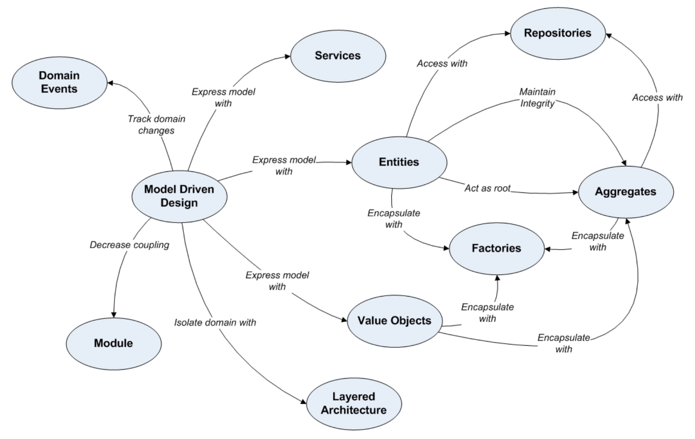
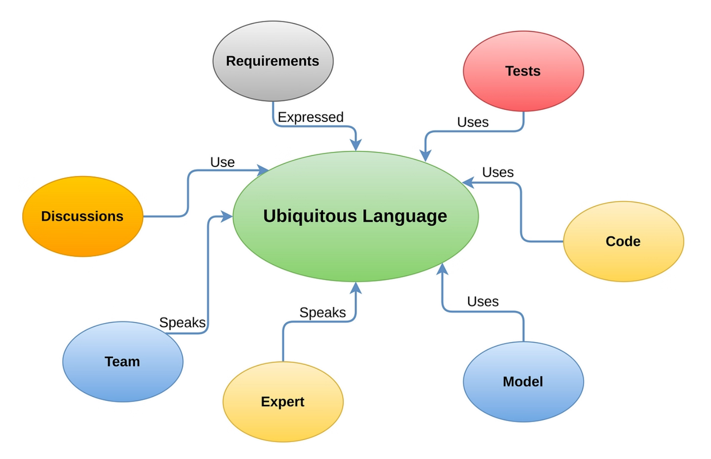
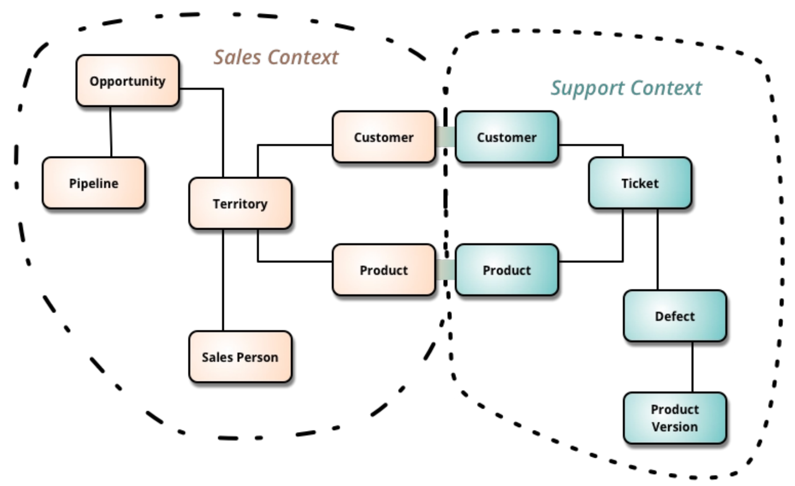
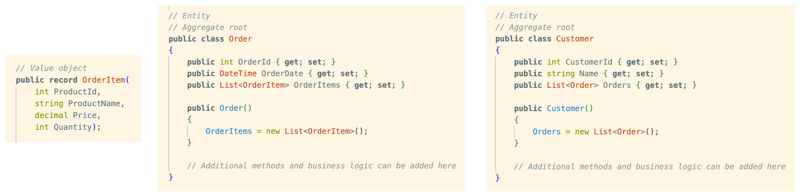

* [Domain-Driven Design](#domain-driven-design)
  * [Ubiquitous Language](#ubiquitous-language)
  * [Bounded Context](#bounded-context)
  * [Aggregate](#aggregate)
  * [Repository](#repository)
  * [Domain Service](#domain-service)

# Domain-Driven Design

__Domain-Driven Design (DDD)__ is an approach to software development that focuses on creating a shared understanding of the problem domain within a development team. It was introduced by Eric Evans in his book "Domain-Driven Design: Tackling Complexity in the Heart of Software."

Key concepts in Domain-Driven Design include:

* __Ubiquitous Language:__ Developing a common, shared language between technical and non-technical team members to ensure a consistent understanding of the domain.
* __Bounded Context:__ Defining explicit boundaries within which a particular model or term is valid. Different parts of a system may have different models for the same term.
* __Aggregates:__ Clusters of related entities and value objects that are treated as a single unit. They are responsible for enforcing consistency and protecting the integrity of the domain.
* __Entities and Value Objects:__ Entities are objects with a distinct identity, while value objects are objects that have no conceptual identity and are immutable.
* __Repositories:__ Objects that mediate between the domain and data mapping layers. They provide a way to access and persist aggregates.
* __Services:__ Operations that don't conceptually belong to any entity or value object and are often used to perform complex operations within the domain.

__There is an opinion, canonical DDD implementation in most cases leads to overly-engineered applications, though parts of it are useful.__

## Ubiquitous Language

## Bounded Context

__Bounded context__ refers to the explicit boundaries within which a particular domain model is defined and applicable. Bounded contexts help manage complexity by clearly defining the scope and meaning of terms and concepts within a specific context, preventing confusion and conflicts.

Within a bounded context, certain terms may have specific meanings that differ from their meanings in
other contexts. This allows teams to work on different parts of a system with their own understanding of the domain, minimizing misunderstandings and promoting better collaboration.

Bounded contexts are essential for large and complex systems where different teams may be working
on different aspects of the software. They help ensure that each team can develop and evolve their part of the system independently, without interfering with other teams or introducing inconsistencies.

__Bounded contexts provide good boundaries for modules of the system.__

## Aggregate

__Aggregate__ is a cluster of domain objects that are treated as a single unit. It usually consists of an entity, which is the root, and a collection of related objects. The aggregate enforces consistency rules for the objects it contains.

## Repository

__Repository__ is a pattern used to access and manage domain objects. It provides a mechanism for abstracting the underlying data access code and allows the application to work with domain objects without directly interacting with the database or other data storage mechanisms.

Key characteristics of a repository in DDD include:

* __Abstraction of Data Access:__ The repository acts as a layer of abstraction between the domain layer and the data access layer, shielding the domain layer from the details of how data is persisted.
* __Aggregate Roots:__ Repositories typically operate on aggregate roots, which are specific entities that serve as the entry points to a cluster of related entities. The aggregate root ensures consistency and integrity within the cluster.
* __CRUD Operations:__ Repositories provide methods for basic CRUD (Create, Read, Update, Delete) operations on domain objects. These operations are often defined in terms of the aggregate roots.
* __Encapsulation of Query Logic:__ Repositories encapsulate the query logic related to retrieving domain objects. This helps in keeping the domain layer focused on business logic rather than data access details.
* __Unit of Work:__ In some cases, repositories are associated with the concept of a Unit of Work, which represents a transaction boundary. A Unit of Work ensures that changes to multiple objects within a repository are committed or rolled back as a single atomic operation.

## Domain Service

__Domain service__ is a stateless, behavior-focused class that performs a specific operation or task related to the domain but doesn't have any inherent concept of identity or lifecycle. Unlike entities, which have an identity and change over time, domain services are typically used for operations that don't naturally fit within the boundaries of a specific entity.

For example, if you have a banking system, you might have a domain service for calculating interest rates or validating transactions. These are operations that involve domain logic but don't necessarily belong to a specific entity like a bank account.

__Distinguish between domain services and application services. Domain services contain logic inherently related to the domain. Application services contain logic specific to the application. Many different applications can use the same domain.__
