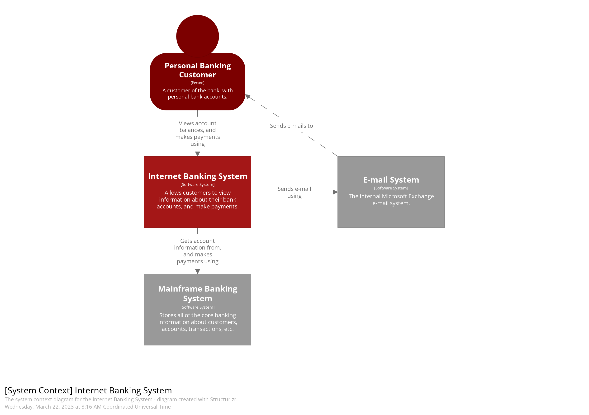
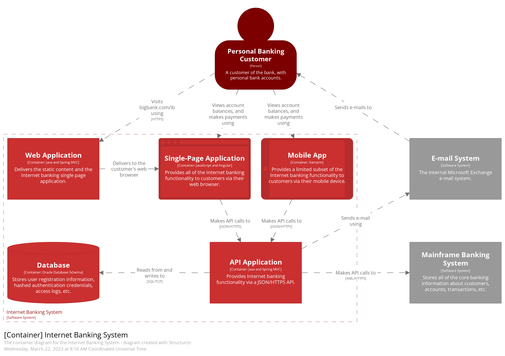
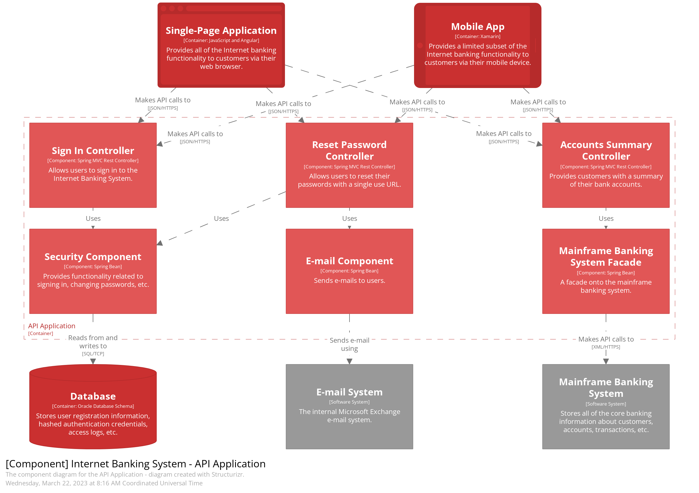

* [Diagrams](#diagrams)
  * [C4 Model](#c4-model)
    * [Context Diagram (C1)](#context-diagram-c1)
    * [Container Diagram (C2)](#container-diagram-c2)
    * [Component Diagram (C3)](#component-diagram-c3)
    * [Code Diagram (C4)](#code-diagram-c4)
    * [Links](#links)

# Diagrams

## C4 Model

__C4 model__ is a framework for visualizing the architecture of a software system. It was created by Simon Brown and is designed to be a simple way to communicate and document software architecture. The "C4" stands for "Context, Containers, Components, and Code" which represent different levels of abstraction in the architecture.

### Context Diagram (C1)

Describes the high-level view of the system, showing how it interacts with external entities such as users, systems, or external services.

### Container Diagram (C2)

Focuses on the containers within the system, representing the applications or services and their dependencies. It provides a high-level view of the software architecture.

### Component Diagram (C3)

Dives deeper into the internal components or classes of a container, illustrating the key components and their interactions.

### Code Diagram (C4)

Represents the actual code, providing a detailed view of the classes, methods, and relationships within a specific component.

### Links

* https://c4model.com/
* Diagrams as Code - https://www.youtube.com/watch?v=Za1-v4Zkq5E
* C4 Model in PlantUML - https://github.com/plantuml-stdlib/C4-PlantUML
