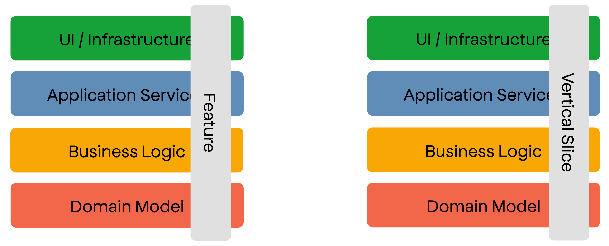

* [Feature-based architecture](#feature-based-architecture)
  * [Screaming Architecture](#screaming-architecture)
  * [Vertical Slices](#vertical-slices)
    * [Statements](#statements)
    * [Pros](#pros)
    * [Cons](#cons)

# Feature-based architecture

## Screaming Architecture

The basic idea behind Screaming Architecture is to create an architecture that clearly reflects the business domain and requirements of the system. It aims to make the architecture "scream" the essential features, behaviors, and rules of the system, making it easily understandable and maintainable.

## Vertical Slices

Link: https://bit.ly/3BNpDMU

### Statements

* Code that is changed together should live together. Proximity Principle

### Pros

* Low barrier to entry
* Resilient to technology changes
* Level of testability can be per feature
* Easy to work on by many teams

### Cons

* Hard to decide what to have as Shared code vs Feature code
* Each feature can be written in a different way leading to cognitive load when switching
