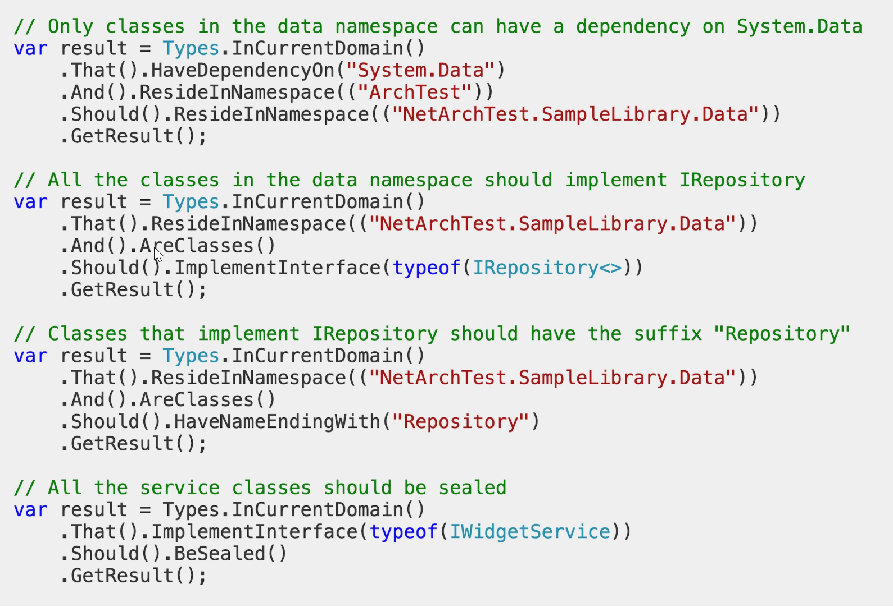

* [Fitness Function](#fitness-function)
  * [NetArchTest](#netarchtest)
* [Links](#links)

# Fitness Function

**Architecture fitness function** is a specific, measurable, and quantifiable criterion used to evaluate the performance or suitability of a system architecture. It can cover various aspects such as performance, reliability, scalability, maintainability, and more.

Fitness functions are commonly associated with the concept of evolutionary architecture, where the design of a system is expected to evolve over time to meet changing requirements.

Fitness functions are often used in CI/CD pipelines to automate the evaluation of architectural qualities during the development process. This helps ensure that architectural goals are continuously met as the software evolves.

Fitness functions can assert different aspects of the software system architecture:

* Cohesion
* Coupling
* Maintainability
* Response Times
* Throughput
* Scalability
* Resilience

## NetArchTest

# Links

* Fitness Functions - https://betterprogramming.pub/the-up-and-running-guide-to-architectural-fitness-functions-1621ebe46ea
* Fitness Functions - https://www.thoughtworks.com/insights/articles/fitness-function-driven-development
* NetArchTest - https://github.com/BenMorris/NetArchTest
