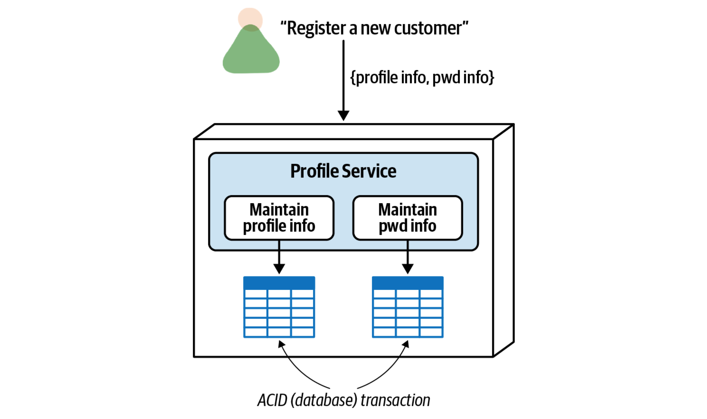

# Service Granularity

_Modularity_ concerns breaking up systems into separate parts, whereas _granularity_ deals with the _size_ of those separate parts.

Determining the right level of granularity — the size of a service — is one of the many hard parts of software architecture that architects and development teams continually struggle with. Granularity is not defined by the number of classes or lines of code in a service, but rather what the service does — hence why it is so hard to get service granularity right.

Two opposing forces for service granularity are _granularity disintegrators_ and _granularity integrators_. Granularity disintegrators address the question _“When should I consider breaking apart a service into smaller parts?”_, whereas Granularity integrators address the question _“When should I consider putting services back together?”_

## Granularity Disintegrators

Granularity disintegrators provide guidance and justification for when to break a service into smaller pieces. While the justification for breaking up a service may involve only a single driver, in most cases the justification will be based on multiple drivers. The six main drivers for granularity disintegration are as follows:

* __Service scope and function__. Is the service doing too many unrelated things?

* __Code volatility__. Are changes isolated to only one part of the service?

* __Scalability and throughput__. Do parts of the service need to scale differently?

* __Fault tolerance__. Are there errors that cause critical functions to fail within the service?

* __Security__. Do some parts of the service need higher security levels than others?

* __Extensibility__. Is the service always expanding to add new contexts?

### Service Scope and Function

The service scope and function is the first and most common driver for breaking up a single service into smaller ones, particularly with regard to microservices. There are two dimensions to consider when analyzing the service scope and function. The first dimension is _cohesion_: the degree and manner to which the operations of a particular service interrelate. The second dimension is the overall _size_ of a component, measured usually in terms of the total number of statements summed from the classes that make up that service, the number of public entrypoints into the service, or both.

This granularity disintegrator is related to the _single-responsibility principle_ coined by Robert C. Martin as part of his _SOLID_ principles, which states, “every class should have responsibility over a single part of that program’s functionality, which it should encapsulate. All of that module, class or function’s services should be narrowly aligned with that responsibility.” While the single-responsibility principle was originally scoped within the context of classes, in later years it has expanded to include components and services.

### Code Volatility

_Code volatility_ — the rate at which the source code changes — is another good driver for breaking a service into smaller ones. This is also known as _volatility-based decomposition_. Objectively measuring the frequency of code changes in a service (easily done through standard facilities in any source code version-control system) can sometimes lead to a good justification for breaking apart a service.

### Scalability and Throughput

Another driver for breaking up a service into separate smaller ones is _scalability_ and _throughput_. The scalability demands of different functions of a service can be objectively measured to qualify whether a service should be broken apart.

### Fault Tolerance

_Fault tolerance_ describes the ability of an application or functionality within a particular domain to continue to operate, even though a fatal crash occurs (such as an out-of-memory condition). Fault Tolerance is another good driver for granularity disintegration.

### Security

A common pitfall when securing sensitive data is to think only in terms of the storage of that data. For example, securing PCI (Payment Card Industry) data from non-PCI data might be addressed through separate schemas or databases residing in different secure regions. What is sometimes missing from this practice, however, is also securing _how_ that data is accessed.

While the credit card _data_ may be protected, _access_ to that data is at risk because the credit card functionality is joined together with the basic customer profile functionality. Although the API entry points into the consolidated customer profile service may differ, nevertheless there is risk that someone entering into the service to retrieve the customer name might also have access to credit card functionality. By breaking this service into two separate services, access to the _functionality_ used to maintain credit card information can be made more secure because the set of credit card operations is going into only a single-purpose service.

### Extensibility

Another primary driver for granularity disintegration is _extensibility_ — the ability to add additional functionality as the service context grows.

## Granularity Integrators

Whereas granularity disintegrators provide guidance and justification for when to break a service into smaller pieces, granularity integrators work in the opposite way — they provide guidance and justification for putting services back together (or not breaking apart a service in the first place). Analyzing the trade-offs between disintegration drivers and integration drivers is the secret to getting service granularity right. The four main drivers for granularity integration are as follows:

* __Database transactions__. Is an ACID transaction required between separate services?

* __Workflow and choreography__. Do services need to talk to one another?

* __Shared code__. Do services need to share code among one another?

* __Database relationships__. Although a service can be broken apart, can the data it uses be broken apart as well?

### Database Transactions

Most monolithic systems and course-grained domain services using relational databases rely on single-unit-of-work database transactions to maintain data integrity and consistency.

Two services, transaction not needed:

Two services, ACID transaction not possible:

One service, ACID transaction possible:

### Workflow and Choreography

Another common granularity integrator is _workflow_ and _choreography_ - services talking to one another (also sometimes referred to as _interservice_ communication or _east-west_ communications). Communication between services is fairly common and in many cases necessary in highly distributed architectures like microservices. However, as services move toward a finer level of granularity based on the disintegration factors outlined in the previous section, service communication can increase to a point where negative impacts start to occur.

Issues with overall fault tolerance is the first impact of too much synchronous interservice communication:

Overall performance and responsiveness is another driver for granularity integration:

Overall reliability and data integrity are also impacted with increased service communication:

### Shared Code

Shared source code is a common (and necessary) practice in software development. Functions like logging, security, utilities, formatters, converters, extractors, and so on are all good examples of shared code. However, things can get complicated when dealing with shared code in a distributed architecture and can sometimes influence service granularity.

Consider the set of five services shown below. While there may have been a good disintegrator driver for breaking apart these services, they all share a common codebase of domain functionality (as opposed to common utilities or infrastructure functionality). If a change occurs in the shared library, this would _eventually_ necessitate a change in the corresponding services using that shared library. We say eventually because versioning can sometimes be used with shared libraries to provide agility and backward compatibility. As such, all of these separately deployed services would have to be changed, tested, and deployed together. In these cases, it might be wise to consolidate these five services into a single service to avoid multiple deployments, as well as having the service functionality be out of sync based on the use of different versions of a library.

Not all uses of shared code drive granularity integration. For example, infrastructure-related cross-cutting functionality such as logging, auditing, authentication, authorization, and monitoring that all services use is not a good driver for putting services back together or even moving back to a monolithic architecture. Some of the guide‐ lines for considering shared code as a granularity integrator are as follows:

* __Specific shared domain functionality__. Shared domain functionality is shared code that contains business logic (as opposed to infrastructure-related cross-cutting functionality).

* __Frequent shared code changes__. Regardless of the size of the shared library, frequent changes to shared functionality require frequent coordinated changes to the services using that shared domain functionality.

* __Defects that cannot be versioned__. While versioning can help mitigate coordinated changes and allow for backward compatibility and agility (the ability to respond quickly to change), at times certain business functionality must be applied to all services at the same time (such as a defect or a change in business rules). If this happens frequently, it might be time to consider putting services back together to simplify the changes.

### Data Relationships

Another trade-off in the balance between granularity disintegrators and integrators is the relationship between the data that a single consolidated service uses as opposed to the data that separate services would use. This integrator driver assumes that the data resulting from breaking apart a service is not shared, but rather formed into tight bounded contexts within each service to facilitate change control and support overall availability and reliability.

#service-granularity
