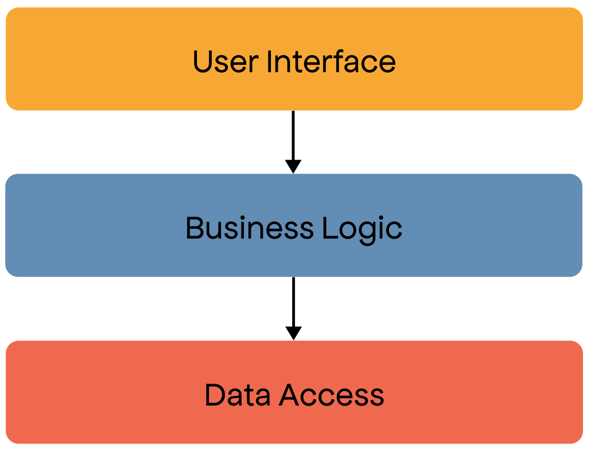
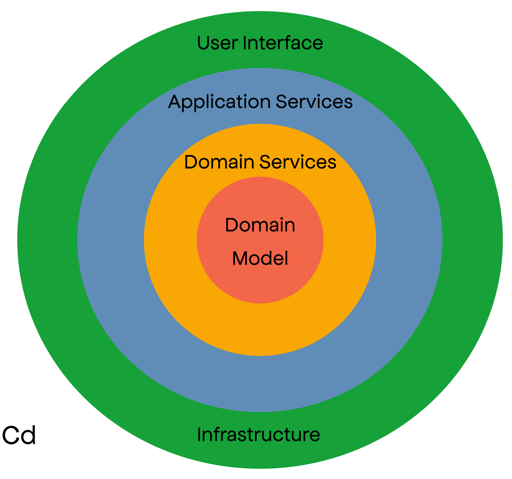
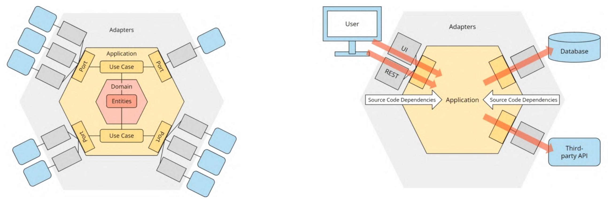
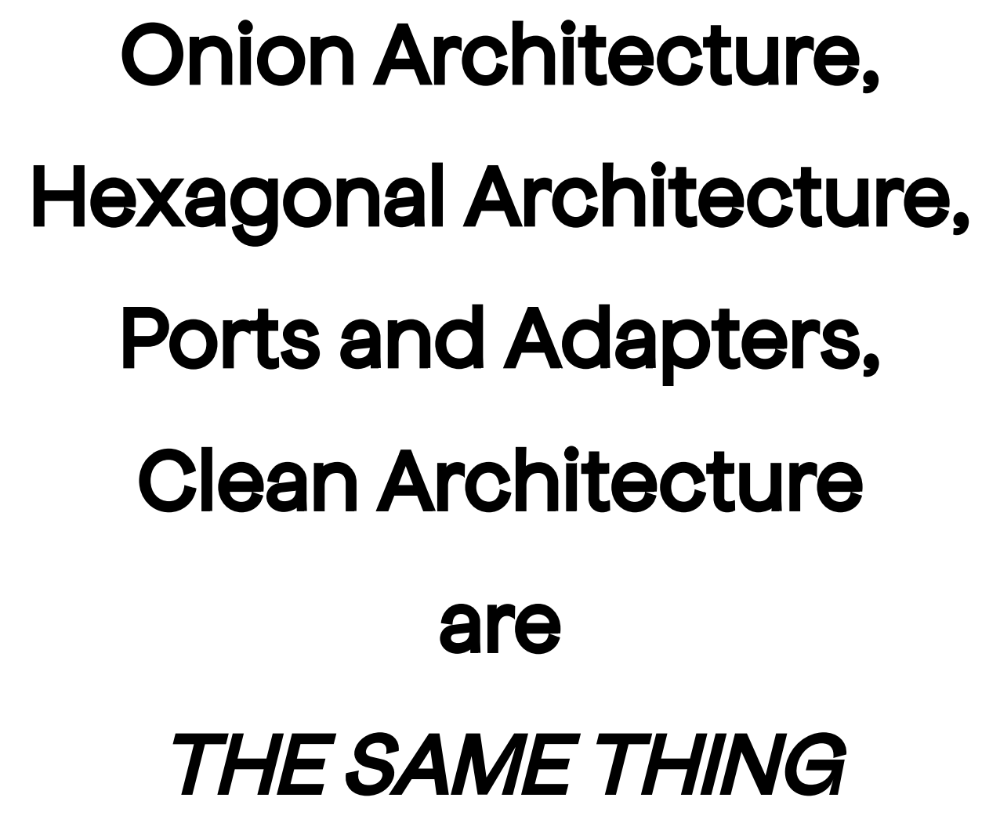

- [1. Traditional Architectures](#1-traditional-architectures)
  - [1.1. Layered  Architecture](#11-layered--architecture)
    - [1.1.1. Pros](#111-pros)
  - [1.2. Onion Architecture](#12-onion-architecture)
    - [1.2.1. Statements](#121-statements)
  - [1.3. Hexagonal Architecture](#13-hexagonal-architecture)
  - [1.4. Clean Architecture](#14-clean-architecture)

# 1. Traditional Architectures
## 1.1. Layered  Architecture

### 1.1.1. Pros
- Separation of concerns
- Abstraction and encapsulation
- Downward dependency direction
- Single responsibility
- Layer independence

## 1.2. Onion Architecture
Link: https://bit.ly/3WmVjCd

- **Domain Model + Domain Services.** This layer contains the core business logic and domain models. It represents the heart of the application and should be independent of any specific technology or infrastructure concerns
- **Application Services.** The application layer sits outside the domain layer and contains the application-specific logic. It orchestrates the interaction between the domain layer and the infrastructure layer, handling use cases and exposing services
- **Infrastructure.** This layer is responsible for interacting with external resources and frameworks, such as databases, file systems, or web services
- **User Interface.** This layer is responsible for presenting information to users and capturing their input. It includes user interfaces, such as web interfaces, desktop applications, or mobile apps

### 1.2.1. Statements
- The domain model is the truth of the organization
- The application is built around an independent object model
- Inner layers define interfaces. Outer layers implement interfaces
- The direction of the coupling is toward the center
- Deeper layers change less often
- All application core code can be compiled and run separately from the infrastructure
- Testability

## 1.3. Hexagonal Architecture
Link: https://bit.ly/3ofxoIp

- **Domain Model + Domain Services.** This layer contains the core business logic and domain models. It represents the heart of the application and should be independent of any specific technology or infrastructure concerns
- **Application Services.** The application layer sits outside the domain layer and contains the application-specific logic. It orchestrates the interaction between the domain layer and the infrastructure layer, handling use cases and exposing services
- **Ports.** Ports define the interfaces through which the core interacts with the outside world. They are the entry and exit points for data and control flow
- **Adapters.** Adapters implement the ports and connect the core with the external world. They are responsible for translating and transforming data between the core and the external systems, such as databases, user interfaces, or third-party services

## 1.4. Clean Architecture
Link: https://bit.ly/3BNEqqS

