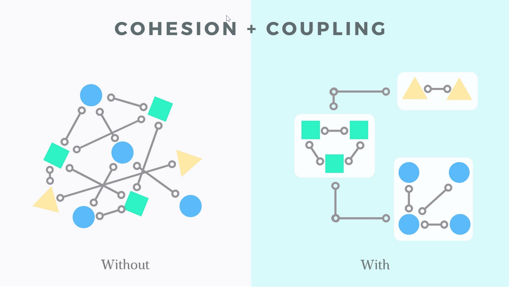

* [Modularity](#modularity)
* [Cohesion and Coupling](#cohesion-and-coupling)
* [Links](#links)

# Modularity

__Modularity__ refers to the design principle of breaking down a software system into smaller, independent, and interchangeable modules or components. Each module represents a distinct and well-defined functionality, and these modules can be developed, tested, and maintained independently.

The key goals of modularity in software engineering include:

* __Ease of Understanding__ - Breaking down a complex system into smaller modules makes it easier for developers to understand and manage the code. Each module can be analyzed in isolation, which facilitates comprehension and debugging.
* __Reusability__ - Modular design encourages the creation of reusable components. Once a module is developed and tested, it can be reused in different parts of the system or even in other projects, reducing the need to recreate similar functionality.
* __Maintainability__ - Modularity facilitates easier maintenance. Updates or changes to one module can be made without affecting other parts of the system as long as the module's interface remains consistent.
* __Scalability__ - Modular systems are often more scalable. New features or enhancements can be added by introducing new modules without disrupting the existing functionality. This makes it easier to adapt the software to changing requirements.
* __Collaboration__ - Different teams or developers can work on separate modules concurrently, promoting parallel development and
collaboration. This can lead to more efficient development processes.
* __Testability__ - Individual modules can be tested independently, making it easier to identify and fix issues. This contributes to better overall software quality.

# Cohesion and Coupling

__Cohesion:__

* Cohesion refers to the degree to which the elements within a module or component are related to each other.
* High cohesion implies that the elements within a module are closely related in terms of functionality, and they work together to achieve a common goal.
* It is generally desirable to have high cohesion within a module because it leads to more maintainable, modular, and understandable code.
* Read more: [cohesion/README.md](cohesion/README.md)

__Coupling:__

* Coupling, on the other hand, refers to the degree of dependence between different modules or components in a system.
* Low coupling means that modules are relatively independent of each other, and changes in one module are less likely to affect others.
* It is generally desirable to have low coupling between modules as it promotes better modularity, reusability, and easier maintenance of the code
* Read more: [coupling/README.md](coupling/README.md)

# Links

* Modularity, Cohesion, Coupling - https://youtu.be/Q76mO3eI4qE
