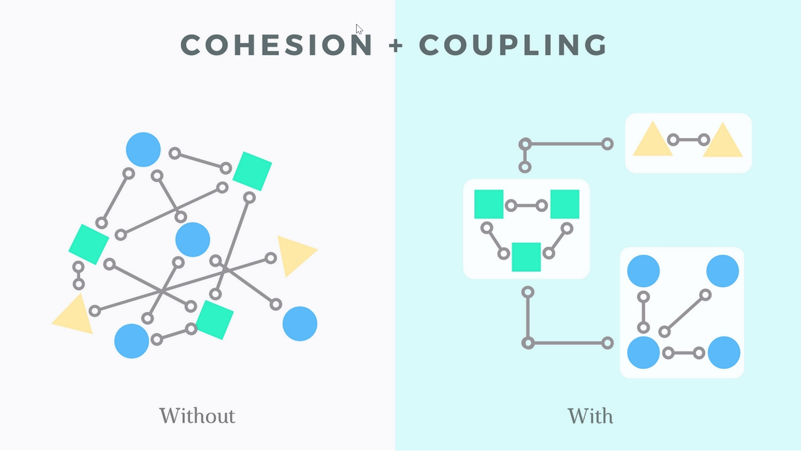

- [Modularity](#modularity)
- [Cohesion and Coupling](#cohesion-and-coupling)
  - [Levels of Cohesion](#levels-of-cohesion)
  - [Cohesion Metrics](#cohesion-metrics)
  - [Levels of Coupling](#levels-of-coupling)
  - [Coupling Metrics](#coupling-metrics)
- [Links](#links)

# Modularity

**Modularity** refers to the design principle of breaking down a software system into smaller, independent, and interchangeable modules or components. Each module represents a distinct and well-defined functionality, and these modules can be developed, tested, and maintained independently.

The key goals of modularity in software engineering include:

* **Ease of Understanding** - Breaking down a complex system into smaller modules makes it easier for developers to understand and manage the code. Each module can be analyzed in isolation, which facilitates comprehension and debugging.
* **Reusability** - Modular design encourages the creation of reusable components. Once a module is developed and tested, it can be reused in different parts of the system or even in other projects, reducing the need to recreate similar functionality.
* **Maintainability** - Modularity facilitates easier maintenance. Updates or changes to one module can be made without affecting other parts of the system as long as the module's interface remains consistent.
* **Scalability** - Modular systems are often more scalable. New features or enhancements can be added by introducing new modules without disrupting the existing functionality. This makes it easier to adapt the software to changing requirements.
* **Collaboration** - Different teams or developers can work on separate modules concurrently, promoting parallel development and
collaboration. This can lead to more efficient development processes.
* **Testability** - Individual modules can be tested independently, making it easier to identify and fix issues. This contributes to better overall software quality.

# Cohesion and Coupling

**Cohesion:**
* Cohesion refers to the degree to which the elements within a module or component are related to each other.
* High cohesion implies that the elements within a module are closely related in terms of functionality, and they work together to achieve a common goal.
* It is generally desirable to have high cohesion within a module because it leads to more maintainable, modular, and understandable code.

**Coupling:**
* Coupling, on the other hand, refers to the degree of dependence between different modules or components in a system.
* Low coupling means that modules are relatively independent of each other, and changes in one module are less likely to affect others.
* It is generally desirable to have low coupling between modules as it promotes better modularity, reusability, and easier maintenance of the code

## Levels of Cohesion

**(From best to worst)**

* **Functional cohesion** - It is considered to be the highest degree of cohesion, and it is highly expected. Elements of module in functional cohesion are grouped because they all contribute to a single well-defined function. It can also be reused.
* **Sequential cohesion** - When elements of module are grouped because the output of one element serves as input to another and so on.
* **Communicational cohesion** - When elements of module are grouped together, which are executed sequentially and work on same data. Grouped because of common I/O source.
* **Procedural cohesion** - Grouped to ensure order of use. Grouped together, which are executed sequentially in order to perform a task.
* **Temporal cohesion** - Grouped by time of use.
* **Logical cohesion** - Grouped by function but not related. Logically categorized elements are put together.
* **Coincidental cohesion** - Grouped by chance. It is unplanned and random cohesion, which might be the result of breaking the program into smaller modules for the sake of modularization

## Cohesion Metrics
* Lack of Cohesion in Methods (LCOM)
* Cohesion Among Methods in a Class (CAM)
* Responsibility Driven Design Metrics
* Cyclomatic Complexity
* Semantic Cohesion
* Component Dependency Metrics
* Coupling Metrics

## Levels of Coupling

**(From best to worst)**

* **Data coupling** - When two modules interact with each other by means of passing data (as parameter). Data is passed between components.
* **Stamp coupling** - When multiple modules share common data structure and work on different parts of it.
* **Control coupling** - If one module decides the function of the other module. Data passed affects control flow. Passing a boolean of flag.
* **Common coupling** - Shared data. When multiple modules have read and write access to some global data.
* **Content coupling** - When a module can directly access or modify or refer to the content of another module. One module changes internal data of another.

## Coupling Metrics

1. Afferent Coupling (Ca):
   * Afferent coupling measures the number of classes or modules that depend on a particular class or module.
   * It indicates how many other modules are using or depending on the module in question.
   * High afferent coupling may indicate that a module has many incoming dependencies, which can make it more
challenging to maintain or modify without affecting other parts of the system.
2. Efferent Coupling (Ce):
   * Efferent coupling measures the number of classes or modules that a particular class or module depends on. It indicates how many other modules the module in question is using or depending on.
   * High efferent coupling may suggest that a module has many outgoing dependencies, which can affect its independence and reusability.
3. Connascence:
   * Two components are connascent if a change in one would require the other to be modified in order to maintain the overall correctness of the system.

# Links

- Modularity, Cohesion, Coupling - https://youtu.be/Q76mO3eI4qE
