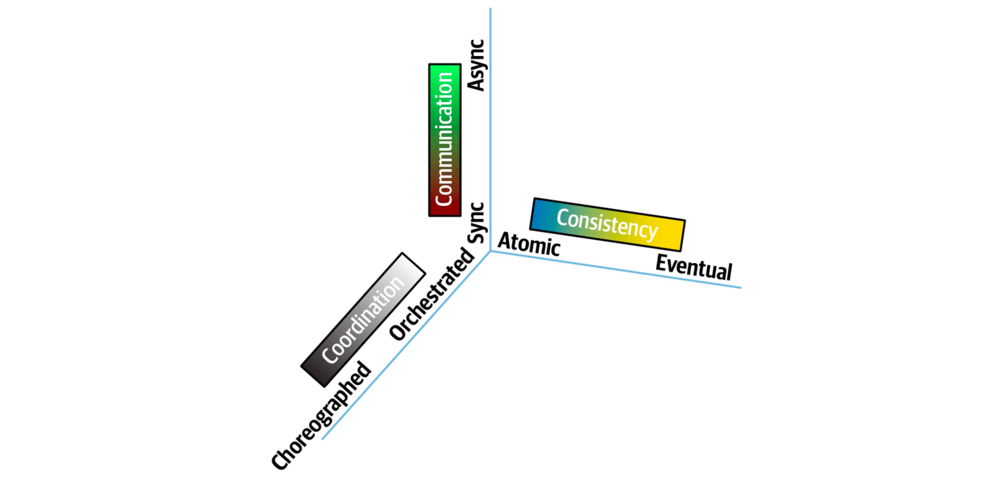
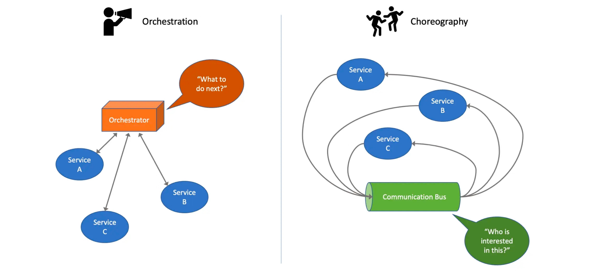

* [Coupling](#coupling)
  * [Levels of Coupling](#levels-of-coupling)
  * [Coupling Metrics](#coupling-metrics)
  * [Coupling Types](#coupling-types)
    * [Static Coupling](#static-coupling)
    * [Dynamic Coupling](#dynamic-coupling)
      * [Synchronous vs. Asynchronous Communication](#synchronous-vs-asynchronous-communication)
      * [Atomic vs. Eventual Consistency](#atomic-vs-eventual-consistency)
      * [Orchestration vs. Choreography](#orchestration-vs-choreography)

# Coupling

## Levels of Coupling

__(From best to worst)!__

* __Data coupling__ - When two modules interact with each other by means of passing data (as parameter). Data is passed between components.
* __Stamp coupling__ - When multiple modules share common data structure and work on different parts of it.
* __Control coupling__ - If one module decides the function of the other module. Data passed affects control flow. Passing a boolean of flag.
* __Common coupling__ - Shared data. When multiple modules have read and write access to some global data.
* __Content coupling__ - When a module can directly access or modify or refer to the content of another module. One module changes internal data of another.

## Coupling Metrics

1. Afferent Coupling (Ca):
   * Afferent coupling measures the number of classes or modules that depend on a particular class or module.
   * It indicates how many other modules are using or depending on the module in question.
   * High afferent coupling may indicate that a module has many incoming dependencies, which can make it more
challenging to maintain or modify without affecting other parts of the system.
2. Efferent Coupling (Ce):
   * Efferent coupling measures the number of classes or modules that a particular class or module depends on. It indicates how many other modules the module in question is using or depending on.
   * High efferent coupling may suggest that a module has many outgoing dependencies, which can affect its independence and reusability.
3. Connascence:
   * Two components are connascent if a change in one would require the other to be modified in order to maintain the overall correctness of the system.

## Coupling Types

__Static coupling__ represents how static dependencies resolve within the architecture via contracts. These dependencies include operating system, frameworks and/or libraries delivered via transitive dependency management, and any other operational requirement to allow the quantum to operate.

__Dynamic coupling__ represents how quanta communicate at runtime, either synchronously or asynchronously.

An easy way to think about the difference is that __static coupling__ describes how services are __wired together__, whereas __dynamic coupling__ describes how services __call__ one another at runtime. For example, in a microservices architecture, a service must contain dependent components such as a database, representing static coupling—the service isn’t operational without the necessary data. That service may call other services during the course of a workflow, which represents dynamic coupling. Neither service requires the other to be present to function, except for this runtime workflow. Thus, __static coupling__ analyzes __operational dependencies__, and __dynamic coupling__ analyzes __communication dependencies__.

### Static Coupling

Static coupling refers to the degree of dependency between different modules or components of a system at compile and startup time. It is a measure of how closely interconnected the various parts of a system are in terms of their code structure, dependencies, and operational requirements.

In a system with __low static coupling__, components are __more independent__ of each other, making it easier to understand, maintain, and modify individual parts without affecting the entire system. On the other hand, __high static coupling__ implies __strong dependencies__ between components, making the system more rigid and harder to modify without affecting other parts.

_Reducing static coupling is a desirable goal in software design as it promotes modularity, reusability, and maintainability. It is often achieved through techniques such as encapsulation, abstraction, and dependency injection._

### Dynamic Coupling

The nature of how services call one another creates difficult trade-off decisions because it represents a multidimensional decision space influenced by three interlocking forces:

* __Communication:__ Refers to the type of connection synchronicity used: __synchronous__ or __asynchronous__
* __Consistency:__ Describes whether the workflow communication requires __atomicity__ or can utilize __eventual consistency__.
* __Coordination:__ Describes whether the workflow utilizes an __orchestrator__ or whether the services communicate via __choreography__.

#### Synchronous vs. Asynchronous Communication

__Synchronous Communication__: one service makes a request to another service and waits for a response before continuing its operation.

* __Blocking:__ The calling microservice is blocked until it receives a response.
* __Request-Response:__ Follows a request-response pattern, similar to traditional client-server communication.

__Examples:__ HTTP/REST API calls are a common form of synchronous communication in microservices.

__Asynchronous Communication__: one microservice sends a message or event to another microservice without waiting for an immediate response.

* __Non-blocking:__ The calling microservice continues its operation without waiting for a response.
* __Event-Driven:__ Typically follows an event-driven model, where services react to events or messages.

__Examples:__ Message queues (e.g., RabbitMQ, Apache Kafka) and publish-subscribe patterns are common in asynchronous communication.

#### Atomic vs. Eventual Consistency

__Atomic Consistency__, also known as linearizability or strong consistency, ensures that the results of any combination of operations on a distributed system appear as if they occurred in a single, instant point in time.

It provides a strong guarantee of consistency and ensures that each operation appears to be instantaneous and takes effect immediately. All nodes in the system observe the same order of operations.

__Eventual Consistency__ is a weaker form of consistency in which, given enough time and no further updates, all replicas of a piece of data in a distributed system will converge to the same value.

Unlike atomic consistency, eventual consistency does not guarantee immediate consistency across all nodes. Instead, it allows temporary inconsistencies that will eventually be resolved as the system converges over time.

__Comparison:__ Atomic consistency provides a stronger guarantee of immediate consistency but may have higher latency and coordination overhead in distributed systems. Eventual consistency allows for more flexibility and availability, trading off immediate consistency for better scalability and fault tolerance.

#### Orchestration vs. Choreography

__Orchestration__ is a centralized approach where a single controller (orchestrator) manages and coordinates the interactions
between different components or services.

* __Control__: The orchestrator dictates the sequence and dependencies of tasks, ensuring that each component performs its part in a
predefined order.
* __Communication__: Components communicate with the orchestrator, and the orchestrator, in turn, communicates with each component.

__Choreography__ is a decentralized approach where each component or service is aware of its own responsibilities and communicates directly with other components to achieve the overall goal.

* __Control__: There is no central controller; instead, the communication and coordination happen through direct interactions between components.
* __Flexibility__: Choreography tends to be more flexible, as components can adapt and evolve independently without relying on a central authority.

