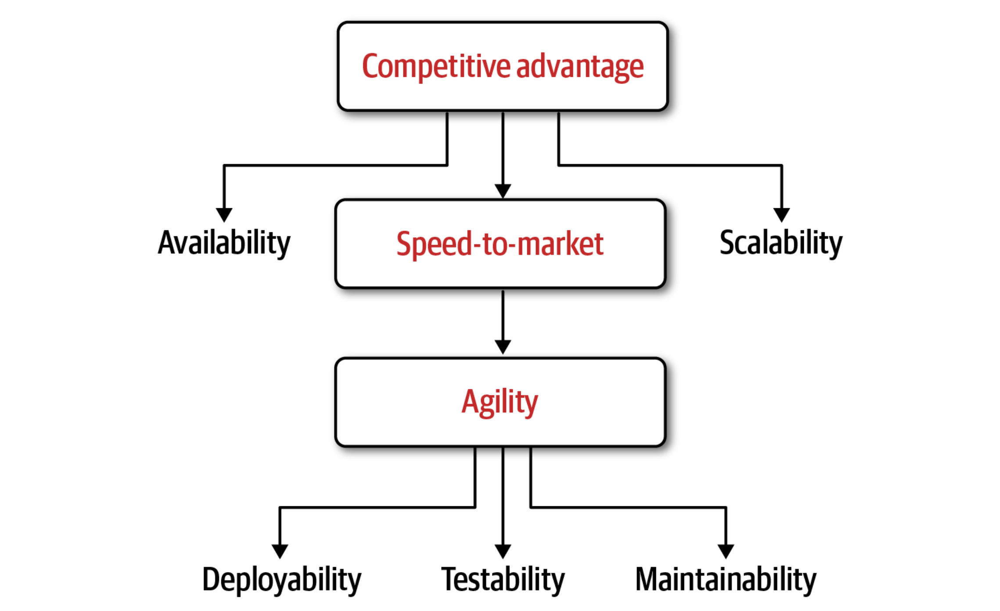
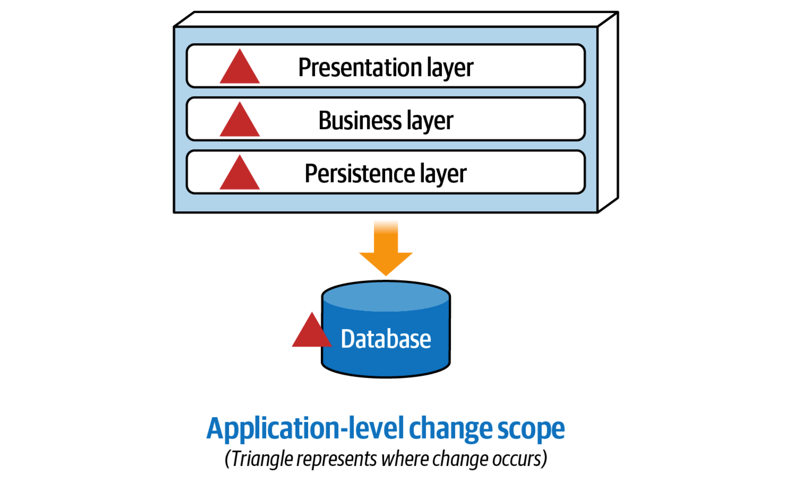
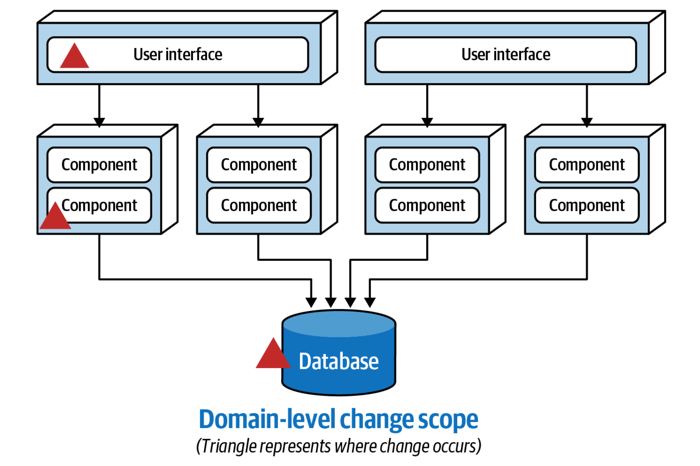
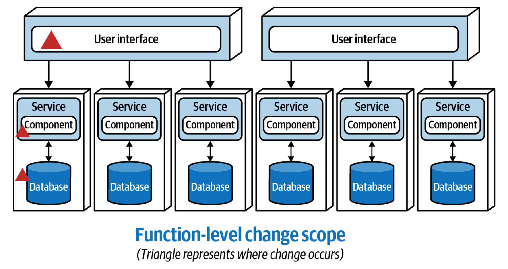
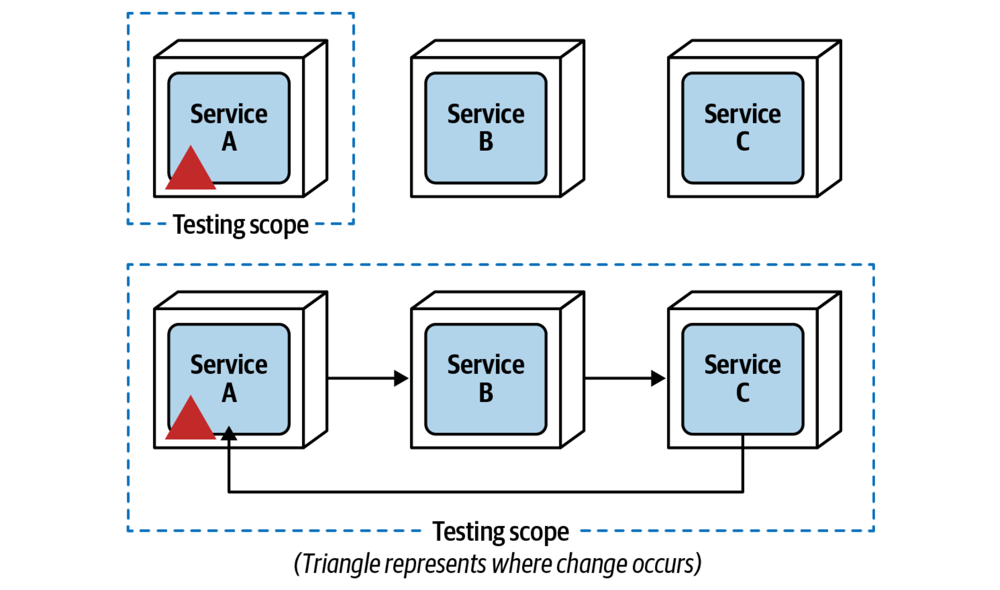
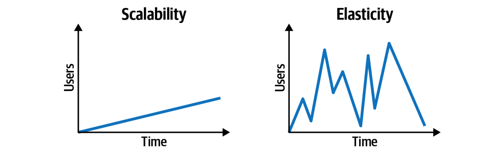
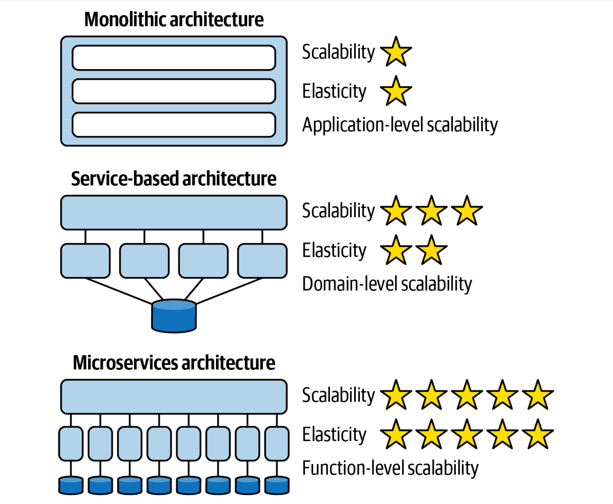

# Modularity Drivers

Architects shouldn’t break a system into smaller parts unless clear business drivers exist. The primary business drivers for breaking applications into smaller parts include _speed-to-market_ (sometimes called _time-to-market_) and achieving a level of _competitive advantage_ in the marketplace.

Speed-to-market is achieved through architectural agility — the ability to respond quickly to change. Agility is a compound architectural characteristic made up of many other architecture characteristics, including _maintainability_, _testability_, and _deployability_.

Competitive advantage is achieved through speed-to-market combined with _scalability_ and overall application _availability_ and _fault tolerance_. The better a company does, the more it grows, hence the need for more scalability to support increased user activity. Fault tolerance, the  ability of an application to fail and continue to operate, is necessary to ensure that as parts of the application fail, other parts are still able to function as normal, minimizing the overall impact to the end user.

## Maintainability

_Maintainability_ is about the ease of adding, changing, or removing features, as well as applying internal changes such as maintenance patches, framework upgrades, third- party upgrades, and so on. As with most composite architecture characteristics, maintainability is hard to define objectively. Alexander von Zitzewitz, software architect and founder of hello2morrow, wrote an article about a new metric for objectively defining the maintainability level of an application:

https://blog.hello2morrow.com/2018/12/a-promising-new-metric-to-track-maintainability/

Some of the typical metrics used for deter‐ mining the relative maintainability of an application based on components (the architectural building blocks of an application) include the following:

* __Component coupling__. The degree and manner to which components know about one another.

* __Component cohesion__. The degree and manner to which the operations of a component interrelate.

* __Cyclomatic complexity__. The overall level of indirection and nesting within a component.

* __Component size__. The number of aggregated statements of code within a component.

* __Technical versus domain partitioning__. Components aligned by technical usage or by domain purpose.

Within the context of architecture, we are defining a _component_ as an architectural building block of the application that does some sort of business or infrastructure function, usually manifested through a package structure (Java), namespace (C#), or physical grouping of files (classes) within some sort of directory structure. For example, the component `Order History` might be implemented through a set of class files located in the namespace `App.Business.Order.History`.

### Monolith

Large monolithic architectures generally have low levels of maintainability due to the technical partitioning of functionality into layers, the tight coupling between components, and weak component cohesion from a domain perspective.

### Service-Based

### Microservices

## Testability

_Testability_ is defined as the ease of testing (usually implemented through automated tests) as well as the _completeness_ of testing. Testability is an essential ingredient for architectural agility. Large monolithic architecture styles like the layered architecture support relatively low levels of testability (and hence agility) due to the difficulty in achieving full and complete regression testing of all features within the large deployment unit. Even if a monolithic application did have a suite of full regression tests, imagine the frustration of having to execute hundreds or even thousands of unit tests for a simple code change. Not only would it take a long time to execute all of the tests, but the poor developer would be stuck researching why dozens of tests failed when in fact the failed tests have nothing to do with the change.

Architectural modularity — the breaking apart of applications into smaller deployment units — significantly reduces the overall testing scope for changes made to a service, allowing for better completeness of testing as well as ease of testing. Not only does modularity result in smaller, more targeted test suites, but maintaining the unit tests becomes easier as well.

Making a change to Service A limits the testing scope to only that service, since Service B and Service C are not coupled to Service A. However, as communication increases among these services, testability declines rapidly because the testing scope for a change to Service A now includes Service B and Service C, therefore impacting both the ease of testing and the completeness of testing.

## Deployability

_Deployability_ is not only about the ease of deployment — it is also about the frequency of deployment and the overall risk of deployment. To support agility and respond quickly to change, applications must support all three of these factors. Deploying software every two weeks (or more) not only increases the overall risk of deployment (due to grouping multiple changes together), but in most cases unnecessarily delays new features or bug fixes that are ready to be pushed out to customers. Of course, deployment frequency must be balanced with the customer’s (or end user’s) ability to be able to absorb changes quickly.

Monolithic architectures generally support low levels of deployability due to the amount of ceremony involved in deploying the application (such as code freezes, mock deployments, and so on), the increased risk that something else might break once new features or bug fixes are deployed, and a long time frame between deployments (weeks to months). Applications having a certain level of architectural modularity in terms of separately deployed units of software have less deployment ceremony, less risk of deployment, and can be deployed more frequently than a large, single monolithic application.

Like testability, deployability is also negatively impacted as services become smaller and communicate more with each other to complete a business transaction. Deployment risk is increased, and it becomes more difficult to deploy a simple change for fear of breaking other services. To quote software architect Matt Stine:

> If your microservices must be deployed as a complete set in a specific order, please put them back in a monolith and save yourself some pain.

## Scalability

_Scalability_ is defined as the ability of a system to remain responsive as user load gradually increases over time. Related to scalability is _elasticity_, which is defined as the ability of a system to remain responsive during significantly high instantaneous and erratic spikes in user load. Here is the differences between scalability and elasticity.

While both of these architectural characteristics include responsiveness as a function of the number of concurrent requests (or users in the system), they are handled differently from an architectural and implementation standpoint. Scalability generally occurs over a longer period of time as a function of normal company growth, whereas elasticity is the immediate response to a spike in user load.

Although both scalability and elasticity improve with finer-grained services, elasticity is more a function of granularity (the size of a deployment unit), whereas scalability is more a function of modularity (the breaking apart of applications into separate deployment units). Consider the traditional layered architecture, service-based architecture, and microservices architecture styles and their corresponding star ratings for scalability and elasticity.

## Availability/Fault Tolerance

Like many architecture characteristics, _fault tolerance_ has varying definitions. Within the context of architectural modularity, we define fault tolerance as the ability for some parts of the system to remain responsive and available as other parts of the system fail. For example, if a fatal error (such as an out-of-memory condition) in the payment-processing portion of a retail application occurs, the users of the system should still be able to search for items and place orders, even though the payment processing is unavailable.

All monolithic systems suffer from low levels of fault tolerance. While fault tolerance can be somewhat mitigated in a monolithic system by having multiple instances of the entire application load balanced, this technique is both expensive and ineffective. If the fault is due to a programming bug, that bug will exist in both instances, therefore potentially bringing down both instances.

Architectural modularity is essential to achieving domain-level and function-level fault tolerance in a system. By breaking apart the system into multiple deployment units, catastrophic failure is isolated to only that deployment unit, thereby allowing the rest of the system to function normally. There is a caveat to this, however: if other services are synchronously dependent on a service that is failing, fault tolerance is not achieved. This is one of the reasons asynchronous communication between services is essential for maintaining a good level of fault tolerance in a distributed system.

#modularity-drivers
