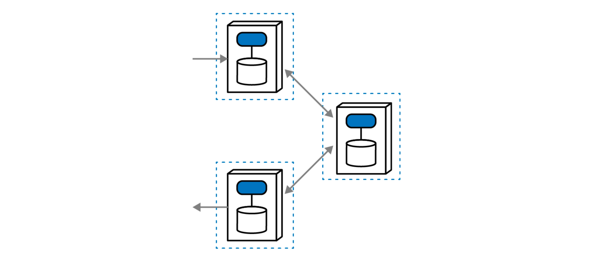
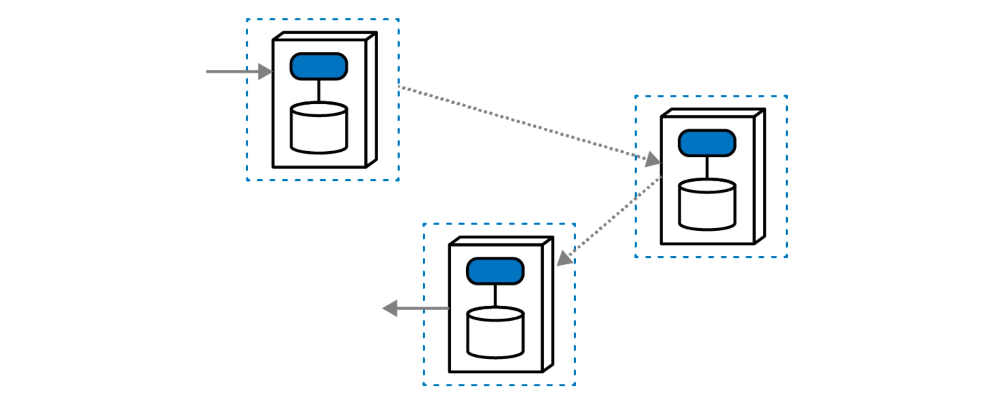

* [Saga Pattern](#saga-pattern)
  * [Epic Saga](#epic-saga)
  * [Phone Tag Saga](#phone-tag-saga)
  * [Fairy Tale Saga](#fairy-tale-saga)
  * [Time Travel Saga](#time-travel-saga)
  * [Fantasy Fiction Saga](#fantasy-fiction-saga)
  * [Horror Story Saga](#horror-story-saga)
  * [Parallel Saga](#parallel-saga)
  * [Anthology Saga](#anthology-saga)

# Saga Pattern

The saga pattern is a design pattern used in distributed systems and microservices architecture to manage long-lived transactions and maintain data consistency across multiple services. It helps address the challenges of handling complex, multi-step business transactions in a distributed environment.

In the saga pattern, a business transaction is divided into a series of smaller, isolated steps or "saga steps." Each step is associated with a service responsible for its execution. If a step fails, compensating transactions are defined to undo the effects of the previous steps, ensuring a consistent state across the system.

This pattern is particularly useful in scenarios where traditional two-phase commit protocols might be impractical due to their blocking nature and potential for distributed system failures. Sagas allow for more flexibility and can be implemented using various approaches, such as choreography (events-based communication between services) or orchestration (a central coordinator managing the flow of the saga).

Understanding [__dynamic coupling__](modularity/coupling/README.md#dynamic-coupling) is very important for understanding different types of saga patterns.

## Epic Saga

Sync, Atomic, Orchestration

## Phone Tag Saga

Sync, Atomic, Choreography

## Fairy Tale Saga

Sync, Eventual, Orchestration

## Time Travel Saga

Sync, Eventual, Choreography

## Fantasy Fiction Saga

Async, Atomic, Orchestration

## Horror Story Saga

Async, Atomic, Choreography

## Parallel Saga

Async, Eventual, Orchestration

## Anthology Saga

Async, Eventual, Choreography

