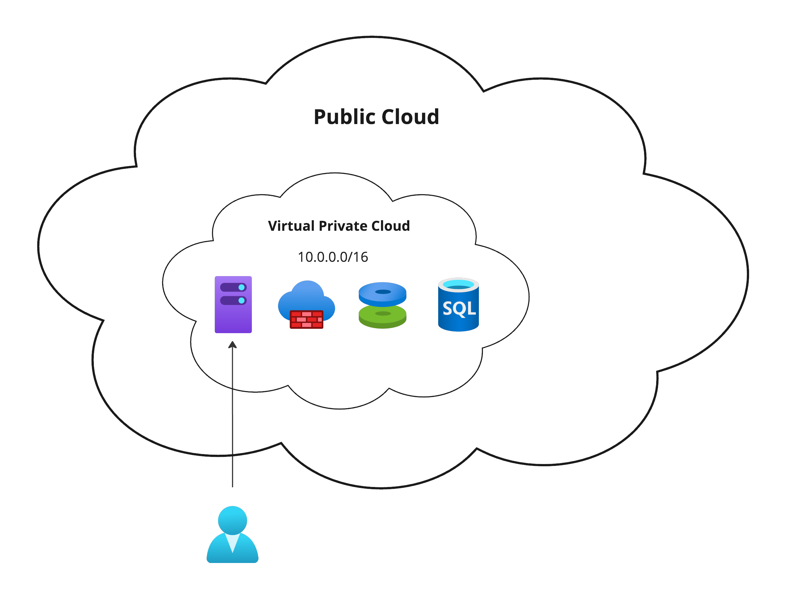
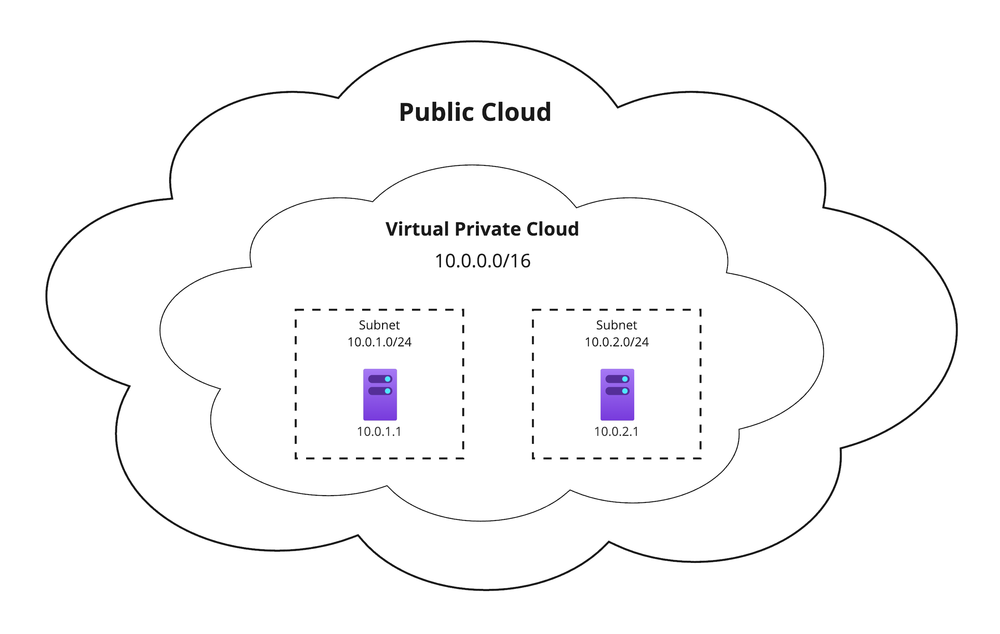
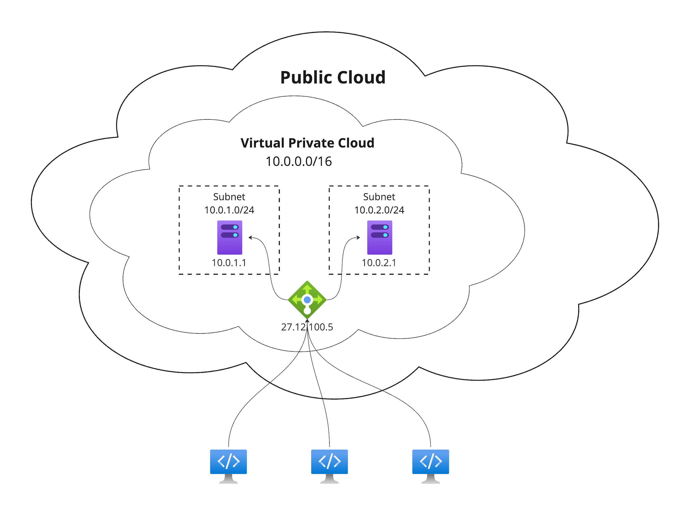

# Cloud Resources

## Virtual Private Cloud

A __Virtual Private Cloud__ (__VPC__) is a cloud computing service model that provides a private and isolated section of a cloud provider's infrastructure to users. It allows organizations to create a logically isolated network within the cloud, where they can deploy and run their applications and services.

Key features of a Virtual Private Cloud typically include:

1. __Isolation__: VPCs offer a level of isolation from other users or tenants on the same cloud platform. This isolation is achieved through the use of virtualization technologies and network segmentation.

2. __Customization__: Users can customize the VPC's network configuration, including IP address ranges, subnets, and routing tables, to meet their specific requirements.

3. __Security__: VPCs often come with built-in security features such as firewalls and access control lists (ACLs) to control inbound and outbound traffic. Additionally, users can deploy their security measures within the VPC.

4. __Scalability__: VPCs are designed to be scalable, allowing users to easily scale their infrastructure based on demand by adding or removing resources within the virtual network.

5. __Connectivity__: VPCs can be connected to on-premises data centers or other VPCs through secure network connections, providing flexibility in designing hybrid cloud architectures.

### Examples

* Amazon Virtual Private Cloud - https://aws.amazon.com/vpc/
* Azure Virtual Network - https://azure.microsoft.com/en-us/products/virtual-network
* GCE Virtual Private Cloud - https://cloud.google.com/vpc
* Hetzner Network - https://docs.hetzner.com/cloud/networks/overview

## Subnet

__Subnet__ is a segmented portion of a larger network, typically within a virtual private cloud (VPC) or a similar cloud infrastructure. Subnetting allows you to divide a large network into smaller, more manageable parts for better organization and security. Each subnet operates as its own network with its own IP addresses and can have specific rules and configurations.

### Examples

* Amazon Virtual Private Cloud Subnets - https://docs.aws.amazon.com/vpc/latest/userguide/configure-subnets.html
* Azure Virtual Network Subnets - https://learn.microsoft.com/en-us/azure/virtual-network/network-overview#virtual-network-and-subnets
* GCE Virtual Private Cloud Subnets - https://cloud.google.com/vpc/docs/subnets
* Hetzner Network Subnets - https://docs.hetzner.com/cloud/networks/overview#networks

## Server Instance

__Cloud server instance__ is a virtual server hosted on a cloud computing platform. Cloud server instances are created and managed in a virtualized environment, allowing users to access computing resources such as CPU, memory, and storage over the internet.

Here are some key points about cloud server instances:

1. __Virtualization__: Cloud server instances are created through virtualization, where physical hardware is divided into multiple virtual machines (VMs) or instances. Each instance operates as an independent server with its own operating system.

2. __On-Demand Resources__: Cloud server instances can be provisioned and de-provisioned on-demand, allowing users to scale their computing resources based on their requirements. This flexibility is a key advantage of cloud computing.

3. __Pay-as-You-Go Model__: Cloud providers typically follow a pay-as-you-go pricing model, where users pay for the resources they consume. This eliminates the need for large upfront investments in hardware.

4. __Variety of Configurations__: Cloud providers offer a variety of instance types with different configurations, such as varying amounts of CPU, memory, and storage. Users can choose the instance type that best suits their specific application requirements.

### Examples

* Amazon Elastic Cloud Computing (EC2) - https://aws.amazon.com/ec2/
* Azure Virtual Machines - https://azure.microsoft.com/en-us/products/virtual-machines
* GCE Compute Engine - https://cloud.google.com/compute
* Hetzner Servers - https://docs.hetzner.com/cloud/servers/overview

## Block Storage

__Block storage__ is a type of storage solution provided by cloud service providers for virtual machines (VMs) or servers in the cloud. Block storage is a raw storage volume that can be attached to a cloud server, and it operates at the block level, allowing for more granular control over storage configurations.

Key points about block storage:

1. __Scalability__: Cloud block storage can be easily scaled up or down based on the storage requirements of your applications.

2. __Performance__: It often provides high-performance storage, suitable for applications that require fast and consistent I/O operations.

3. __Independence__: Block storage is independent of the server it's attached to, making it a flexible and versatile storage solution. It can be attached to one server at a time, allowing for easy detachment and reattachment to other servers.

4. __Snapshots__: Many cloud providers offer snapshot capabilities, allowing you to create point-in-time copies of your block storage volume. This is useful for data backup and recovery.

5. __Redundancy__: Cloud providers typically implement redundancy measures to ensure data durability and availability. This may involve replicating data across multiple physical locations or data centers.

### Examples

* Amazon Elastic Block Store - https://aws.amazon.com/ebs/
* Azure Blob Storage - https://azure.microsoft.com/en-us/products/storage/blobs
* GCE Persistent Disk - https://cloud.google.com/persistent-disk
* Hetzner Volumes - https://docs.hetzner.com/cloud/volumes/overview

## Firewall

__Cloud network firewall__ is a security feature that helps protect your cloud-based infrastructure from unauthorized access and potential cyber threats. It acts as a barrier between your cloud servers and the internet, monitoring and controlling incoming and outgoing network traffic based on predetermined security rules.

Firewalls enable you to implement security policies to protect your servers. This may include blocking certain types of traffic, such as specific ports or protocols known to be vulnerable.

### Examples

* AWS Network Firewall - https://aws.amazon.com/network-firewall/
* Azure Firewall - https://azure.microsoft.com/en-us/products/azure-firewall
* GCE VPC Firewall Rules - https://cloud.google.com/firewall/docs/firewalls
* Hetzner Firewalls - https://docs.hetzner.com/cloud/firewalls/overview

## Load Balancer

__Load balancer__ is a technology that distributes incoming network traffic across multiple servers to ensure no single server bears too much demand. This helps in optimizing resource utilization, maximizing throughput, minimizing response time, and preventing server overload.

In cloud computing, load balancing is often implemented through a cloud load balancer, a service provided by cloud providers. These load balancers can be either hardware or software-based and are designed to efficiently distribute incoming application traffic across multiple servers or resources.

Key features of cloud load balancers include:

1. __Traffic Distribution__: Distributes incoming traffic evenly across multiple servers to ensure no single server is overwhelmed.

2. __High Availability__: Ensures that if one server fails, traffic is automatically redirected to healthy servers to maintain application availability.

3. __Scalability__: Easily scales with increased traffic or growing infrastructure by adding more servers without affecting the overall performance.

4. __Health Monitoring__: Monitors the health of servers and directs traffic only to healthy instances, preventing requests from being sent to a malfunctioning server.

5. __TLS Termination__: Manages TLS encryption and decryption, offloading this process from the application servers to improve performance.

6. __Session Persistence__: Maintains the user's session with a specific server to ensure continuity for applications that require it.

### Examples

* AWS Elastic Load Balancing - https://aws.amazon.com/elasticloadbalancing/
* Azure Load Balancer - https://azure.microsoft.com/en-us/products/load-balancer
* GCE Cloud Load Balancing - https://cloud.google.com/load-balancing
* Hetzner Load Balancers - https://docs.hetzner.com/cloud/load-balancers/overview

#cloud-resources
