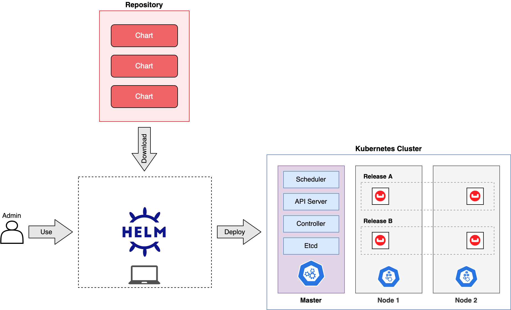

# Helm

Helm is a package manager for Kubernetes, which is an open-source platform for automating deployment, scaling, and management of containerized applications.

Helm helps in simplifying the deployment and management of applications on Kubernetes clusters by allowing users to define, install, and upgrade complex applications and services using pre-configured packages called __charts__. These charts encapsulate all the resources required for running an application, such as Kubernetes manifests, container images, configurations, and dependencies.

With Helm, users can easily share, discover, and reuse application configurations and components, making it a popular tool in the Kubernetes ecosystem for managing the complexity of deploying applications in containerized environments.

## Charts

A Helm chart is a package definition for Kubernetes. Helm charts are used to define, install, and manage Kubernetes applications. Essentially, they provide a convenient way to package, distribute, and manage applications and their dependencies in Kubernetes environments.

Here's a breakdown of the key components of a Helm chart:

1. __Chart.yaml__. This file contains metadata about the chart, including its name, version, description, maintainers, and other relevant information.

2. __values.yaml__. This file defines customizable parameters that can be overridden when the chart is installed. It allows users to customize the behavior of the chart without modifying its code.

3. __Templates__. These are Kubernetes manifest files (such as YAML files) with placeholders that are dynamically filled in during installation. Templates enable the chart to be deployed with varying configurations based on the values provided.

4. __Charts__. Helm charts can be composed of other charts, allowing for modularity and reusability. Charts can be included as dependencies within a parent chart.

5. __Templates Functions and Helpers__. Helm provides a set of built-in functions and helpers that can be used within templates to perform tasks such as conditionals, loops, and variable manipulation.

## Releases

Helm release refers to an instance of a Helm chart being deployed onto a Kubernetes cluster.

Helm chart is a package of pre-configured Kubernetes resources, such as deployments, services, and ingresses, packaged together for easy deployment. When you install a Helm chart onto a Kubernetes cluster, it creates a Helm release, which represents the deployment of that chart onto the cluster.

Helm releases can be managed, upgraded, rolled back, and deleted using Helm commands, providing a convenient way to handle the lifecycle of applications deployed on Kubernetes. This abstraction allows for easier management and versioning of applications, especially in complex Kubernetes environments.

## Repositories

Helm repository can be thought of as a centralized location where Helm charts are stored and made available for deployment. It can be hosted publicly or privately, and it allows users to easily search for, retrieve, and install charts using Helm commands.

Public repositories like Artifact Hub provide a wide range of charts for common applications and services, while organizations may also maintain private repositories to store and distribute proprietary or specialized charts tailored to their specific needs.

In summary, a Helm repository is a vital component of the Helm ecosystem, serving as a hub for sharing and distributing Kubernetes applications packaged as Helm charts.

## Architecture

## Common Commands

* __helm install__. Installs a chart onto your Kubernetes cluster.

Example: `helm install my-release stable/nginx-ingress`

* __helm uninstall__. Uninstalls a release from your Kubernetes cluster.

Example: `helm uninstall my-release`

* __helm upgrade__. Upgrades a release to a new version of the chart.

Example: `helm upgrade my-release stable/nginx-ingress`

* __helm list__. Lists releases installed on the cluster.

Example: `helm list`

* __helm status__. Displays the status of a release.

Example: `helm status my-release`

* __helm history__. Displays the release history.

Example: `helm history my-release`

* __helm repo add__. Adds a chart repository.

Example: `helm repo add stable https://charts.helm.sh/stable`

* __helm repo update__: Updates local cache with the latest charts from all configured chart repositories.

Example: `helm repo update`

* __helm dependency update__: Updates any dependencies of a chart.

Example: `helm dependency update ./my-chart`

* __helm package__: Packages a chart directory into a chart archive.

Example: `helm package ./my-chart`

#helm
