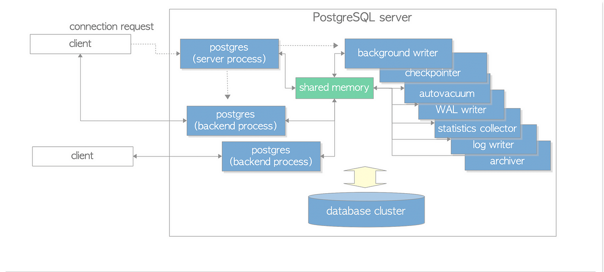

# PostgreSQL

PostgreSQL is an advanced, enterprise-class, and open-source relational database system. PostgreSQL supports both SQL (relational) and NoSQL (non-relational) querying.

The PostgreSQL project started in 1986 at Berkeley Computer Science Department, University of California.

The project was originally named POSTGRES, in reference to the older Ingres database which also developed at Berkeley. The goal of the POSTGRES project was to add the minimal features needed to support multiple data types.

In 1996, the POSTGRES project was renamed to PostgreSQL to clearly illustrate its support for SQL. Today, PostgreSQL is commonly abbreviated as Postgres.

Since then, the PostgreSQL Global Development Group, a dedicated community of contributors continues to make the releases of the open-source and free database project.

## Features

* __Expansive Data Types and Extensibility__. PostgreSQL offers a large variety of built-in data types and extensibility. These features allow programmers to define their own custom data types. Moreover, PostgreSQL supports advanced data types, including arrays, JSON, hstore, and geometric kinds, making it possible to store and manipulate complex data effectively.

* __Transaction Support__. PostgreSQL adheres to the ACID (Atomicity, Consistency, Isolation, Durability) principles, guaranteeing trustworthy and reliable transaction support. It supports layered transactions, savepoints, and various transaction isolation levels and offers explicit transaction control.

* __Concurrency Control__. Another great feature of PostgreSQL is its concurrency control. It offers multi-version concurrency control (MVCC), which PostgreSQL uses, to ensure high concurrency. Using multi-version concurrency avoids conflicts and maintains data integrity while allowing numerous transactions to access the database at once.

* __Advanced Querying Capabilities__. PostgreSQL has robust querying features, including support for recursive queries, common table expressions (CTEs), subqueries, complicated SQL queries, and window functions. Additionally, it supports user-defined functions (UDFs), triggers, and stored procedures in a number of programming languages.

* __Full-Text Search and Indexing__. PostgreSQL has a variety of indexes, including B-tree, hash, GIN, and generic search trees (GiST). These indexes improve query performance and provide practical data sorting and searching capabilities. Furthermore, PostgreSQL has strong full-text search capabilities with stemming, ranking, and phrase-searching support.

* __Replication and High Availability__. PostgreSQL supports various replication strategies, including asynchronous streaming, logical, and synchronous replication. In dispersed contexts, these qualities provide data redundancy, fault tolerance, and high availability.

* __Security and Authentication__. PostgreSQL is highly secure because of its advanced security features. It offers robust security features, such as SSL encryption, username/password authentication, LDAP authentication, Kerberos authentication, role-based access control (RBAC), and row-level security (RLS). Additionally, it offers capabilities for auditing and reporting database activity.

## Advantages

* __Open-Source__. PostgreSQL is an open-source database that provides affordable solutions without a license charge. Developers can look at and alter the source code, encouraging creativity, security, and adaptability.

* __Customizability and Extensibility__. Thanks to PostgreSQL's design, programmers can add new custom data types, operators, and functions to the database to expand its capability. It is also helpful for managing particular data types or developing domain-specific features because of its extensibility.

* __Data Integrity and Reliability__. PostgreSQL maintains data integrity by enforcing constraints, verifying data types, and enabling referential integrity through foreign vital regulations. In order to reduce the danger of data loss, it also offers write-ahead logging (WAL) and crash recovery procedures.

* __Performance and Scalability__. PostgreSQL is built to manage demanding workloads and large-scale applications. Sharding facilitates horizontal scalability and offers performance-enhancing tools like query planning, caching, and parallel query execution.

* __Strong Community Support__. The users, administrators, and developers of PostgreSQL form a dynamic and engaged community. This form of community-driven development guarantees ongoing development, issue fixes, and timely updates. It also offers a variety of documentation, extensions developed by the community, and resources.

## Architecture

## Links

* https://www.postgresql.org/
* https://www.postgresql.org/about/featurematrix/

#postgresql
