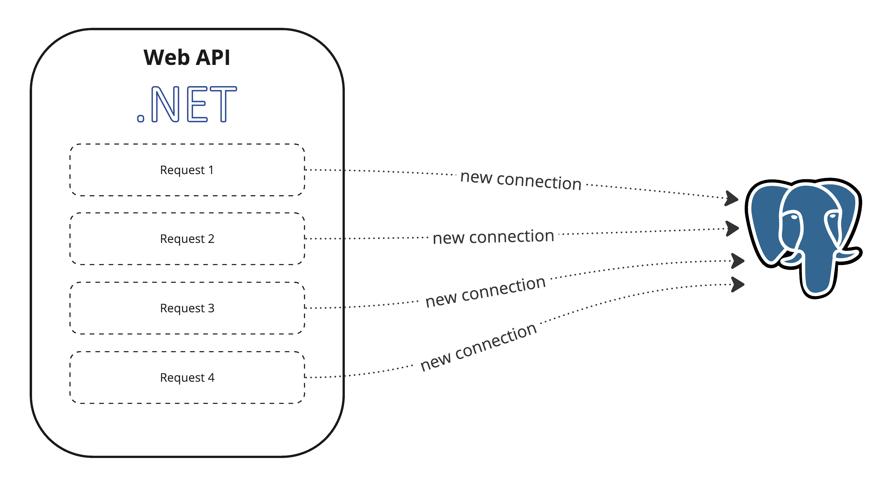
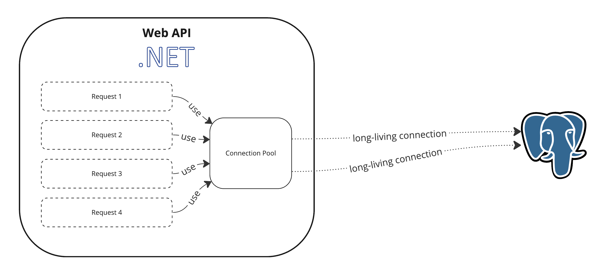
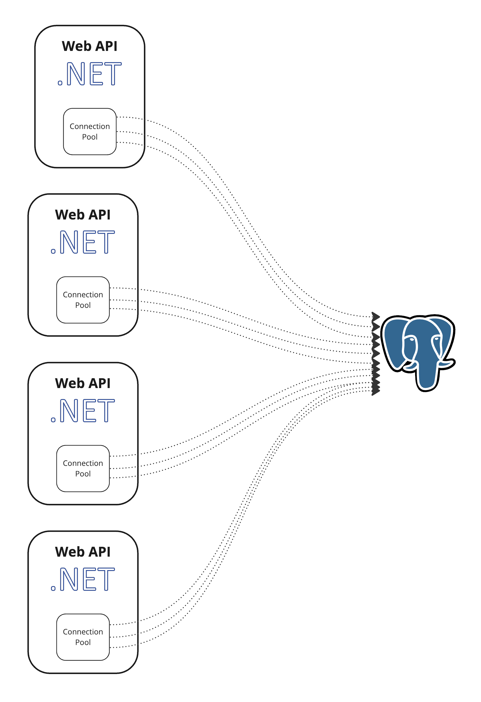
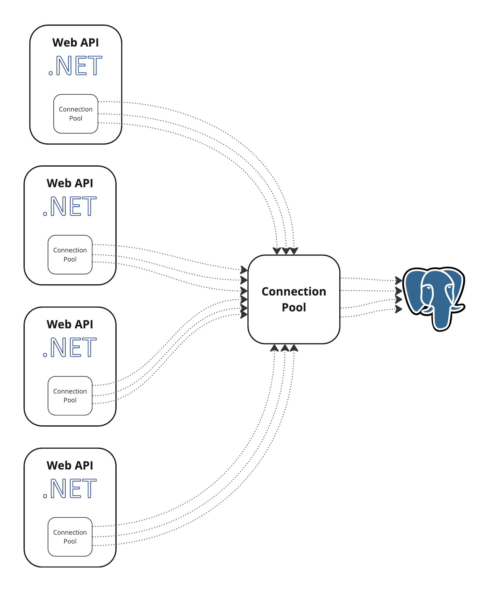
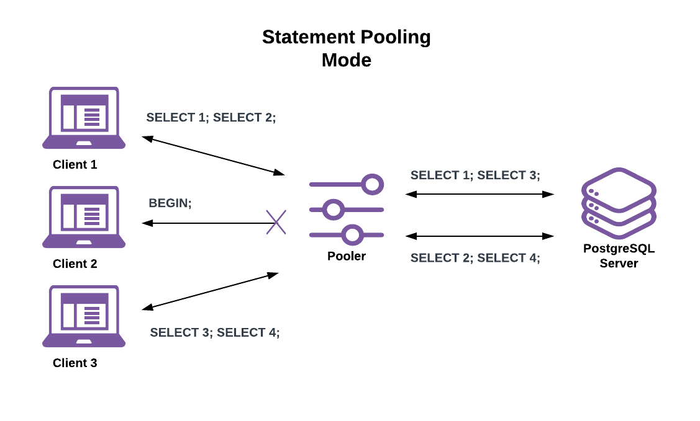
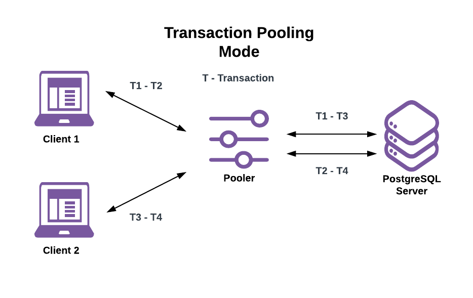
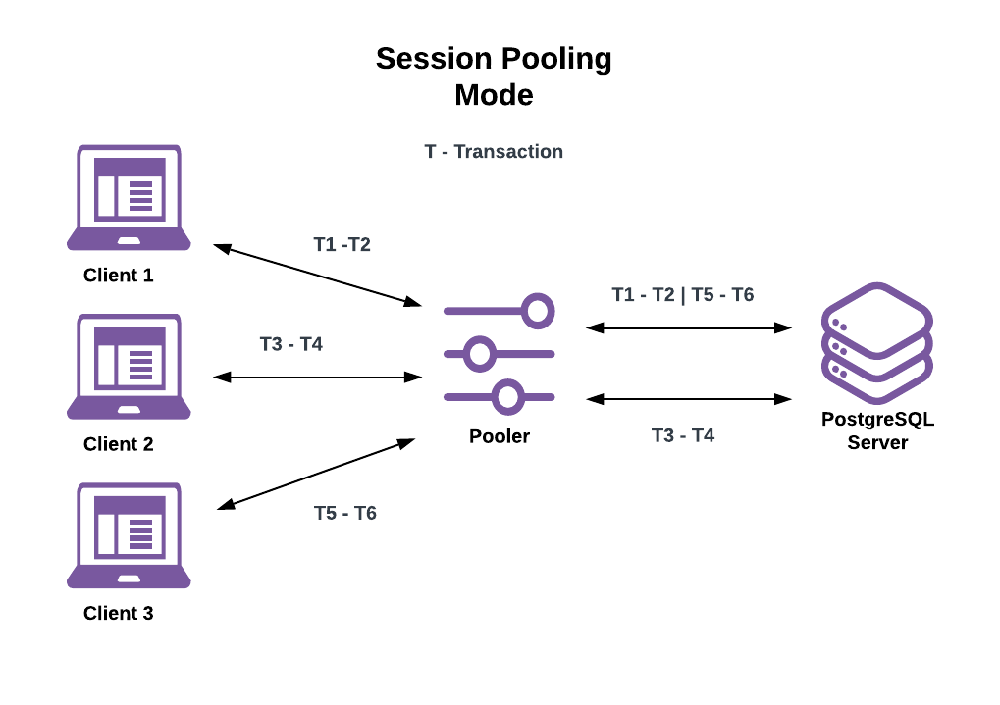

# PostgreSQL Connections

## Listening Addresses Management

To configure PostgreSQL to listen on a specific IP address, you need to modify the `postgresql.conf` file. Follow these steps:

1. __Create or edit `postgresql.auto.conf`__:

Locate directory `/var/lib/postgresql/{version}/main`. Create or edit `postgresql.auto.conf` file in a text editor with administrative privileges. This file overrides parameters in `postgresql.conf` file.

3. __Create or find `listen_addresses` section__:

Look for the `listen_addresses` parameter in the file. It may be commented out (with a `#` at the beginning of the line). If it's commented, uncomment the line.

4. __Configure IP address__:

Set the `listen_addresses` parameter to the IP address you want PostgreSQL to listen on. If you want it to listen on all available IP addresses, set it to `'*'`.

Example:

```ini
listen_addresses = '192.168.1.100'      # comma-separated list of addresses
```

or for all addresses:

```ini
listen_addresses = '*'      # Listen on all available IP addresses
```

5. __Save and close file__:

Save the changes and close the `postgresql.auto.conf` file.

6. __Restart PostgreSQL__:

After making these changes, you need to restart the PostgreSQL server for the new configuration to take effect.
On Linux, you can use:

```sh
sudo service postgresql restart
```

On Windows, you can use the Services application to restart the PostgreSQL service.

## Client Access Management

1. __Locate file `pg_hba.conf`__:

It is in the same directory as `postgresql.conf`.

2. __Add access rule__:

Add line `host db_name role_name client_ip/32 scram-sha-256` to `pg_hba.conf`, where:

* `db_name` is the name of the DB to allow connections to.

* `role_name` is the name of role to allow connections for.

* `client_ip` is IP address of the host to allow connections from.

3. __Save and close file__.

4. __Restart PostgreSQL__.

## Connection Pools

Connection pooling is a technique used to efficiently manage and reuse database connections, which can help improve the performance of database interactions in applications. Instead of opening and closing a new database connection for each database operation, a connection pool maintains a pool of pre-established connections that can be reused, reducing the overhead of opening and closing connections repeatedly.

No connection pool:



In-process connection pool:



### Npgsql Connection Pool

When working with Npgsql, you may configure parameters such as the minimum and maximum number of connections, idle connection timeout, and other settings to fine-tune the behavior of the connection pool based on the requirements of your application.

Connection string parameters to tune an application pool:

Parameter                   | Description                                | Default
----------------------------|--------------------------------------------|--------
Pooling                     | Whether connection pooling should be used. | true
Minimum Pool Size           | The minimum connection pool size.          | 0
Maximum Pool Size           | The maximum connection pool size.          | 100
Connection Idle Lifetime    | The time (in seconds) to wait before closing idle connections in the pool if the count of all connections exceeds `Minimum Pool Size`. | 300
Connection Pruning Interval | How many seconds the pool waits before attempting to prune idle connections that are beyond idle lifetime. | 10
Connection Lifetime         | The total maximum lifetime of connections (in seconds). Connections which have exceeded this value will be destroyed instead of returned from the pool. This is useful in clustered configurations to force load balancing between a running server and a server just brought online. | 0 (disabled)

Example:

```
Host=postgres;Database=mydb;Username=user;Password=123456789;Maximum Pool Size=50;Connection Idle Lifetime=60;
```

### External Connection Pools

External connection pooling in PostgreSQL refers to the practice of managing and reusing database connections in an external process specially tailored for this.

External connection pooling helps to decrease open connection count in environments with multiple client applications.

No external connection pool:



External connection pool:



External connection pool tools include pgBouncer, pgpool-II, Yandex Odyssey.

#### pgBouncer

pgBouncer is a lightweight connection pooler for PostgreSQL databases. It is designed to improve scalability and resource utilization in situations where a large number of clients need to connect to a PostgreSQL database. The main purpose of pgBouncer is to manage database connections efficiently, reducing the overhead associated with establishing new connections for each client.

pgBouncer modes:

1. __Statement Mode__. This is a less common mode where pgBouncer pools connections at the statement level. Each SQL statement is treated as a separate transaction, and connections are released back to the pool after executing a statement. This mode is less common and may not be suitable for all applications.



2. __Transaction Mode__. In this mode, pgBouncer pools database connections at the transaction level. When a client connects to pgBouncer, it gets a connection from the pool and can use it for the duration of a transaction. Once the transaction is completed, the connection is returned to the pool for reuse by another client.



3. __Session Mode__. This mode pools connections at the session level. When a client connects to pgBouncer, it gets a dedicated connection for its entire session. The connection is only released back to the pool when the client disconnects.



## Links

* MUST READ - https://jpcamara.com/2023/04/12/pgbouncer-is-useful.html
* https://www.postgresql.org/docs/current/runtime-config-connection.html
* https://www.postgresql.org/docs/current/auth-pg-hba-conf.html
* https://www.npgsql.org/doc/connection-string-parameters.html#pooling
* https://www.digitalocean.com/community/tutorials/managed-databases-connection-pools-and-postgresql-benchmarking-using-pgbench
* https://devcenter.heroku.com/articles/best-practices-pgbouncer-configuration

#postgresql-connections
