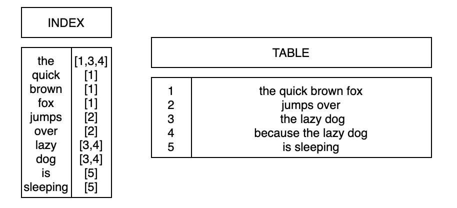

# PostgreSQL JSON

PostgreSQL has robust support for JSON data, allowing you to store, query, and manipulate JSON documents efficiently. Here are the key aspects of PostgreSQL's JSON support:

1. __`JSON` data type__:

PostgreSQL provides a dedicated `JSON` data type to store JSON data. There is also a `JSONB` type, which is a binary representation of JSON data and offers additional indexing and query optimization.

`JSONB` is the preferred type since it stored JSON records in a parsed binary format.

2. __JSON functions__:

PostgreSQL offers a variety of functions for working with JSON data. These include functions for extracting values, navigating the JSON structure, and manipulating JSON objects.

Example Functions:

* `->` and `->>`: Used for extracting a specific element or a field from a JSON object.

* `#>` and `#>>`: Used for extracting a nested element or field.

* `json_agg`: Aggregates values into a JSON array.

* `json_object_agg`: Aggregates key-value pairs into a JSON object.

3. __Indexing and query optimization__:

For the JSONB type, PostgreSQL allows indexing on specific keys, which can significantly improve query performance. This makes it suitable for scenarios where efficient querying of JSON data is crucial.

Example Index:

```sql
CREATE INDEX idx_name ON table_name USING GIN (jsonb_column_name);
```

4. __Querying JSON data__:

PostgreSQL supports querying JSON data using the SQL language. You can filter and search for specific values, as well as aggregate and manipulate JSON documents within SQL queries.

Example Query:

```sql
SELECT * FROM table_name WHERE json_column_name->>'key' = 'value';
```

5. __JSON path expressions__:

PostgreSQL supports JSON path expressions for more complex queries. You can use the @> operator along with a JSON path expression to filter data based on specific criteria.

Example Path Expression:

```sql
SELECT * FROM table_name WHERE json_column_name @> '{"path": {"to": "value"}}';
```

6. __JSON Aggregation__:

PostgreSQL allows you to aggregate JSON data using various functions, making it easy to perform operations on arrays or objects.

Example Aggregation:

```sql
SELECT json_agg(column_name) FROM table_name;
```

These features make PostgreSQL a powerful choice for applications that require flexible and efficient handling of JSON data.

## Generalized Inverted Index (GIN)

__GIN__ stands for __Generalized Inverted Index__. GIN is designed for handling cases where the items to be indexed are composite values, and the queries to be handled by the index need to search for element values that appear within the composite items. For example, the items could be documents, and the queries could be searches for documents containing specific words.

Here are some key points about PostgreSQL GIN:

* __Array searching__: GIN indexes are especially beneficial when you need to search for values within arrays. They efficiently handle queries involving array containment, overlap, and other array-related operations.

* __Full-Text search__: GIN indexes can be used to accelerate full-text search operations, making them a good choice when dealing with text-based data.

* __JSONB data type__: GIN indexes are commonly used with the JSONB data type in PostgreSQL, enabling fast and efficient querying of JSONB documents.

* __Extensibility__: GIN is extensible, allowing developers to create custom operators and strategies for indexing specific data types.

Simplified GIN structure:



## Links

* https://www.postgresql.org/docs/current/datatype-json.html
* https://medium.com/@suffyan.asad1/an-introduction-to-working-with-json-data-in-postgresql-730aa889c5d3
* https://www.postgresql.org/docs/current/gin.html
* https://towardsdatascience.com/how-gin-indices-can-make-your-postgres-queries-15x-faster-af7a195a3fc5

#postgresql-json
