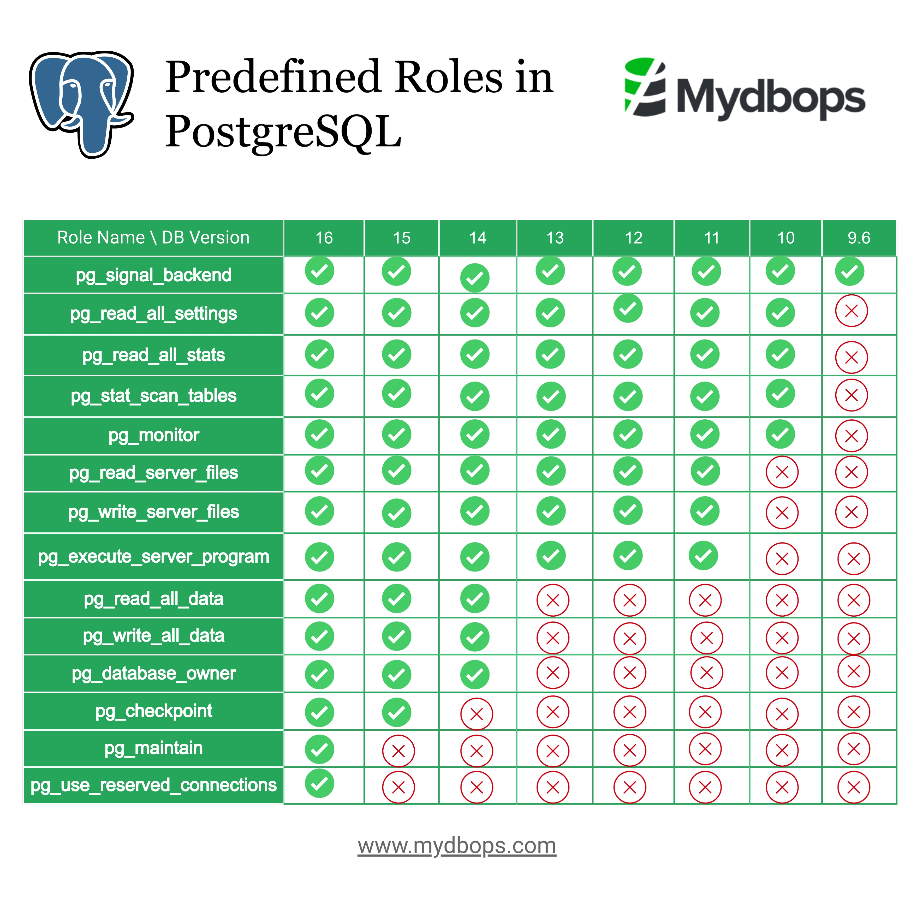

# PostgreSQL Roles

PostgreSQL roles are a fundamental aspect of managing access control and permissions within a PostgreSQL database system. Roles can be thought of as database users or groups of users, and they help control who can access the database and what actions they can perform.

Here are some key points about PostgreSQL roles:

* __User Roles__: In PostgreSQL, roles can be either a user or a group. Users are individual database users, while groups are collections of users.

* __Superuser Role__: The superuser role has special privileges and can perform any action in the database. It is generally used for database administration tasks.

* __Login Role__: A role can be a login role, which means that users with this role can connect to the database. Not all roles need to be login roles.

* __Role Permissions__: Roles can be assigned various permissions, such as the ability to create or modify objects within the database (tables, views, etc.), or the ability to connect to the database.

* __Role Hierarchy__: PostgreSQL supports role hierarchies, allowing roles to inherit permissions from other roles. This simplifies the management of permissions for large user populations.

* __Default Roles__: PostgreSQL has some predefined roles, such as `pg_read_all_data` and `pg_write_all_data`, which provide read and write access across all databases.

* __Role Management__: Roles can be created, modified, and deleted using SQL commands such as `CREATE ROLE`, `ALTER ROLE`, and `DROP ROLE`.

## Operations

1. __Create role__:

```sql
CREATE ROLE role_name;
```

2. __Create role with password__:

```sql
CREATE ROLE role_name WITH LOGIN PASSWORD 'password';
```

3. __Alter role (change password)__:

```sql
ALTER ROLE role_name WITH PASSWORD 'new_password';
```

4. __Grant role to another role__:

```sql
GRANT role_name TO other_role;
```

5. __Revoke role from another role__:

```sql
REVOKE role_name FROM other_role;
```

6. __Drop role__:

```sql
DROP ROLE role_name;
```

## `LOGIN` and `NOLOGIN` Roles

A `NOLOGIN` role can be seen as a user group. The idea is to attach all privileges to a group rather than to individual users, which has several advantages:

* It is possible to drop the user, because it does not have any privileges.

* It is less work to add a user to a group or remove a user from a group than to grant or revoke lots of permissions whenever you have to add a user or change its privileges.

* There is no danger of having so many individual ACL entries attached to a single database object that it becomes impossible to add more permissions (the whole metadata row has to fit into a single 8kB block).

To create a `LOGIN` role:

```sql
CREATE ROLE role_name WITH LOGIN PASSWORD 'password';
```

To create a `NOLOGIN` role:

```sql
CREATE ROLE role_name;
```

## Privileges

When an object is created, it is assigned an owner. The owner is normally the role that executed the creation statement. For most kinds of objects, the initial state is that only the owner (or a superuser) can do anything with the object. To allow other roles to use it, __privileges__ must be granted.

The available privileges are:

* __`SELECT`__:

Allows `SELECT` from any column, or specific column(s), of a table, view, materialized view, or other table-like object. Also allows use of `COPY TO`. This privilege is also needed to reference existing column values in `UPDATE`, `DELETE`, or `MERGE`. For sequences, this privilege also allows use of the `currval` function. For large objects, this privilege allows the object to be read.

* __`INSERT`__:

Allows `INSERT` of a new row into a table, view, etc. Can be granted on specific column(s), in which case only those columns may be assigned to in the `INSERT` command (other columns will therefore receive default values). Also allows use of `COPY FROM`.

* __`UPDATE`__:

Allows `UPDATE` of any column, or specific column(s), of a table, view, etc. (In practice, any nontrivial `UPDATE` command will require `SELECT` privilege as well, since it must reference table columns to determine which rows to update, and/or to compute new values for columns.) `SELECT ... FOR UPDATE` and `SELECT ... FOR SHARE` also require this privilege on at least one column, in addition to the `SELECT` privilege. For sequences, this privilege allows use of the nextval and setval functions. For large objects, this privilege allows writing or truncating the object.

* __`DELETE`__:

Allows `DELETE` of a row from a table, view, etc. (In practice, any nontrivial `DELETE` command will require `SELECT` privilege as well, since it must reference table columns to determine which rows to delete.)

* __`TRUNCATE`__:

Allows `TRUNCATE` on a table.

* __`REFERENCES`__:

Allows creation of a foreign key constraint referencing a table, or specific column(s) of a table.

* __`TRIGGER`__:

Allows creation of a trigger on a table, view, etc.

* __`CREATE`__:

For databases, allows new schemas and publications to be created within the database, and allows trusted extensions to be installed within the database.

For schemas, allows new objects to be created within the schema. To rename an existing object, you must own the object and have this privilege for the containing schema.

For tablespaces, allows tables, indexes, and temporary files to be created within the tablespace, and allows databases to be created that have the tablespace as their default tablespace.

Note that revoking this privilege will not alter the existence or location of existing objects.

* __`CONNECT`__:

Allows the grantee to connect to the database. This privilege is checked at connection startup (in addition to checking any restrictions imposed by `pg_hba.conf`).

* __`TEMPORARY`__:

Allows temporary tables to be created while using the database.

* __`EXECUTE`__:
 
Allows calling a function or procedure, including use of any operators that are implemented on top of the function. This is the only type of privilege that is applicable to functions and procedures.

* __`USAGE`__:

For procedural languages, allows use of the language for the creation of functions in that language. This is the only type of privilege that is applicable to procedural languages.

For schemas, allows access to objects contained in the schema (assuming that the objects' own privilege requirements are also met). Essentially this allows the grantee to “look up” objects within the schema. Without this permission, it is still possible to see the object names, e.g., by querying system catalogs. Also, after revoking this permission, existing sessions might have statements that have previously performed this lookup, so this is not a completely secure way to prevent object access.

For sequences, allows use of the `currval` and `nextval` functions.

For types and domains, allows use of the type or domain in the creation of tables, functions, and other schema objects. (Note that this privilege does not control all “usage” of the type, such as values of the type appearing in queries. It only prevents objects from being created that depend on the type. The main purpose of this privilege is controlling which users can create dependencies on a type, which could prevent the owner from changing the type later.)

For foreign-data wrappers, allows creation of new servers using the foreign-data wrapper.

For foreign servers, allows creation of foreign tables using the server. Grantees may also create, alter, or drop their own user mappings associated with that server.

* __`SET`__:

Allows a server configuration parameter to be set to a new value within the current session. (While this privilege can be granted on any parameter, it is meaningless except for parameters that would normally require superuser privilege to set.)

* __`ALTER SYSTEM`__:

Allows a server configuration parameter to be configured to a new value using the `ALTER SYSTEM` command.

### Commands

You can grant multiple privileges at once or use the keyword `ALL` to grant all privileges:

```sql
GRANT SELECT, INSERT, UPDATE ON table_name TO role_name;
-- or
GRANT ALL ON table_name TO role_name;
```

You can revoke privileges:

```sql
REVOKE SELECT, INSERT ON table_name FROM role_name;
-- or
REVOKE ALL ON table_name FROM role_name;
```

## Predefined Roles



## Links

* https://www.postgresql.org/docs/current/user-manag.html
* https://www.mydbops.com/blog/overview-of-predefined-roles-in-postgresql/
* https://www.postgresql.org/docs/current/ddl-priv.html

#postgresql-roles
