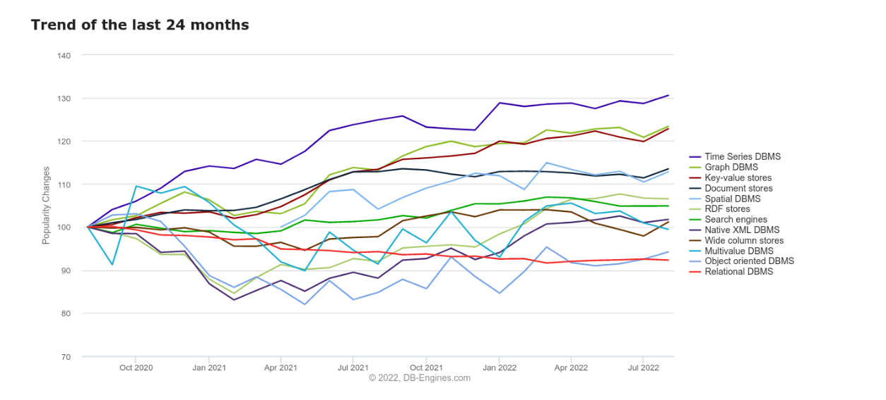
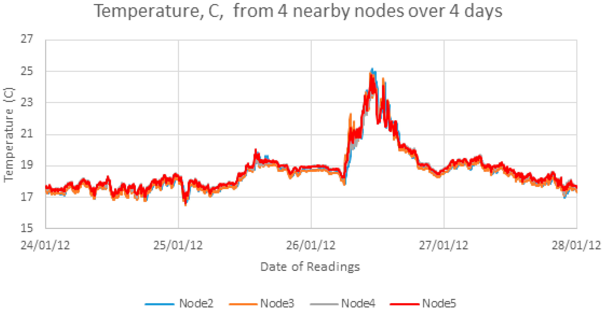

# TimescaleDB


TimescaleDB is an open-source time-series database optimized for fast ingest and complex queries. It is built on top of PostgreSQL, extending it to support time-series data with improved performance and scalability. TimescaleDB is designed to handle large amounts of data generated over time, making it suitable for applications such as monitoring, sensor data, and IoT (Internet of Things) applications.

## Time-series Data

Time-series data is a type of data that is collected or recorded over time, with each data point associated with a specific timestamp. In other words, it's a sequence of data points ordered chronologically. Time-series data is commonly used in various fields, such as finance, economics, signal processing, and environmental science, to analyze and make predictions based on patterns and trends over time.

Examples:






### Functions

Here are some common functions and techniques used in the context of time-series data:

1. __Resampling__: Changing the frequency of the data points, such as converting daily data to monthly data.

2. __Smoothing__: Techniques like moving averages to reduce noise and highlight trends in the data.

3. __Detrending__: Removing trends or seasonal components from the data to focus on the underlying patterns.

4. __Aggregation__: Grouping data points over a certain time period, often used for summarization or analysis.

5. __Forecasting__: Predicting future values of the time series based on historical patterns.

6. __Autocorrelation__: Examining the correlation of a time series with a lagged version of itself.

7. __Statistical Measures__: Calculating metrics like mean, median, standard deviation, etc., to describe the characteristics of the time series.

8. __Anomaly Detection__: Identifying unusual patterns or outliers in the time series data.

9. __Seasonal Decomposition__: Breaking down the time series into its trend, seasonal, and residual components.

## Capabilities

1. __Time-Series Hypertables__: TimescaleDB introduces the concept of hypertables, which are an extension of regular tables in PostgreSQL. Hypertables partition data across time and other dimensions for efficient storage and retrieval.

2. __Automated Time-Based Partitioning__: TimescaleDB automates the process of partitioning data into chunks based on time intervals. This helps in optimizing query performance and data management.

3. __Continuous Aggregations__: TimescaleDB supports continuous aggregations, which are precomputed summaries of data that can significantly improve query performance, especially for time-series data analytics.

4. __Advanced Time-Series Functions__: It provides a set of specialized time-series functions for performing operations on time-stamped data efficiently. These functions include window functions, interpolation, and alignment.

5. __Compression__: TimescaleDB uses data compression techniques to reduce storage requirements, which is crucial for handling large volumes of time-series data efficiently.

6. __High-Performance Queries__: TimescaleDB is optimized for fast and efficient querying of time-series data, making it suitable for real-time analytics and monitoring applications.

7. __Support for PostgreSQL Ecosystem__: Since TimescaleDB is an extension of PostgreSQL, it benefits from the rich ecosystem of tools, libraries, and extensions available for PostgreSQL.

8. __Open Source__: TimescaleDB is an open-source project, allowing users to inspect, modify, and contribute to its codebase. This openness fosters community collaboration and innovation.

## Example

Assuming you have TimescaleDB installed and a database created, let's create a simple table and ingest some time-series data.

```sql
-- Connect to your TimescaleDB-enabled database
\c your_database_name

-- Create a hypertable (a special kind of table for time-series data)
CREATE TABLE sensor_data (
    time        TIMESTAMPTZ       NOT NULL,
    sensor_id   INT               NOT NULL,
    temperature DOUBLE PRECISION  NULL,
    humidity    DOUBLE PRECISION  NULL
);

-- Convert the table to a hypertable
SELECT create_hypertable('sensor_data', 'time');
```

Now let's insert some sample data:

```sql
INSERT INTO sensor_data (time, sensor_id, temperature, humidity)
VALUES
  ('2024-01-18 12:00:00'::TIMESTAMPTZ, 1, 25.5, 60.0),
  ('2024-01-18 12:15:00'::TIMESTAMPTZ, 2, 26.0, 55.5),
  ('2024-01-18 12:30:00'::TIMESTAMPTZ, 1, 27.0, 58.0);
```

Now, let's run some queries:

* Basic SELECT:

```sql
SELECT * FROM sensor_data;
```

* Time-based Query:

```sql
SELECT * FROM sensor_data
WHERE time >= '2024-01-18 12:00:00' AND time <= '2024-01-18 12:30:00';
```

* Aggregation Query:

```sql
SELECT sensor_id, AVG(temperature) as avg_temp
FROM sensor_data
GROUP BY sensor_id;
```

* Time Bucketing:

```sql
SELECT time_bucket('15 minutes', time) as time_bucket, AVG(temperature) as avg_temp
FROM sensor_data
GROUP BY time_bucket
ORDER BY time_bucket;
```

## Areas of Use

1. __Internet of Things (IoT)__: TimescaleDB is well-suited for handling massive amounts of time-stamped data generated by IoT devices. It allows for efficient storage, retrieval, and analysis of sensor data, telemetry, and other time-series information.

2. __Monitoring and Observability__: TimescaleDB is widely used in monitoring systems, including application performance monitoring (APM), infrastructure monitoring, and network monitoring. It enables the storage and quick analysis of time-series metrics and logs.

3. __Financial Services__: In the financial industry, TimescaleDB can be used to store and analyze time-series data related to stock prices, market trends, trading activities, and other financial metrics. It provides a scalable solution for financial data analysis.

4. __Energy Management and Utilities__: TimescaleDB is employed in applications related to energy management and utilities for storing and analyzing time-series data from smart grids, energy consumption monitoring, and renewable energy sources.

5. __Healthcare and Medical Monitoring__: In healthcare, TimescaleDB can be used for storing time-series data from medical devices, patient monitoring systems, and healthcare applications. It facilitates the analysis of health-related metrics over time.

6. __Telecommunications__: TimescaleDB is used in the telecommunications industry to handle time-series data from network equipment, call records, and performance metrics. It helps in monitoring and optimizing network performance.

7. __Environmental Monitoring__: TimescaleDB is applicable in environmental monitoring applications, where time-series data from weather stations, environmental sensors, and climate monitoring devices are collected and analyzed.

8. __Supply Chain and Logistics__: TimescaleDB can be used to manage time-series data related to supply chain and logistics operations. This includes tracking inventory movements, monitoring transportation routes, and analyzing delivery performance.

9. __DevOps and CI/CD__: TimescaleDB is used in DevOps processes to store and analyze time-series data related to software builds, deployments, and system performance. It helps in identifying trends and issues in the development lifecycle.

## Links

* https://www.timescale.com/
