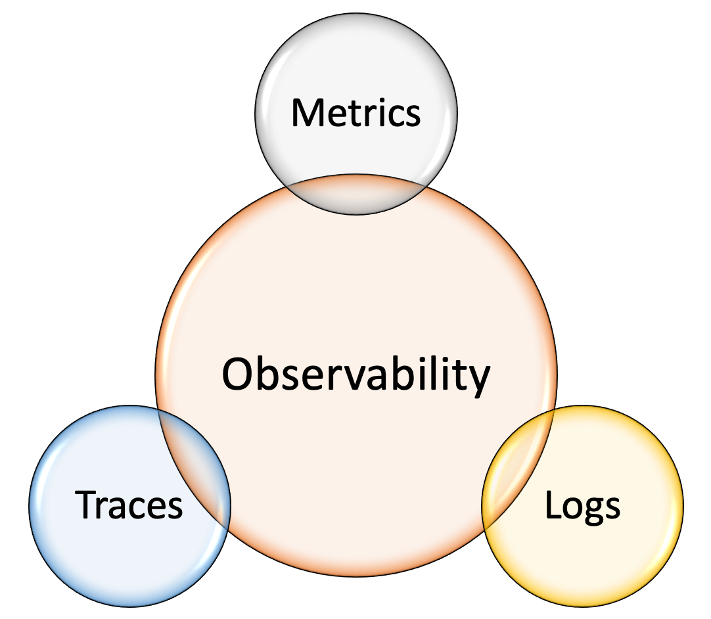
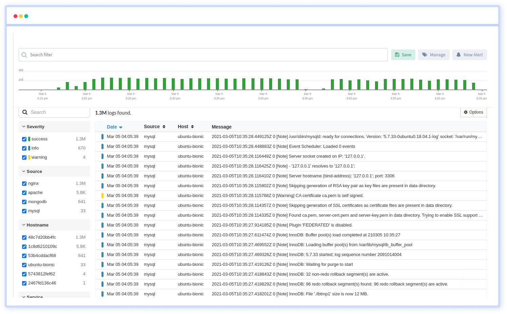
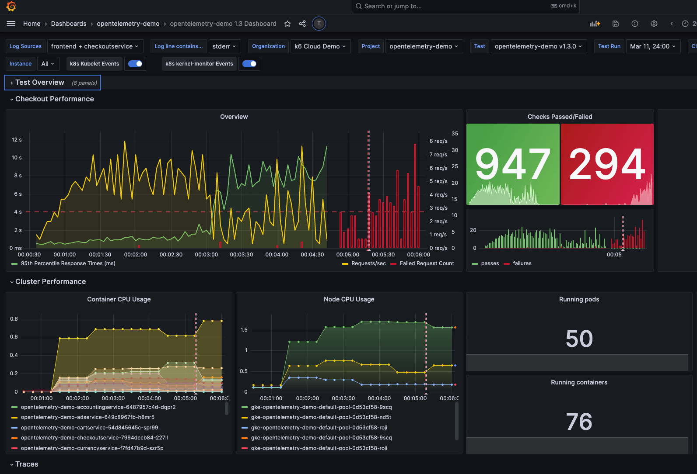
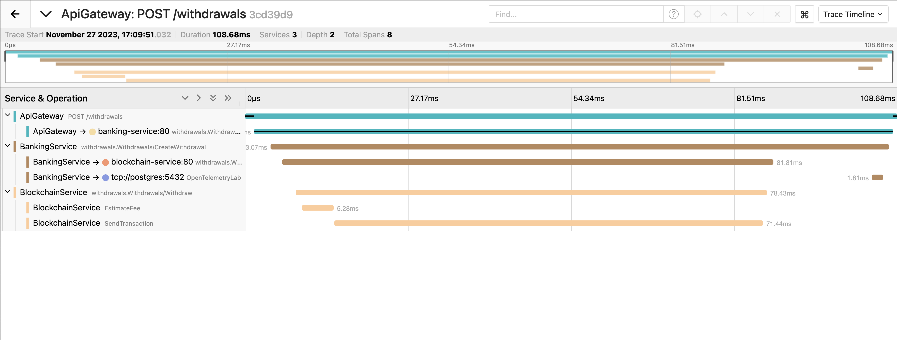

# Observability

Observability refers to the ability to understand and gain insights into the internal state of a system based on its external outputs or behaviors. In the context of software development and IT operations, observability is a key concept for monitoring and managing complex systems.

Observability involves collecting and analyzing data from various sources, such as logs, metrics, and traces, to gain a comprehensive understanding of how a system is performing. This information helps identify issues, troubleshoot problems, and optimize performance.

Key components of observability include:

1. __Logs__: Textual records of events and activities within a system, providing detailed information that can be used for debugging and analysis.

2. __Metrics__: Quantitative measurements that offer a high-level view of system performance, such as response times, error rates, and resource utilization.

3. __Traces__: A detailed record of the path a request takes through a system, showing how different components interact and contribute to overall performance.

By combining these elements, organizations can achieve a more holistic view of their systems, allowing for proactive problem-solving and improved overall performance. Observability is particularly important in modern, distributed, and microservices-based architectures where traditional monitoring approaches may fall short.

## Logs

Logs, in the context of observability, refer to structured records or messages generated by a system during its operation. These logs contain information about events, errors, warnings, and other relevant activities within the system. Logging is a fundamental aspect of observability, as it allows developers, operators, and other stakeholders to understand what is happening within the system and diagnose issues.

Key characteristics of logs in observability include:

1. __Structured Data__: Modern logging systems often encourage the use of structured log data. This means that logs are not just free-form text but are organized in a structured format, such as JSON or key-value pairs. Structured logs make it easier to parse and analyze the data.

2. __Timestamps__: Each log entry includes a timestamp to indicate when the event or activity occurred. This is crucial for understanding the sequence of events and for correlating logs with other telemetry data.

3. __Severity Levels__: Logs typically include a severity level (e.g., info, warning, error) to help prioritize and filter events based on their importance.

4. __Contextual Information__: Logs often include contextual information, such as request IDs, user IDs, or other metadata, to help link logs related to a specific operation or transaction.

## Metrics

In the context of observability, metrics are quantitative measurements that provide insight into the behavior and performance of a system. Observability metrics are crucial for monitoring, analyzing, and optimizing the operation of software applications and infrastructure. They help teams understand how different components are performing and identify potential issues or areas for improvement.

Here are some key characteristics of observability metrics:

1. __Quantitative Data__: Metrics are numerical values that represent various aspects of a system's performance. Examples include response times, error rates, throughput, and resource utilization.

2. __Aggregation and Aggregation Periods__: Metrics are often aggregated over specific time intervals to provide a high-level summary of system behavior. Common aggregation periods include seconds, minutes, or hours. Aggregation helps to smooth out fluctuations and highlight trends.

3. __Key Performance Indicators (KPIs)__: Metrics are often chosen based on their relevance to the overall health and performance of the system. Key Performance Indicators are specific metrics that are closely tied to the goals and objectives of the organization or application.

4. __Visualization__: Metrics are frequently visualized using charts and graphs to make it easier for humans to interpret the data. Monitoring tools often provide dashboards that display real-time or historical metric data.

5. __Alerting__: Metrics are used for setting up alerting thresholds. If certain metrics exceed predefined thresholds, it can trigger alerts to notify operators or automated systems of potential issues.

Common types of observability metrics include:

1. __Performance Metrics__: Response times, latency, throughput, and error rates are examples of metrics that provide insights into the performance of a system.

2. __Resource Utilization Metrics__: Metrics related to the consumption of resources such as CPU usage, memory usage, and disk space help monitor the health and capacity of the underlying infrastructure.

3. __User Experience Metrics__: Metrics related to user interactions, such as page load times or transaction completion times, are crucial for understanding the end-user experience.

4. __Saturation Metrics__: Saturation metrics measure the degree to which a resource is utilized. For example, network saturation might be measured in terms of bandwidth usage.

## Traces

Observability traces, in the context of software systems and infrastructure, refer to the ability to trace and monitor the flow of requests as they move through a distributed system. Tracing is a crucial aspect of observability, providing insights into the interactions and dependencies between different components or services within an application.

Observability traces typically include the following components:

1. __Span__: A span represents a unit of work or an operation within a system. It could be a specific function call, an HTTP request, or any other meaningful operation. Spans have attributes such as a start time, duration, and optional metadata.

2. __Trace__: A trace is a collection of spans that represents the entire journey of a request as it moves through various services or components. A trace is uniquely identified by a trace ID, and each span within the trace is associated with this ID.

3. __Trace ID__: A trace ID is a unique identifier assigned to a trace, allowing the correlation of spans that are part of the same distributed transaction or request.

4. __Parent-Child Relationships__: Spans are often organized in a hierarchical structure to represent the relationships between different operations. This structure helps to visualize the flow of requests through the system.

5. __Contextual Information__: Spans may include additional contextual information, such as error status, tags, and annotations, providing more details about the specific operation being traced.

Observability traces help answer questions related to the performance, latency, and dependencies of a distributed system. They enable developers and operators to:

1. __Identify bottlenecks__: By analyzing trace data, teams can pinpoint areas where requests experience delays or performance issues.

2. __Understand dependencies__: Traces provide a clear picture of the dependencies between different services or components, helping teams understand how changes in one area might impact others.

3. __Diagnose issues__: When errors occur, traces can be invaluable for diagnosing the root cause by showing the sequence of events leading up to the error.

4. __Optimize performance__: Traces provide data for performance optimization by revealing which parts of the system contribute most to latency.

## Links

* https://en.wikipedia.org/wiki/Observability_(software)
* https://www.splunk.com/en_us/blog/learn/observability.html
* https://www.splunk.com/en_us/blog/learn/observability-vs-monitoring-vs-telemetry.html

#observability
