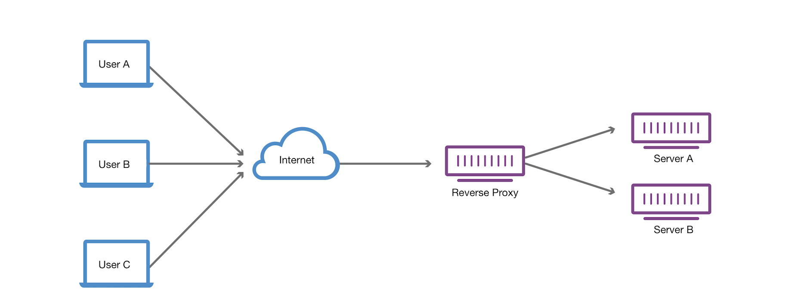

# Reverse Proxies

__Reverse proxy__ is a server or software application that acts as an intermediary between client devices and a web server. Unlike a traditional forward proxy, which sits between client devices and the internet, a reverse proxy sits between client devices and a web server, forwarding client requests to the server and returning the server's responses to the clients.

Here are some key points about reverse proxies:

* __Load Balancing__: Reverse proxies often include load balancing functionality, distributing incoming client requests across multiple backend servers. This helps distribute the load and improve the overall performance and reliability of a web application.

* __Security__: Reverse proxies can enhance security by hiding the details of the backend servers from external clients. They can also provide features like SSL termination, protecting the backend servers from direct exposure to the internet.

* __Caching__: Reverse proxies can cache static content, such as images and CSS files, to reduce the load on backend servers and improve overall response times. Caching can also enhance the user experience by serving content more quickly.

* __Authentication and Authorization__: Some reverse proxies can handle user authentication and authorization, adding an extra layer of security. They can authenticate users before allowing access to the backend resources.

* __Application Firewall__: Reverse proxies can function as application firewalls, inspecting and filtering incoming traffic to protect against various types of attacks, such as SQL injection and cross-site scripting (XSS).

* __URL Rewriting__: Reverse proxies can rewrite URLs, allowing for more user-friendly or SEO-friendly URLs while internally routing requests to the appropriate backend resources.

Popular reverse proxy software includes Nginx, Apache HTTP Server with mod_proxy, HAProxy, Traefik, Linkerd. Many content delivery networks (CDNs) also use reverse proxy architecture to efficiently deliver content to users.

Overall, reverse proxies play a crucial role in optimizing performance, enhancing security, and improving the scalability of web applications.

## Forwarding Headers

Forwarding headers refers to the process of passing certain HTTP headers from the client request to the backend server, and vice versa. This is important for maintaining information about the original client request as it travels through the proxy to the server and back.

Common headers that are forwarded include:

1. __X-Forwarded-For__: This header is used to pass the client's IP address to the backend server, allowing the server to know the original client's IP address, especially when there are multiple proxies in the chain.

2. __X-Forwarded-Proto__: It indicates the protocol (HTTP or HTTPS) used by the client to access the proxy. This is useful for the backend server to know if the original request was made using a secure connection.

3. __X-Forwarded-Host__: This header conveys the original __Host__ header sent by the client. It helps the backend server know which host the client initially requested.

4. __X-Real-IP__: Similar to `X-Forwarded-For`, this header is sometimes used to convey the real IP address of the client.

Configuring a reverse proxy to forward these headers is essential for applications that need to be aware of the client's information despite being accessed through a proxy. The exact configuration depends on the reverse proxy software being used (e.g., Nginx, Apache, HAProxy), and you can find specific instructions in the documentation of the respective software.

## Links

* https://www.cloudflare.com/learning/cdn/glossary/reverse-proxy/
* https://blog.hubspot.com/website/reverse-proxy
* https://learn.microsoft.com/en-us/aspnet/core/fundamentals/servers/kestrel/when-to-use-a-reverse-proxy?view=aspnetcore-8.0
* https://learn.microsoft.com/en-us/aspnet/core/host-and-deploy/proxy-load-balancer?view=aspnetcore-8.0

#reverse-proxies
