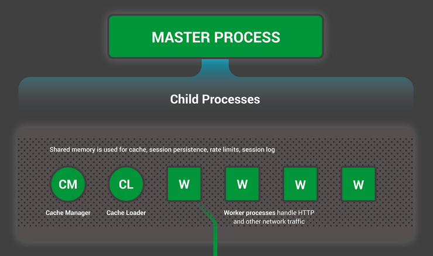

# NGINX

NGINX is a popular open-source web server and reverse proxy server. It is known for its high performance, stability, and low resource usage. Nginx is commonly used to serve static content, proxy requests to application servers, and act as a load balancer.

Key features of NGINX include its ability to handle a large number of simultaneous connections, efficient use of system resources, and support for various protocols such as HTTP, HTTPS, SMTP, and more. It is widely used in conjunction with popular web technologies and is known for its reliability in delivering web content.

NGINX is used by 26% of web sites on the internet.

## Configuration

On many Linux distributions, the configuration file will be located at `/etc/nginx/nginx.conf`. If it does not exist there, it may also be at `/usr/local/nginx/conf/nginx.conf` or `/usr/local/etc/nginx/nginx.conf`.

### Contexts

One of the first things that you should notice when looking at the main configuration file is that it is organized in a tree-like structure, marked by sets of brackets (`{` and `}`). In NGINX documentation, the areas that these brackets define are called “contexts” because they contain configuration details that are separated according to their area of concern.

```nginx
# main context

http {

    # http context

    server {

        # first server context

    }

    server {

        # second server context

    }

}
```

```nginx
# main context

server {
    
    # server context

    location /match/criteria {

        # first location context

    }

    location /other/criteria {

        # second location context

        location nested_match {

            # first nested location

        }

        location other_nested {

            # second nested location

        }

    }

}
```

### Directives

Directive refers to a configuration parameter that defines how the server should operate. Directives are used in the configuration files to customize the behavior of NGINX.

Directives can only be used in the contexts that they were designed for. Nginx will throw an error when reading a configuration file with directives that are declared in the wrong context.

```nginx
# the number of worker processes to use
worker_processes 4;

# include additional configuration files
include /etc/nginx/conf.d/*.conf;

http {
  # HTTP server settings
  server {
    # listen on port 80
    listen 80;

    # server name
    server_name example.com;

    # default location
    location / {
      # root directory
      root /var/www/html;

      # index file
      index index.html;
    }
  }
```

## Reverse Proxy

The `proxy_pass` directive is commonly used in the configuration to forward client requests to another server. This is often used in reverse proxy setups or load balancing scenarios.

```nginx
worker_processes 4;
pid /run/nginx.pid;

events {
    worker_connections 4096;
}

http {
    access_log /var/log/nginx/access.log;
    error_log /var/log/nginx/error.log;

    server {
        listen 80;
        server_name frontend.drim.city;

        location / {
            proxy_pass http://10.0.1.1/;
        }

        location /api/ {
            # backend server address
            proxy_pass http://10.0.1.2/;
            
            # setup forwarding headers
            proxy_set_header X-Forwarded-Host $host;
            proxy_set_header X-Forwarded-For $proxy_add_x_forwarded_for;
            proxy_set_header X-Forwarded-Proto $scheme;
        }
    }
}
```

## Static Content Serving

The `root` directive specifies the root directory that will be used to search for a file. To obtain the path of a requested file, NGINX appends the request URI to the path specified by the root directive. The directive can be placed on any level within the `http {}`, `server {}`, or `location {}` contexts. In the example below, the root directive is defined for a virtual server. It applies to all location {} blocks where the root directive is not included to explicitly redefine the root:

```nginx
server {
    root /www/data;

    location / {
    }

    location /images/ {
    }

    location ~ \.(mp3|mp4) {
        root /www/media;
    }
}
```

Here, NGINX searches for a URI that starts with `/images/` in the `/www/data/images/` directory in the file system. But if the URI ends with the `.mp3` or `.mp4` extension, NGINX instead searches for the file in the `/www/media/` directory because it is defined in the matching `location` block.

If a request ends with a slash, NGINX treats it as a request for a directory and tries to find an index file in the directory. The `index` directive defines the index file’s name (the default value is `index.html`). To continue with the example, if the request URI is `/images/some/path/`, NGINX delivers the file `/www/data/images/some/path/index.html` if it exists. If it does not, NGINX returns HTTP code `404 (Not Found)` by default.

You can list more than one filename in the `index` directive. NGINX searches for files in the specified order and returns the first one it finds.

```nginx
location / {
    index index.$geo.html index.htm index.html;
}
```

### Trying Several Options

The `try_files` directive can be used to check whether the specified file or directory exists; NGINX makes an internal redirect if it does, or returns a specified status code if it doesn’t. For example, to check the existence of a file corresponding to the request URI, use the `try_files` directive and the `$uri` variable as follows:

```nginx
server {
    root /www/data;

    location /images/ {
        try_files $uri /images/default.gif;
    }
}
```

The last parameter can also be a status code (directly preceded by the equals sign):

```nginx
location / {
    try_files $uri $uri/ $uri.html =404;
}
```

In the next example, if neither the original URI nor the URI with the appended trailing slash resolve into an existing file or directory, the request is redirected to the named location which passes it to a proxied server:

```nginx
location / {
    try_files $uri $uri/ @backend;
}

location @backend {
    proxy_pass http://backend.example.com;
}
```

## Load Balancing

Load balancing across multiple application instances is a commonly used technique for optimizing resource utilization, maximizing throughput, reducing latency, and ensuring fault‑tolerant configurations.

To start using NGINX to load balance HTTP traffic to a group of servers, first you need to define the group with the `upstream` directive. The directive is placed in the `http` context.

Servers in the group are configured using the `server` directive (not to be confused with the `server` block that defines a virtual server running on NGINX). For example, the following configuration defines a group named `backend` and consists of three server configurations (which may resolve in more than three actual servers):

```nginx
http {
    upstream backend {
        server backend1.example.com weight=5;
        server backend2.example.com;
        server 192.0.0.1 backup;
    }
}
```

To pass requests to a server group, the name of the group is specified in the `proxy_pass` directive.

```nginx
server {
    location / {
        proxy_pass http://backend;
    }
}
```

```nginx
http {
    upstream backend {
        server backend1.example.com;
        server backend2.example.com;
        server 192.0.0.1 backup;
    }
    
    server {
        location / {
            proxy_pass http://backend;
        }
    }
}
```

### Load-Balancing Methods

1. __Round Robin__ – Requests are distributed evenly across the servers, with server weights taken into consideration. This method is used by default (there is no directive for enabling it):

```nginx
upstream backend {
   # no load balancing method is specified for Round Robin
   server backend1.example.com;
   server backend2.example.com;
}
```

2. __Least Connections__ – A request is sent to the server with the least number of active connections, again with server weights taken into consideration:

```nginx
upstream backend {
    least_conn;
    server backend1.example.com;
    server backend2.example.com;
}
```

3. __IP Hash__ – The server to which a request is sent is determined from the client IP address. In this case, either the first three octets of the IPv4 address or the whole IPv6 address are used to calculate the hash value. The method guarantees that requests from the same address get to the same server unless it is not available:

```hash
upstream backend {
    ip_hash;
    server backend1.example.com;
    server backend2.example.com;
}
```

4. __Generic Hash__ – The server to which a request is sent is determined from a user‑defined key which can be a text string, variable, or a combination. For example, the key may be a paired source IP address and port, or a URI as in this example:

```nginx
upstream backend {
    hash $request_uri consistent;
    server backend1.example.com;
    server backend2.example.com;
}
```

The optional `consistent` parameter to the hash directive enables __ketama__ consistent‑hash load balancing. Requests are evenly distributed across all upstream servers based on the user‑defined hashed key value. If an upstream server is added to or removed from an upstream group, only a few keys are remapped which minimizes cache misses in the case of load‑balancing cache servers or other applications that accumulate state.

### Server Weights

By default, NGINX distributes requests among the servers in the group according to their weights using the Round Robin method. The `weight` parameter to the server directive sets the weight of a server; the default is `1`:

```nginx
upstream backend {
    server backend1.example.com weight=5;
    server backend2.example.com;
    server 192.0.0.1 backup;
}
```

### Server Slow-Start

The server slow‑start feature prevents a recently recovered server from being overwhelmed by connections, which may time out and cause the server to be marked as failed again.

In NGINX, slow‑start allows an upstream server to gradually recover its weight from `0` to its nominal value after it has been recovered or became available. This can be done with the `slow_start` parameter to the `server` directive:

```nginx
upstream backend {
    server backend1.example.com slow_start=30s;
    server backend2.example.com;
    server 192.0.0.1 backup;
}
```

### Health Checks

NGINX can continually test your HTTP upstream servers, avoid the servers that have failed, and gracefully add the recovered servers into the load‑balanced group.

#### Passive Health Checks

For passive health checks, NGINX monitors transactions as they happen, and try to resume failed connections. If the transaction still cannot be resumed, NGINX marks the server as unavailable and temporarily stop sending requests to it until it is marked active again.

The conditions under which an upstream server is marked unavailable are defined for each upstream server with parameters to the server directive in the upstream block:

* `fail_timeout` – Sets the time during which a number of failed attempts must happen for the server to be marked unavailable, and also the time for which the server is marked unavailable (default is `10` seconds).

* `max_fails` – Sets the number of failed attempts that must occur during the fail_timeout period for the server to be marked unavailable (default is `1` attempt).

```nginx
upstream backend {
    server backend1.example.com;
    server backend2.example.com max_fails=3 fail_timeout=30s;
}
```

#### Active Health Checks

NGINX can periodically check the health of upstream servers by sending special health‑check requests to each server and verifying the correct response.

To enable active health checks:

1. In the location that passes requests (`proxy_pass`) to an upstream group, include the `health_check` directive:

```nginx
server {
    location / {
        proxy_pass http://backend;
        health_check;
    }
}
```

Optionally you can specify another port for health checks, for example, for monitoring health of many services on the same host. Specify a new port with the `port` parameter of the `health_check` directive:

```nginx
server {
    location / {
        proxy_pass   http://backend;
        health_check port=8080;
    }
}
```

2. In the upstream server group, define a shared memory zone with the `zone` directive:

```nginx
http {
    upstream backend {
        zone backend 64k;
        server backend1.example.com;
        server backend2.example.com;
        server backend3.example.com;
        server backend4.example.com;
    }
}
```

The defaults for active health checks can be overridden with parameters to the `health_check` directive:

```nginx
location / {
    proxy_pass   http://backend;
    health_check interval=10 fails=3 passes=2;
}
```

## Architecture



NGINX uses a predictable process model that is tuned to the available hardware resources:

* The _master_ process performs the privileged operations such as reading configuration and binding to ports, and then creates a small number of child processes (the next three types).

* The _cache loader_ process runs at startup to load the disk‑based cache into memory, and then exits. It is scheduled conservatively, so its resource demands are low.

* The _cache manager_ process runs periodically and prunes entries from the disk caches to keep them within the configured sizes.

* The _worker_ processes do all of the work! They handle network connections, read and write content to disk, and communicate with upstream servers.

### Asynchrony

Most web servers and web applications use a process‑per‑connection or thread‑per‑connection model to handle requests Each process or thread contains the instructions to process the request through to the end. During the time the process is run by the server, it spends most of its time ‘blocked’ – waiting for the client to complete its next operation.

It is a _synchronous_ processing. NGINX, on the other side, uses _asynchronous_ and _event-driven_ processing.


Each worker (remember – there’s usually one worker for each CPU core) can handle hundreds (in fact, hundreds of thousands) of connections simultaneously.

1. The worker waits for events on the listen and connection sockets.

2. Events occur on the sockets and the worker handles them:

  * An event on the listen socket means that a client has created a new connection. The worker creates a new connection socket.

  * An event on a connection socket means that the client sent new data. The worker responds promptly.

A worker never blocks on network traffic, waiting for the client to respond. When it has handled the event, the worker immediately proceeds to other connections where events are waiting to be processed, or handles new connections.

## Links

* Directives - https://nginx.org/en/docs/dirindex.html
* Configuration structure - https://www.digitalocean.com/community/tutorials/understanding-the-nginx-configuration-file-structure-and-configuration-contexts
* Reverse proxy - https://docs.nginx.com/nginx/admin-guide/web-server/reverse-proxy/
* Static content - https://docs.nginx.com/nginx/admin-guide/web-server/serving-static-content/
* Load balancing - https://docs.nginx.com/nginx/admin-guide/load-balancer/http-load-balancer/
* Health checks - https://docs.nginx.com/nginx/admin-guide/load-balancer/http-health-check/
* Architecture - https://www.nginx.com/blog/inside-nginx-how-we-designed-for-performance-scale/
* Performance - https://aosabook.org/en/v2/nginx.html

#nginx
