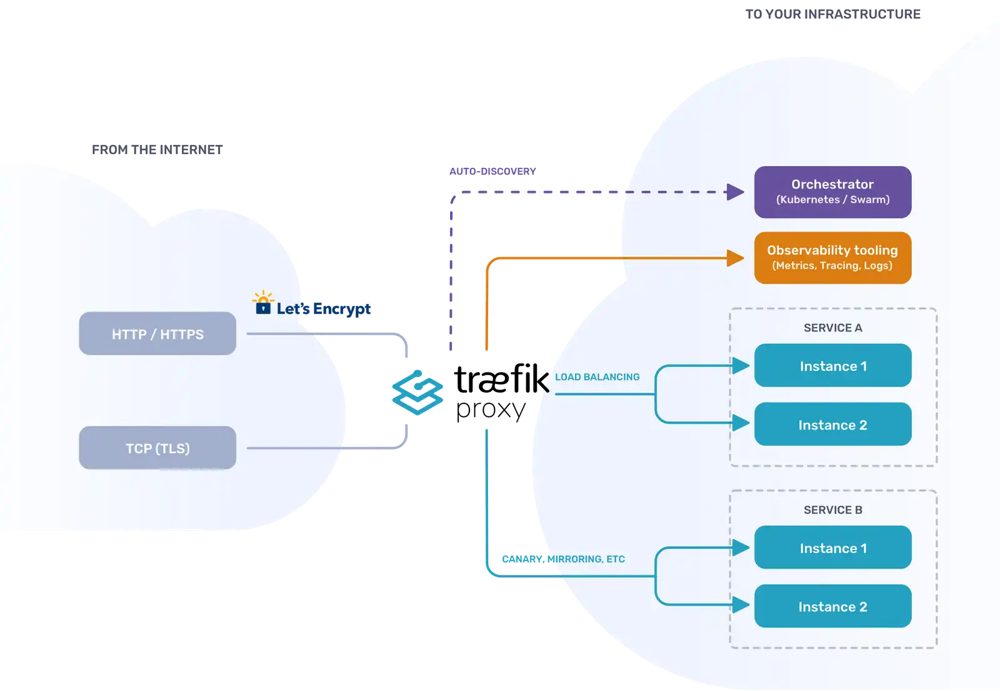
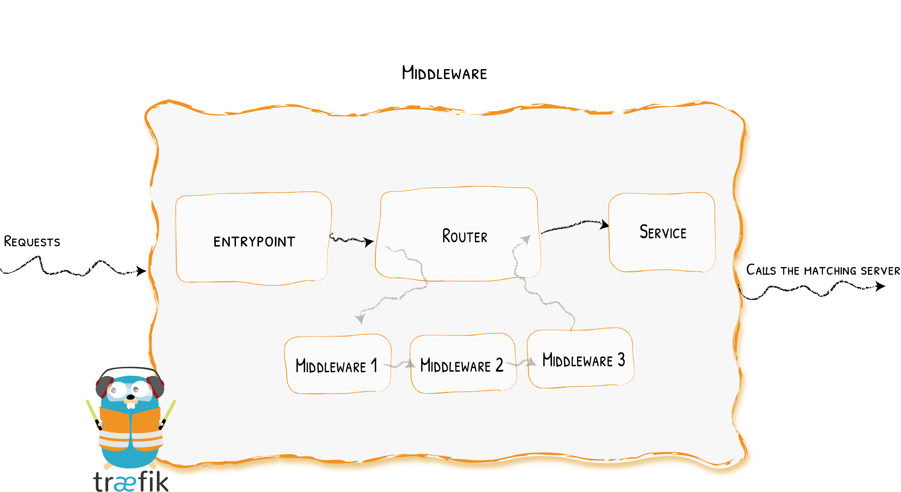

# Traefik

Traefik is a modern and dynamic reverse proxy and load balancer designed specifically for microservices and containerized applications. It is an open-source tool written in Go language and is commonly used in cloud-native environments.

Traefik works by automatically discovering new services as they are deployed and dynamically configuring itself to route traffic to these services. It integrates seamlessly with container orchestration platforms like Kubernetes, Docker Swarm, and Mesos, making it easier to manage routing and load balancing in dynamic environments.

Some key features of Traefik include:

1. __Automatic Service Discovery__. Traefik can automatically detect new services as they are deployed, eliminating the need for manual configuration.

2. __Dynamic Configuration__. It dynamically updates its configuration based on changes in the infrastructure, ensuring that routing rules are always up to date.

3. __Load Balancing__. It can distribute incoming traffic among multiple instances of a service to ensure optimal performance and reliability.

4. __TLS Encryption__. Traefik supports automatic SSL certificate generation and termination, enabling secure communication between clients and services.

5. __Middleware Support__. It provides a wide range of middleware functionalities such as authentication, rate limiting, and request rewriting, allowing for advanced traffic management.

Overall, Traefik simplifies the process of managing network traffic in containerized environments, offering flexibility, scalability, and automation. It has gained popularity within the DevOps community as a crucial component for building resilient and scalable microservices architectures.

## Architecture

## Requests Flow

## Links

* Traefik - https://traefik.io/traefik/

#traefik
