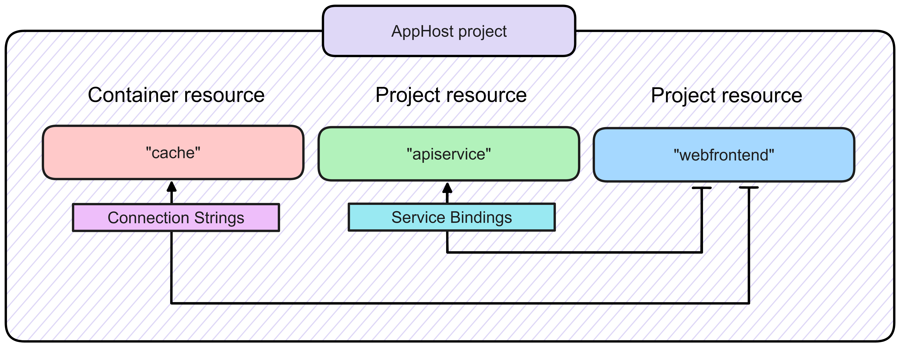

# .NET Aspire

.NET Aspire is an opinionated, cloud ready stack for building observable, production ready, distributed applications.​

## Features

### Dashboard

.NET Aspire project templates offer a sophisticated dashboard for comprehensive app monitoring and inspection. This dashboard allows you to track closely various aspects of your application, including logs, traces, and environment configurations, in real-time. It's purpose-built to enhance the local development experience, providing an insightful overview of your app's state and structure.

https://learn.microsoft.com/en-us/dotnet/aspire/fundamentals/dashboard

### Orchestration

Orchestration refers to the coordination and management of various elements within a cloud-native application. .NET Aspire streamlines the configuration and interconnection of different parts of your cloud-native app. It provides useful abstractions for managing service discovery, environment variables, and container configurations without having to handle low level implementation details. These abstractions also provide consistent setup patterns across apps with many components and services.

.NET Aspire orchestration assists with the following concerns:

* __App composition__: Specify the .NET projects, containers, executables, and cloud resources that make up the application.
* __Service discovery and connection string management__: The app host manages injecting the right connection strings and service discovery information to simplify the developer experience.

* https://learn.microsoft.com/en-us/dotnet/aspire/fundamentals/app-host-overview

### Service Discovery

Service discovery is a way for developers to use logical names instead of physical addresses (IP address and port) to refer to external services.

.NET Aspire includes functionality for configuring service discovery at development and testing time. Service discovery functionality works by providing configuration in the format expected by the configuration-based endpoint resolver from the .NET Aspire AppHost project to the individual service projects added to the application model.

* https://learn.microsoft.com/en-us/dotnet/core/extensions/service-discovery?tabs=dotnet-cli
* https://learn.microsoft.com/en-us/dotnet/aspire/service-discovery/overview

### Observability

One of the primary objectives of .NET Aspire is to ensure that apps are straightforward to debug and diagnose. .NET Aspire components automatically set up Logging, Tracing, and Metrics configurations, which are sometimes known as the pillars of observability, using the .NET OpenTelemetry SDK.

* __Logging__: Log events describe what's happening as an app runs. A baseline set is enabled for .NET Aspire components by default and more extensive logging can be enabled on-demand to diagnose particular problems.
* __Tracing__: Traces correlate log events that are part of the same logical activity (e.g. the handling of a single request), even if they're spread across multiple machines or processes.
* __Metrics__: Metrics expose the performance and health characteristics of an app as simple numerical values. As a result, they have low performance overhead and many services configure them as always-on telemetry. This also makes them suitable for triggering alerts when potential problems are detected.

* https://learn.microsoft.com/en-us/dotnet/core/diagnostics/observability-with-otel
* https://learn.microsoft.com/en-us/dotnet/aspire/fundamentals/telemetry

### Health Checks

Health checks provide availability and state information about an app. Health checks are often exposed as HTTP endpoints, but can also be used internally by the app to write logs or perform other tasks based on the current health. Health checks are typically used in combination with an external monitoring service or container orchestrator to check the status of an app. The data reported by health checks can be used for various scenarios:

* Influence decisions made by container orchestrators, load balancers, API gateways, and other management services. For instance, if the health check for a containerized app fails, it might be skipped by a load balancer routing traffic.
* Verify that underlying dependencies are available, such as a database or cache, and return an appropriate status message.
* Trigger alerts or notifications when an app isn't responding as expected.

* https://learn.microsoft.com/en-us/aspnet/core/host-and-deploy/health-checks?view=aspnetcore-8.0
* https://learn.microsoft.com/en-us/dotnet/aspire/fundamentals/health-checks

### Resilience

Resilience is the ability of your system to react to failure and still remain functional. It's not about avoiding failure, but accepting failure and constructing your cloud-native services to respond to it. You want to return to a fully functioning state quickly as possible.

.NET Aspire configures resilience patterns for HTTP clients:

* Rate limiters
* Retries
* Timeouts
* Circuit breakers
* Request hedging

* https://learn.microsoft.com/en-us/dotnet/core/resilience/http-resilience?tabs=dotnet-cli

### Service Defaults

Cloud-native applications often require extensive configurations to ensure they work across different environments reliably and securely. .NET Aspire provides many helper methods and tools to streamline the management of configurations for OpenTelemetry, health checks, environment variables, and more.

* https://learn.microsoft.com/en-us/dotnet/aspire/fundamentals/service-defaults

### Components

.NET Aspire components are NuGet packages designed to simplify connections to popular services and platforms, such as Redis or PostgreSQL. .NET Aspire components handle many cloud-native concerns for you through standardized configuration patterns, such as adding health checks and telemetry.

Each component is designed to work with .NET Aspire orchestration, and they're capable of flowing their configurations through dependencies based on .NET project and package references. In other words, if `Example.ServiceFoo` references `Example.ServiceBar`, `Example.ServiceFoo` inherits the component's required configurations to allow them to communicate with each other automatically.

* https://learn.microsoft.com/en-us/dotnet/aspire/fundamentals/components-overview?tabs=dotnet-cli

### Deployment

.NET Aspire applications are built with cloud-agnostic principles, allowing deployment flexibility across various platforms supporting .NET and containers. Users can adapt the provided guidelines for deployment on other cloud environments or local hosting. The manual deployment process, while feasible, involves exhaustive steps prone to errors. We anticipate users will prefer leveraging CI/CD pipelines and cloud-specific tooling for a more streamlined deployment experience tailored to their chosen infrastructure.

* https://learn.microsoft.com/en-us/dotnet/aspire/deployment/overview

## Links

* https://learn.microsoft.com/en-us/dotnet/aspire/get-started/aspire-overview

#dotnet-aspire
