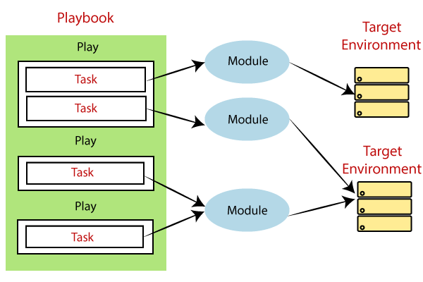
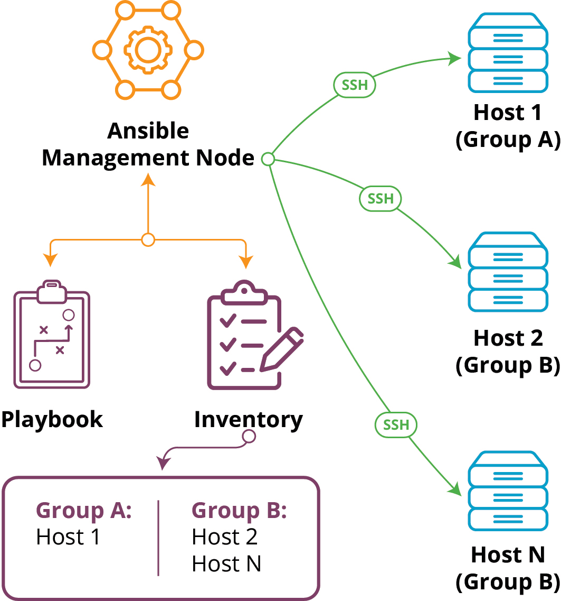

# Ansible

Ansible is an open-source automation tool that is used for configuration management, application deployment, task automation, and infrastructure orchestration. It simplifies the process of managing and scaling infrastructure by allowing users to define tasks in a declarative language, rather than through procedural scripts.

Key features of Ansible include:

1. __Agentless__: Ansible operates over SSH and does not require any agent to be installed on the managed nodes, making it easy to set up and use.

2. __Declarative Language__: Ansible uses YAML to define tasks in a human-readable format. This makes it easy to understand and write playbooks.

3. __Idempotence__: Ansible playbooks are designed to be idempotent, meaning they can be run multiple times without changing the outcome. This helps ensure consistency in the desired state of the infrastructure.

4. __Community and Extensibility__: Ansible has a large and active community, and it supports a wide range of modules for various technologies. Users can also create custom modules to extend Ansible's functionality.

Overall, Ansible is widely used in IT environments to automate repetitive tasks, ensure consistency in configurations, and streamline the management of infrastructure.

## Concepts

### Inventory

Inventory is a file or a collection of files that contain information about the hosts you want to manage with Ansible. The inventory file typically lists the hostnames or IP addresses of your servers and groups them based on different criteria, such as their function (e.g., web servers, database servers) or their location.

Here are some key points about Ansible inventory:

1. __Format__: Ansible inventory files can be written in various formats, including INI-style, YAML, or scripts that dynamically generate the inventory.

2. __Groups__: You can organize your hosts into groups, making it easier to apply configurations to specific sets of servers.

3. __Variables__: Inventory files can also include variables that define specific settings for individual hosts or groups of hosts.

4. __Dynamic Inventory__: Instead of a static file, Ansible also supports dynamic inventories, which can be scripts or programs that generate inventory information on-the-fly. This is useful in dynamic or cloud environments where hosts may be added or removed frequently.

5. __Location__: By default, Ansible looks for the inventory file in the `/etc/ansible/hosts` directory, but you can specify a different inventory file or location using the -i option when running Ansible commands.

Example inventory file in INI format:

```ini
[web_servers]
65.100.15.12
65.100.15.13

[db_servers]
65.100.16.52
65.100.16.53
```

### Task

* A task is the smallest unit of work in Ansible.
* It represents a single action to be performed, such as installing a package, copying a file, or restarting a service.
* Tasks are defined within plays in Ansible.

### Module

* A module is a standalone script that Ansible uses to perform tasks on remote hosts.
* Modules are the building blocks for tasks; they encapsulate the functionality required to carry out specific actions.
* Ansible provides a wide range of built-in modules, and users can also create custom modules if needed.

### Play

* A play is a set of tasks that are executed on a set of hosts.
* It is defined in a playbook and represents a higher-level organization of tasks.
* Plays consist of tasks and can include additional directives, such as variables, handlers, and roles.
* Multiple plays can be defined within a single playbook, allowing you to organize your automation logic more effectively.

### Playbook

* A playbook is a collection of plays.
* It is a YAML file that defines a series of plays, each specifying a set of tasks to be executed on hosts.
* Playbooks allow you to orchestrate complex tasks, define variables, use conditionals, and control the flow of execution.
* Playbooks are often used for configuration management, application deployment, and other automation tasks.



Example playbook:

```yaml
- name: Web Server Configuration # first play name
  hosts: web_servers
  become: yes

  tasks:
    - name: Upgrade system # first task name
      apt:                 # module
        upgrade: dist      # module argument
        update_cache: yes
    - name: Install Nginx  # second task name
      apt:
        name: nginx
        state: present

- name: Database Server Configuration # second play name
  hosts: db_servers
  become: yes

  tasks:
    - name: Upgrade system # first task name
      apt:                 # module
        upgrade: dist      # module argument
        update_cache: yes
    - name: Install MySQL  # second task name
      apt:
        name: mysql-server
        state: present
```

### Management Node

Management node is the machine from which you run the Ansible CLI tools (`ansible-playbook`, `ansible`, `ansible-vault` and others). Multiple control nodes are possible, but Ansible itself does not coordinate across them.

### Managed Nodes

Managed nodes, also referred to as ‘hosts’, these are the target devices (servers, network appliances or any computer) you aim to manage with Ansible. Ansible is not normally installed on managed nodes, unless you are using `ansible-pull`, but this is rare and not the recommended setup.

### Handlers

Handler is a way to trigger a service restart or another action only when a change has been made. Handlers are associated with tasks, and they are notified at the end of a play if any task within that play has made a change.

Here's a brief overview of how handlers work in Ansible:

1. __Define Handlers__: Handlers are defined separately from tasks. You can define them in the playbook or in an included file. Here's an example:

```yaml
handlers:
  - name: Restart Nginx
    service:
      name: nginx
      state: restarted
```

2. __Notify Handlers__: In your tasks, you can notify a handler if a change has been made. For example:

```yaml
tasks:
  - name: Ensure Nginx configuration is present
    template:
      src: templates/nginx.conf.j2
      dest: /etc/nginx/nginx.conf
    notify: Restart Nginx
```
In this example, the handler named "Restart Nginx" will be triggered only if the configuration file is changed.

3. __Handlers Execution__: Handlers are executed at the end of each play, after all the tasks have been completed. If a task notifies a handler, that handler will only run once at the end of the play, regardless of how many tasks notify it.

Handlers are a way to consolidate tasks that should be run only if changes have occurred, reducing unnecessary restarts or service reloads. They help ensure that actions are taken only when needed.

### Role

Ansible role is a reusable and self-contained unit of automation that encapsulates tasks, handlers, variables, and other elements required to perform a specific function. Roles help in organizing and structuring your Ansible playbooks by promoting modularity and reusability.

Typically, an Ansible role consists of the following directory structure:

```
my_role/
|-- tasks/
|   |-- main.yml
|-- handlers/
|   |-- main.yml
|-- templates/
|-- files/
|-- vars/
|   |-- main.yml
|-- defaults/
|   |-- main.yml
|-- meta/
|   |-- main.yml
```

* __tasks__: Contains the main set of tasks to be executed by the role.
* __handlers__: Contains handlers, which are tasks that can be triggered by other tasks.
* __templates__: Contains Jinja2 templates that can be used with the `template` module.
* __files__: Contains files that can be deployed using the copy module.
* __vars__: Contains variables used by the role.
* __defaults__: Contains default values for variables.
* __meta__: Contains metadata about the role, such as dependencies.

Roles make it easier to share and reuse automation content across different projects. They contribute to the overall maintainability and scalability of Ansible playbooks.

### Plugin

Ansible plugins can be used to customize and extend various aspects of Ansible's functionality. These plugins can be written in Python and cover a wide range of areas, including inventory, modules, callbacks, and more.

### Collection

Ansible collection bundles together playbooks, roles, modules, and other elements into a single, versioned archive. This makes it easy to share and distribute Ansible content in a structured and reusable way.

Collections are organized namespaces that contain content related to a specific purpose, such as managing a particular application or service. They provide a more modular and maintainable way to organize and distribute Ansible content compared to traditional roles.

### Ansible Galaxy

Ansible Galaxy is a platform and online community for sharing and discovering Ansible content. It provides a centralized hub where Ansible roles, collections, and playbooks can be shared, collaborated on, and reused by the Ansible community.

https://galaxy.ansible.com/ui/

## Workflow



Commands:

`ansible-playbook`: This command is used to run Ansible playbooks.
```bash
ansible-playbook playbook.yml
```

`ansible`: The basic Ansible command without any options. It can be used to execute ad-hoc commands on remote hosts.
```bash
ansible all -m ping
```

`ansible-galaxy`: Used to manage Ansible roles. You can use it to install roles from the Ansible Galaxy community or create your own roles.
```bash
ansible-galaxy install username.rolename
```

`ansible-doc`: Provides documentation for Ansible modules.
```bash
ansible-doc module_name
```

`ansible-config`: Displays the Ansible configuration settings.
```bash
ansible-config view
```

`ansible-galaxy init`: Initializes a new Ansible role directory structure.
```bash
ansible-galaxy init rolename
```

## Links

* https://www.ansible.com/

#ansible
