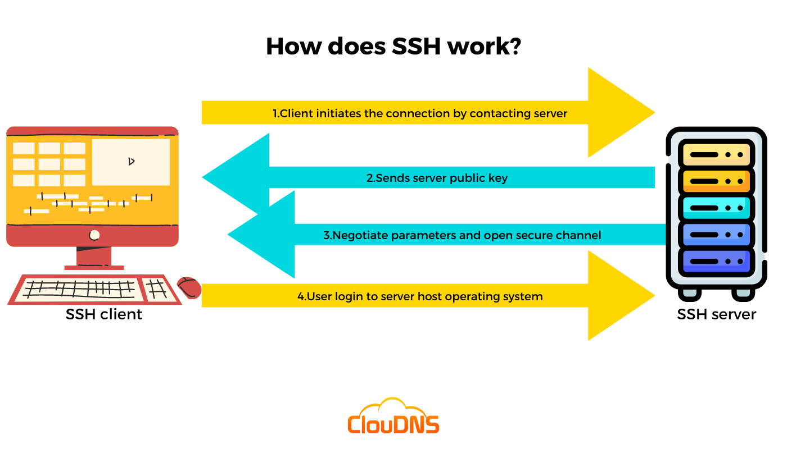

# SSH

__SSH__, which stands for __Secure Shell__, is a cryptographic network protocol used to securely access and manage network devices and servers over a potentially unsecured network. It provides a secure channel over an unsecured network, such as the internet, allowing for encrypted communication between the client and the server. SSH is commonly used for remote administration, file transfers, and tunneling.

Key features of SSH include:

1. __Encryption__: SSH encrypts data during transmission, preventing unauthorized access to sensitive information.

2. __Authentication__: SSH uses various authentication methods, including passwords, public-key cryptography, and other mechanisms to ensure secure access.

3. __Tunneling__: SSH supports tunneling, allowing users to create secure channels for various network services, such as web browsing, database connections, and more.

4. __Remote Access__: It enables users to access and manage remote systems and servers as if they were directly connected to them.

SSH is widely used in the IT industry for managing servers, accessing remote machines, and securing communication between devices. It is a fundamental tool for system administrators and developers who need to interact with remote systems in a secure manner.

## Protocol



The way SSH works is by making use of a client-server model to allow for authentication of two remote systems and encryption of the data that passes between them.

SSH operates on TCP port 22 by default (though SSH port can be changed if needed). The host (server) listens on port 22 (or any other SSH assigned port) for incoming connections. It organizes the secure connection by authenticating the client and opening the correct shell environment if the verification is successful.

### Session Encryption Negotiation

When a client tries to connect to the server via TCP, the server presents the encryption protocols and respective versions that it supports. If the client has a similar matching pair of a protocol and version, an agreement is reached and the connection is started with the accepted protocol. The server also uses an asymmetric public key which the client can use to verify the authenticity of the host.

Once this is established, the two parties use what is known as a Diffie-Hellman Key Exchange Algorithm to create a symmetrical key. This algorithm allows both the client and the server to arrive at a shared encryption key which will be used henceforth to encrypt the entire communication session.

### Authenticating the User

The final stage before the user is granted SSH access to the server is authenticating his/her credentials. There are 2 options:

1. __Password__: Some SSH users use a password. The user is asked to enter the username, followed by the password. These credentials securely pass through the symmetrically encrypted tunnel, so there is no chance of them being captured by a third party. Although passwords are encrypted, it is still not recommended to use passwords for secure connections. This is because many bots can simply brute force easy or default passwords and gain shell access to your account.

2. __Key Pair__: These are a set of asymmetric keys used to authenticate the user without the need of inputting any password. It is the recommended approach.

#### Key Pair Generation

To establish secure connections using SSH, you need to generate a pair of public and private keys. These work together to authenticate and encrypt your communication with remote servers.

There are two commonly used algorithms for generating authentication keys:

* __RSA__ – an SSH RSA key is considered highly secure as it has typically larger key sizes, often 2048 or 4096 bits. It is also more compatible with older operating systems.
* __Ed25519__ – a more modern algorithm with a smaller standard key size of 256 bits. It is just as secure and efficient as an RSA key due to its strong cryptographic properties. The compatibility is lower, but newer operating systems support it.

Open a shell and enter the ssh-keygen command:

```bash
ssh-keygen
```

The command will display the following message:

```bash
Generating public/private rsa key pair.
```

The key generator should ask you to choose a location to store the keys:

```bash
Enter file in which to save the key (/home/local_username/.ssh/id_rsa):
```

Next, the key generator window will ask you to create an SSH key passphrase to access your private key.

```bash
Enter passphrase (empty for no passphrase):
```

Next, the information about saved files is displayed.

```
Your identification has been saved in /home/username/.ssh/id_rsa.
Your public key has been saved in /home/username/.ssh/id_rsa.pub.
The key fingerprint is:
SHA256:CAjsV9M/tt5skazroTc1ZRGCBz+kGtYUIPhRvvZJYBs username@hostname
The key's randomart image is:
+---[RSA 3072]----+
|o   ..oo.++o ..  |
| o o +o.o.+...   |
|. . + oE.o.o  .  |
| . . oo.B+  .o   |
|  .   .=S.+ +    |
|      . o..*     |
|        .+= o    |
|        .=.+     |
|       .oo+      |
+----[SHA256]-----+
```

#### Public Key Copying

##### Using `ssh-copy-id`

The simplest way to copy your public key to an existing server is to use a utility called `ssh-copy-id`. Because of its simplicity, this method is recommended if available.

To use the utility, you need to specify the remote host that you would like to connect to, and the user account that you _have password-based SSH access_ to. This is the account where your public SSH key will be copied.

The syntax is:

```bash
ssh-copy-id username@remote_host
```

###### Manual Copying

If you do not have password-based SSH access to your server available, you will have to do the above process manually.

The content of your `id_rsa.pub` file will have to be added to a file at `~/.ssh/authorized_keys` on your remote machine somehow.

To display the content of your `id_rsa.pub` key, type this into your local computer:

```bash
cat ~/.ssh/id_rsa.pub
```

You will see the key’s content, which may look something like this:

```
ssh-rsa AAAAB3NzaC1yc2EAAAADAQABAAACAQCqql6MzstZYh1TmWWv11q5O3pISj2ZFl9HgH1JLknLLx44+tXfJ7mIrKNxOOwxIxvcBF8PXSYvobFYEZjGIVCEAjrUzLiIxbyCoxVyle7Q+bqgZ8SeeM8wzytsY+dVGcBxF6N4JS+zVk5eMcV385gG3Y6ON3EG112n6d+SMXY0OEBIcO6x+PnUSGHrSgpBgX7Ks1r7xqFa7heJLLt2wWwkARptX7udSq05paBhcpB0pHtA1Rfz3K2B+ZVIpSDfki9UVKzT8JUmwW6NNzSgxUfQHGwnW7kj4jp4AT0VZk3ADw497M2G/12N0PPB5CnhHf7ovgy6nL1ikrygTKRFmNZISvAcywB9GVqNAVE+ZHDSCuURNsAInVzgYo9xgJDW8wUw2o8U77+xiFxgI5QSZX3Iq7YLMgeksaO4rBJEa54k8m5wEiEE1nUhLuJ0X/vh2xPff6SQ1BL/zkOhvJCACK6Vb15mDOeCSq54Cr7kvS46itMosi/uS66+PujOO+xt/2FWYepz6ZlN70bRly57Q06J+ZJoc9FfBCbCyYH7U/ASsmY095ywPsBo1XQ9PqhnN1/YOorJ068foQDNVpm146mUpILVxmq41Cj55YKHEazXGsdBIbXWhcrRf4G2fJLRcGUr9q8/lERo9oxRm5JFX6TCmj6kmiFqv+Ow9gI0x8GvaQ== username@hostname
```

Once you have access to your account on the remote server, you should make sure the ~/.ssh directory is created. This command will create the directory if necessary, or do nothing if it already exists:

```bash
mkdir -p ~/.ssh
```

Now, you can create or modify the authorized_keys file within this directory. You can add the contents of your id_rsa.pub file to the end of the authorized_keys file, creating it if necessary, using this:

```bash
echo public_key_string >> ~/.ssh/authorized_keys
```

##### Copying with Web UI

This method is used at most cloud and hosting providers.

#### Authenticating to Server

If you have successfully completed one of the procedures above, you should be able to log into the remote host without the remote account’s password.

```bash
ssh -i ~/.ssh/id_rsa username@remote_host
```

## Links

* https://www.hostinger.com/tutorials/ssh-tutorial-how-does-ssh-work
* https://www.hostinger.com/tutorials/ssh/how-to-set-up-ssh-keys
* https://en.wikipedia.org/wiki/Diffie%E2%80%93Hellman_key_exchange

#ssh
