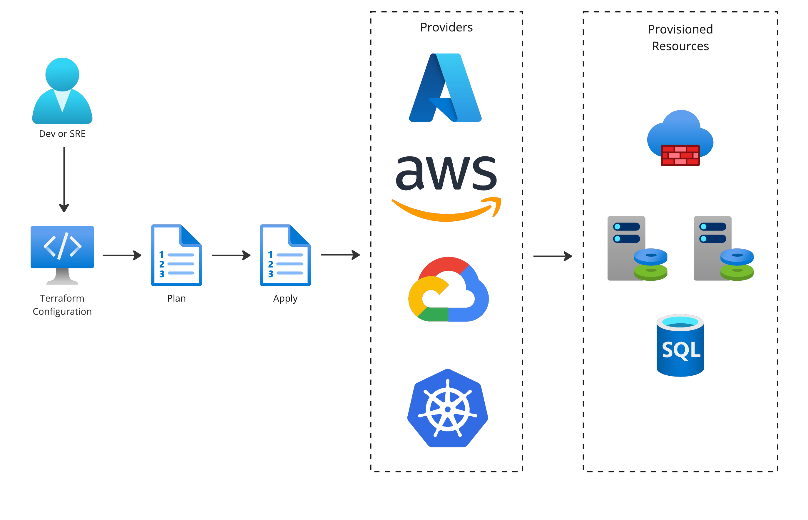
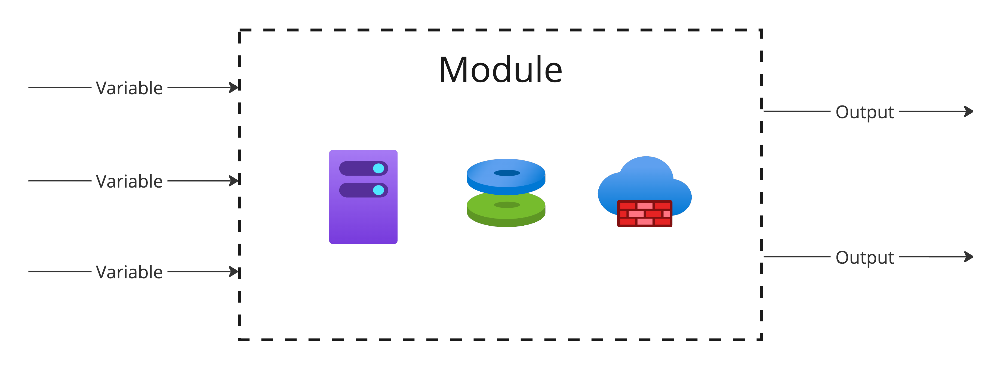

# Terraform


HashiCorp Terraform is an open-source infrastructure as code (IaC) tool that enables operators to define and provision infrastructure using a declarative configuration language. Terraform helps manage and automate the deployment of infrastructure resources across various cloud providers and on-premises environments.

Key features of HashiCorp Terraform include:

1. __Declarative Syntax__: Terraform uses a declarative configuration language to describe the desired state of infrastructure. Users define the resources and their configurations in a human-readable format.

2. __Multi-Cloud Support__: Terraform supports multiple cloud providers, including Amazon Web Services (AWS), Microsoft Azure, Google Cloud Platform (GCP), and many others. This allows users to manage infrastructure across different cloud environments using a single tool.

3. __Infrastructure as Code (IaC)__: Terraform treats infrastructure as code, allowing users to version control and manage infrastructure configurations just like software code. This makes it easier to collaborate, track changes, and maintain consistency in infrastructure deployments.

4. __Resource Graph__: Terraform creates a dependency graph of resources, allowing it to determine the order in which resources need to be provisioned or destroyed. This helps in maintaining the desired state of the infrastructure.

5. __Change Automation__: Terraform can plan and apply changes to infrastructure. It calculates the difference between the desired state and the current state and then applies only the necessary changes, reducing the risk of human error.

6. __Extensibility__: Terraform can be extended through providers, which are plugins that enable integration with various services and platforms. There are providers for cloud services, databases, networking equipment, and more.

To get started with HashiCorp Terraform, you typically need to install the Terraform CLI, write a Terraform configuration file, and then use the CLI to apply and manage your infrastructure.

## Flow



## Commands

```
terraform init
```

Initializes a new or existing Terraform configuration. This command downloads the required providers and sets up the working directory.

```
terraform plan
```

Creates an execution plan, showing the changes that Terraform will make to your infrastructure based on your configuration files.

```
terraform apply
```

Applies the changes proposed in a Terraform execution plan. It provisions or modifies the infrastructure according to the configuration.

```
terraform destroy
```

Destroys the Terraform-managed infrastructure. It's used to clean up and de-provision all resources defined in your Terraform configuration.

```
terraform validate
```

Validates the configuration files for syntax errors and other issues.

```
terraform fmt
```

Rewrites Terraform configuration files to a canonical format. It helps in maintaining consistent code style.

```
terraform show
```

Outputs the current state or a saved plan. It shows the Terraform resources that have been created.

## Concepts

### Provider

Terraform __providers__ are responsible for interacting with APIs and managing resources in various cloud providers, services, and other infrastructure platforms.

For example, if you are working with AWS (Amazon Web Services), there is a Terraform AWS provider that allows you to define and provision AWS resources using Terraform configuration files. Similarly, there are providers for other cloud providers like Azure, Google Cloud, and various on-premises solutions.

To use a Terraform provider, you typically include its configuration block in your Terraform code, specifying details such as authentication credentials and region. Here's a simple example using the AWS provider:

```
provider "aws" {
  region     = "us-west-2"
  access_key = "your-access-key"
  secret_key = "your-secret-key"
}

# Define AWS resources below...
```

https://developer.hashicorp.com/terraform/language/providers

### Resource

__Resource__ in Terraform represents a piece of infrastructure, such as a virtual machine, network interface, or DNS record. Resources are declared in Terraform configurations, and Terraform uses these configurations to create, update, or delete the corresponding infrastructure.

For example, a simple Terraform resource block for creating an AWS S3 bucket might look like this in HCL:

```
resource "aws_s3_bucket" "example_bucket" {
  bucket = "my-example-bucket"
  acl    = "private"
}
```

https://developer.hashicorp.com/terraform/language/resources

### Variable

Terraform __variables__ refer to placeholders that you can use to parameterize your Terraform configurations. Variables allow you to create more flexible and reusable infrastructure code by abstracting values that may change between environments or deployments.

Here are some key points about Terraform variables:

1. __Declaration__: Variables are declared in Terraform using the variable keyword. For example:

```
variable "example" {
  type    = string
  default = "default_value"
}
```

2. __Types__: Variables can have different types such as `string`, `number`, `list`, `map`, etc. The `type` attribute is used to specify the variable type.

3. __Default Values__: You can provide default values for variables using the `default` attribute. If a value is not provided during execution, Terraform uses the default value.

4. __Input Values__: Variables can be assigned values from various sources, including command-line arguments, environment variables, or from variable files.

5. __Interpolation__: Variables can be interpolated within strings or other expressions using the `${var.example}` syntax.

6. __Variable Files__: You can use variable files (commonly with a `.tfvars` extension) to set values for variables. These files can be passed during the Terraform plan or apply phase.

Example variable file (`example.tfvars`):

```
example = "new_value"
```

Command to use the variable file:

```
terraform apply -var-file=example.tfvars
```

7. __Variable Outputs__: You can use the output of one Terraform configuration as input for another. This is often useful when you want to pass information between different Terraform modules.

https://developer.hashicorp.com/terraform/language/values

### Module

Terraform __module__ is a way to organize and package Terraform code into a set of files that define a specific piece of infrastructure or functionality. Modules can be used to encapsulate and share infrastructure components, making it easier to reuse code across different projects or environments.

Key points about Terraform modules:

1. __Reusability__: Modules allow you to write infrastructure code once and reuse it in multiple projects, promoting consistency and reducing duplication.

2. __Abstraction__: Modules provide a level of abstraction, hiding the complexity of the underlying infrastructure and making it easier to use and understand.

3. __Input and Output Variables__: Modules can define input variables to customize their behavior and output variables to expose information to the calling code.

4. __Versioning__: Modules can be versioned, allowing for better control over changes and updates to infrastructure components.

5. __Registry__: Terraform has a public module registry where you can find and share pre-built modules. This can save time and effort when setting up common infrastructure patterns.



https://developer.hashicorp.com/terraform/language/modules

### State

Terraform __state__ is a crucial aspect of managing infrastructure, and it includes information about the resources that Terraform is managing, their current state, and metadata.

Here are some key points related to Terraform state:

1. __State File__: Terraform creates a state file that records the current state of your infrastructure. By default, this file is named `terraform.tfstate` and is usually stored locally.

2. __Remote State__: For collaboration and to enable sharing of infrastructure state among team members, Terraform allows you to store the state remotely. This can be done using backends like Amazon S3, Azure Storage, or HashiCorp Consul.

3. __Locking__: To prevent concurrent modifications to the state by multiple users, Terraform supports state locking. This is essential for avoiding conflicts when multiple team members are working on the same infrastructure.

4. __Data Sensitivity__: The state file can contain sensitive information, such as passwords or private keys. It is important to handle the state file securely and, when necessary, use remote backends with proper access controls.

https://developer.hashicorp.com/terraform/language/state

### Data Source

__Data source__ is a way to fetch and use information from an external system or service within your Terraform configuration. Data sources allow you to incorporate external data into your infrastructure definition. This can be useful for obtaining information about existing resources that you want to reference or use in your Terraform configuration.

To use a data source in Terraform, you typically define it using the `data` block in your Terraform configuration files. The specific syntax and parameters depend on the type of data source you're using. Common data sources include AWS, Azure, Google Cloud, and others, as well as generic HTTP-based sources.

Here's a simple example using an AWS data source to fetch information about an Amazon S3 bucket:

```
data "aws_s3_bucket" "example" {
  bucket = "example-bucket"
}

resource "aws_instance" "example" {
  # Your instance configuration here
  # You can reference data from the data source, e.g., data.aws_s3_bucket.example.id
}
```

https://developer.hashicorp.com/terraform/language/data-sources

## Links

* https://developer.hashicorp.com/terraform

#terraform
