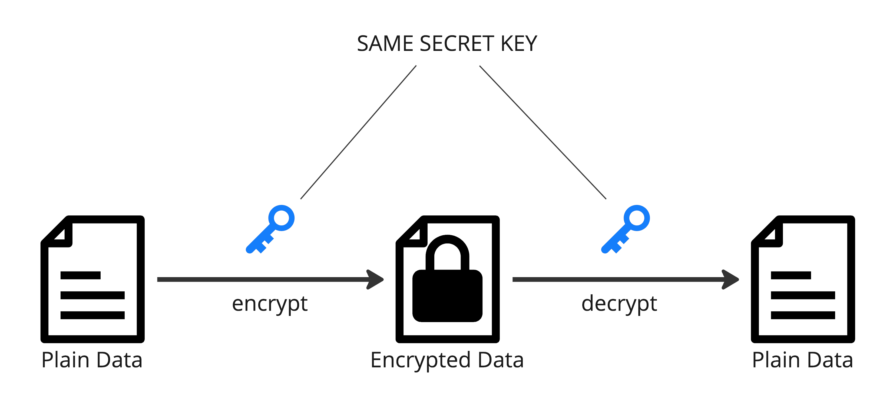
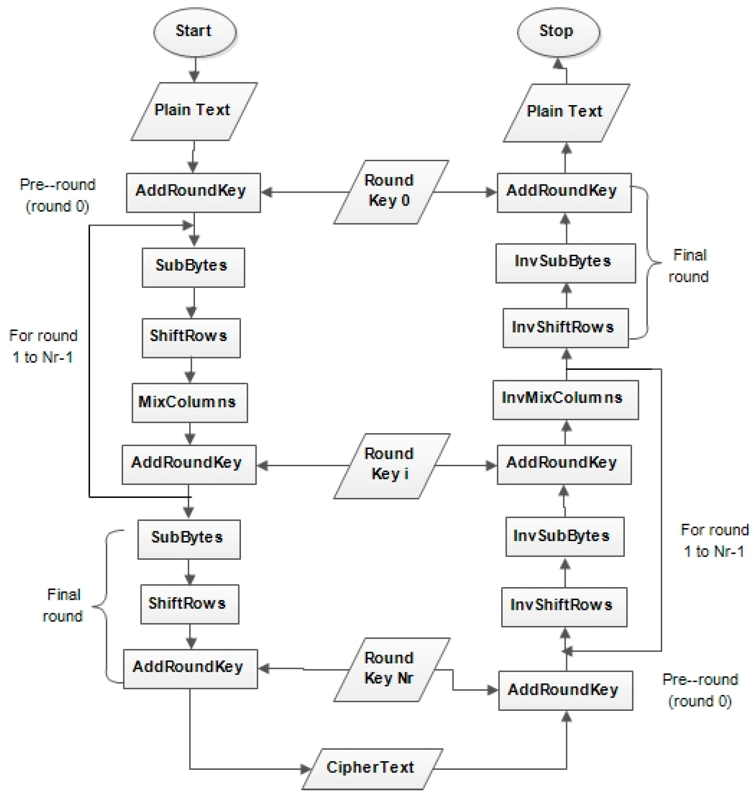
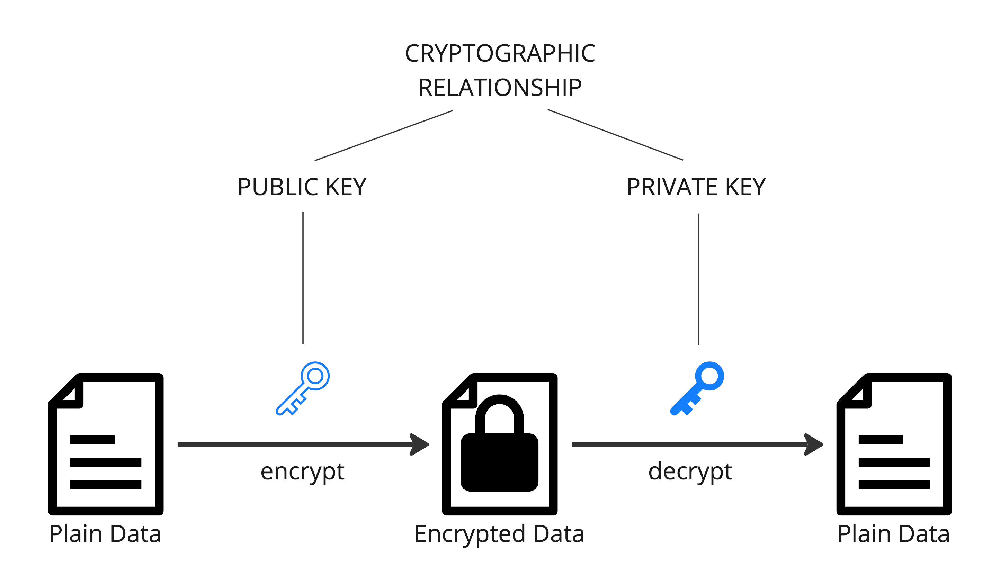

# Encryption

__Encryption__ is a process used to secure and protect information by converting it into a coded form that can only be deciphered by authorized individuals or systems. There are two main types of encryption: __symmetric encryption__ and __asymmetric encryption__.

## Symmetric Encryption

* __Key Concept__: In symmetric encryption, the same key is used for both the encryption and decryption of the data.
* __Process__: The sender and the receiver must both have a copy of the shared key, and this key is used to encrypt and decrypt the data.
* __Advantages__: Symmetric encryption is generally faster and less computationally intensive than asymmetric encryption.
* __Disadvantages__: The challenge lies in securely sharing and managing the secret key, especially in situations where secure key exchange is difficult.
* __Algorithms__: AES, Blowfish, Serpent.

### AES

__Advanced Encryption Standard (AES)__ is a widely used symmetric encryption algorithm established by the U.S. National Institute of Standards and Technology (NIST) in 2001. It is the successor to the Data Encryption Standard (DES) and is designed to be secure, efficient, and suitable for a wide range of applications.

Key features of AES include:

1. __Symmetric Key Algorithm__: AES uses a symmetric key algorithm, which means the same key is used for both encryption and decryption.

2. __Key Sizes__: AES supports key sizes of 128, 192, and 256 bits. The security strength of the algorithm increases with the key size.

3. __Block Cipher__: AES operates on data blocks of fixed size (128 bits) and uses a series of transformations to encrypt or decrypt the data.

4. __Rounds__: The number of rounds in AES depends on the key size: 10 rounds for 128-bit keys, 12 rounds for 192-bit keys, and 14 rounds for 256-bit keys.

5. __Security__: AES is considered highly secure and has withstood extensive cryptanalysis. It is widely used in various applications, including securing communications, protecting sensitive data, and ensuring the integrity of information.

6. __Global Standard__: Due to its security and efficiency, AES has become a global standard for encryption and is used in a wide range of security protocols and systems.

AES has broad adoption and is utilized in applications such as secure communication protocols (e.g., TLS/SSL), disk encryption, wireless network security (e.g., WPA2 and WPA3), and more. Its widespread use reflects its effectiveness and reliability in ensuring the confidentiality of information.

#### Modes

AES supports several modes of operation, which determine how the encryption and decryption processes are applied to the data. Here are some common AES modes:

1. __ECB (Electronic Codebook)__: This is the simplest mode where each block of plaintext is independently encrypted into a corresponding block of ciphertext. It's not recommended for use in secure systems for encrypting large amounts of data because identical blocks of plaintext will result in identical blocks of ciphertext.

2. __CBC (Cipher Block Chaining)__: In this mode, each block of plaintext is XORed with the previous ciphertext block before being encrypted. This introduces a level of diffusion and makes each block dependent on all previous blocks, enhancing security.

3. __CFB (Cipher Feedback)__: This mode allows the encryption of individual bytes, rather than blocks. Each ciphertext block is fed back into the encryption process to encrypt the next plaintext block.

4. __OFB (Output Feedback)__: Similar to CFB, but instead of encrypting the ciphertext feedback, it encrypts the output of the encryption function. It creates a stream of key-dependent pseudo-random bits that are XORed with the plaintext to produce the ciphertext.

5. __CTR (Counter)__: This mode turns a block cipher into a stream cipher. A counter value is encrypted and combined with the plaintext to produce the ciphertext. The counter is typically incremented for each subsequent block.

6. __GCM (Galois/Counter Mode)__: This mode combines the Counter mode with Galois field multiplication to provide both confidentiality and data integrity. It's widely used in applications like TLS for secure communication over the internet.

These modes address different security and performance requirements, and the choice of mode depends on the specific needs of the application. It's important to understand the characteristics of each mode and choose the one that best fits the security goals of the system.

#### Initialization Vector

__Initialization Vector (IV)__is a crucial component in enhancing the security of encrypted data. The IV is a block of data that is used as an additional input to the encryption algorithm for each block of plaintext. It ensures that the same plaintext encrypted with the same key will produce different ciphertexts, thus preventing patterns from emerging in the encrypted data.

Here are some key points about AES initialization vector:

1. __Unpredictability__: The IV should be unique and unpredictable for each encryption operation. This helps prevent attackers from deducing patterns and makes it more challenging to launch certain types of attacks.

2. __Size__: The size of the IV is typically equal to the block size of the encryption algorithm. For AES, which has a block size of 128 bits, the IV is also 128 bits (16 bytes).

3. __Transmission__: In some encryption modes, the IV needs to be transmitted along with the ciphertext to the recipient. This is important for decryption, as the recipient needs the same IV that was used during encryption.

4. __Preventing Replay Attacks__: The use of an IV also helps prevent replay attacks, where an attacker intercepts and retransmits encrypted data.

It's important to note that while the IV enhances security, its management and usage need to be carefully implemented to ensure the overall security of the cryptographic system.

## Asymmetric Encryption

* __Key Concept__: Asymmetric encryption uses a pair of keys, a public key, and a private key. The public key is used for encryption, and the private key is used for decryption.
* __Process__:
  * The public key can be freely distributed and is used by anyone who wants to send an encrypted message to the owner of the private key.
  * The private key is kept secret and is used by the owner to decrypt messages encrypted with their public key.
* __Advantages__: Asymmetric encryption provides a solution to the key distribution problem inherent in symmetric encryption. Even if the public key is widely known, only the private key can decrypt messages.
* __Disadvantages__: Asymmetric encryption is generally slower than symmetric encryption due to the complexity of the algorithms involved.
* __Algorithms__: RSA, ECC, ElGamal.

In practice, a common approach is to use a combination of both symmetric and asymmetric encryption in what is known as hybrid encryption. In this approach, symmetric encryption is used for the actual data, and asymmetric encryption is used to secure and exchange the symmetric keys. This combines the efficiency of symmetric encryption with the key management advantages of asymmetric encryption.

### RSA

__RSA__ algorithm, named after its inventors Ron Rivest, Adi Shamir, and Leonard Adleman, is a widely used public-key cryptosystem that enables secure data transmission and digital signatures. Here are some key points about the RSA algorithm:

1. __Public-Key Cryptosystem__: RSA is a public-key cryptosystem, which means it uses two keys: a public key for encryption and a private key for decryption. The keys are mathematically related but computationally infeasible to derive one from the other.

2. __Key Generation__: The security of RSA is based on the practical difficulty of factoring the product of two large prime numbers. The algorithm involves generating a pair of large prime numbers and using them to create public and private key pairs.

3. __Encryption and Decryption__: To send a secure message, the sender uses the recipient's public key to encrypt the message. The recipient, who holds the corresponding private key, can then decrypt the message. The reverse is also possible: a digital signature created with the sender's private key can be verified using their public key.

4. __Security__: RSA's security is based on the difficulty of factoring the product of two large prime numbers, a problem that becomes computationally infeasible as the size of the prime numbers increases. The security strength of RSA depends on the key length, with longer keys providing higher levels of security.

5. __Applications__: RSA is commonly used for securing communication over the internet, including email encryption, secure web browsing (HTTPS), and digital signatures. It is a fundamental component of many cryptographic protocols and systems.

6. __Challenges__: As computing power increases, longer key lengths may be required to maintain the same level of security. Additionally, advancements in quantum computing could potentially threaten the security of RSA, leading to the exploration of post-quantum cryptographic algorithms.

It's important to note that while RSA has been widely used, newer cryptographic algorithms and systems are also in use or development to address evolving security challenges.

## Secret Key Exchange

### Diffie-Hellman Key Exchange Algorithm

__Diffie-Hellman key exchange algorithm__ is a cryptographic method that allows two parties to agree on a shared secret key over an insecure communication channel. This key can then be used for secure communication, such as encrypting and decrypting messages.

Here's a brief overview of how the Diffie-Hellman key exchange works:

1. __Initialization__: Both parties, usually named Alice and Bob, agree on a public prime number (`p`) and a base (`g`) that are known to everyone. These parameters are not secret.

2. __Private Keys__: Each party generates a private key ((`a`) for Alice and (`b`) for Bob). These keys are kept private and not shared.

3. __Public Keys__: Using the agreed-upon (`p`) and (`g`), each party calculates a public key. Alice computes (`A = g^a mod p`), and Bob computes (`B = g^b mod p`).

4. __Exchange__: Alice and Bob exchange their public keys (`A`) and (`B`) with each other.

5. __Secret Key Calculation__: Both Alice and Bob independently use their private keys and the received public key to compute the shared secret key. Alice computes (`s = B^a mod p`), and Bob computes (`s = A^b mod p`).

The magic of the Diffie-Hellman algorithm is that even though (`a`), (`b`), (`A`), and (`B`) are exchanged over the insecure channel, an eavesdropper would find it computationally infeasible to determine the shared secret key without knowing at least one of the private keys.

This makes Diffie-Hellman a crucial component of many secure communication protocols, such as SSL/TLS used in web browsers for secure data transmission. It provides a way for two parties to agree on a secret key even if an adversary is listening to their communication.

#encryption
