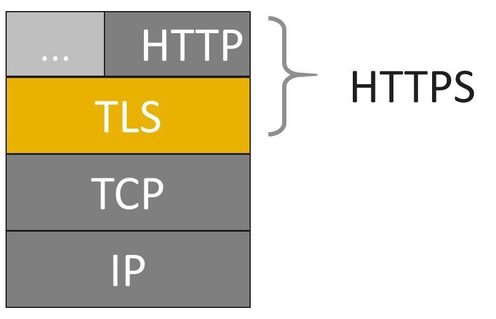
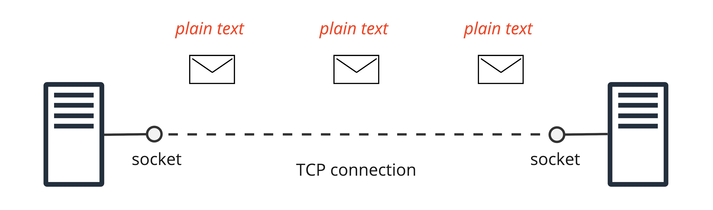
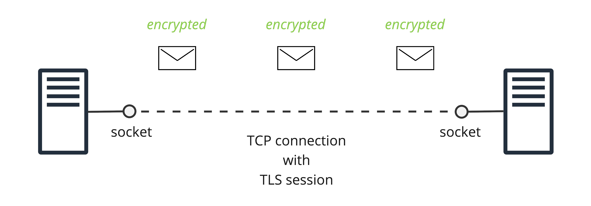
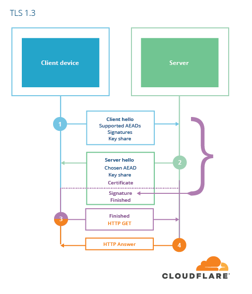
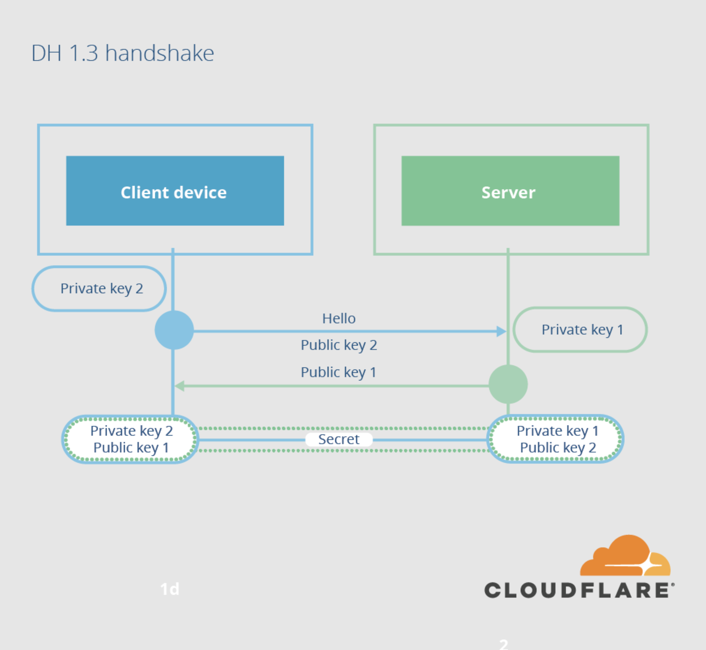
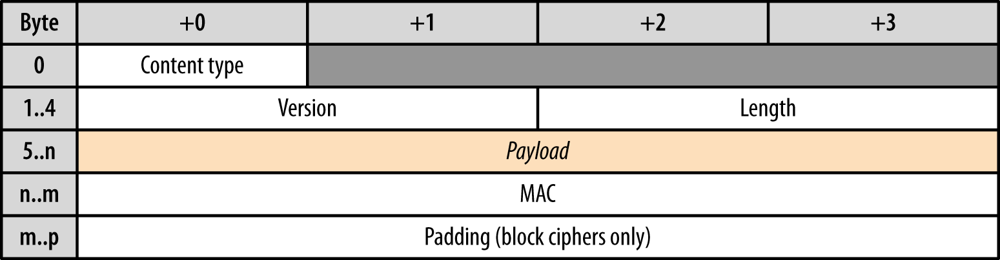

# Transport Layer Security

__Transport Layer Security__ (__TLS__) is a cryptographic protocol designed to provide secure communication over a computer network. TLS ensures that data transmitted between devices or systems is encrypted and authenticated, preventing eavesdropping and tampering by unauthorized parties.

TLS operates at the transport layer of the TCP/IP stack, providing a secure channel between communicating applications. TLS is normally implemented on top of TCP in order to encrypt application layer protocols such as HTTP, FTP, SMTP and IMAP, although it can also be implemented on UDP, DCCP and SCTP as well (e.g. for VPN and SIP-based application uses).

TLS provides several security features, including:

* __Encryption__. Data exchanged between the client and server is encrypted, making it unreadable to attackers.

* __Data Integrity__. TLS ensures that data transmitted between parties is not altered or tampered with during transmission.

* __Authentication__. TLS supports server authentication, where the client verifies the identity of the server using digital certificates. Optionally, mutual authentication can be performed, where both client and server authenticate each other.

* __Forward Secrecy__. TLS can provide forward secrecy, meaning that even if an attacker were to obtain the private key of the server in the future, they would not be able to decrypt past communications.

## Secure Sockets Layer (SSL)

TLS is a successor of SSL, designed to address vulnerabilities found in SSL. TLS 1.0 was defined in 1999, and subsequent versions have been released to enhance security and performance.

## TCP Connection

Data transmitted between the client and server is not encrypted, leaving it vulnerable to interception and tampering as it travels various internet devices. This lack of encryption can pose security risks, especially when sensitive information is being exchanged over the connection.

## TCP Connection with TLS Session

TLS is layered on top of TCP to provide secure communication. It encrypts data exchanged between the client and server, preventing eavesdropping and tampering by unauthorized parties.

## TLS Operation

### 1. Handshake

The TLS handshake process establishes a secure connection between the client and the server. It involves several steps:

* __Client Hello__. The client sends a message to the server indicating the highest TLS version it supports and the list of cryptographic algorithms it can use.

* __Server Hello__. The server responds with its chosen TLS version and cryptographic algorithms. The server sends its public key to the client, which is used to establish a shared secret key for encryption.

* __Authentication__. The server may request the client to authenticate itself, typically through digital certificates.

* __Session Key Generation__. Both parties generate _session keys_ used for encrypting and decrypting data.

TLS 1.3 uses Diffie-Hellman key exchange algorithm to create a shared secret. Previous version could also use RSA, but it was excluded because id had not provided a __perfect forward secrecy__.

### 2. Data Transfer

Once the secure connection is established, data can be transferred securely between the client and server. TLS encrypts the data to protect it from eavesdropping and tampering during transmission.

### TLS Record Protocol

Not unlike the IP or TCP layers below it, all data exchanged within a TLS session is also framed using a well-defined protocol . The TLS Record protocol is responsible for identifying different types of messages (handshake, alert, or data via the “Content Type” field), as well as securing and verifying the integrity of each message.

A typical workflow for delivering application data is as follows:

* Record protocol receives application data.

* Received data is divided into blocks: maximum of 214 bytes, or 16 KB per record.

* Message authentication code (MAC) or HMAC is added to each record.

* Data within each record is encrypted using the negotiated cipher.

Once these steps are complete, the encrypted data is passed down to the TCP layer for transport. On the receiving end, the same workflow, but in reverse, is applied by the peer: decrypt record using negotiated cipher, verify MAC, extract and deliver the data to the application above it.

### 3. Termination

When the communication is complete, either party can terminate the TLS connection.

## TLS Versions

The main versions of TLS include:

1. __TLS 1.0__. This was the first version of TLS, released in 1999. It provided security improvements over its predecessor, SSL (Secure Sockets Layer), but has since been found to have vulnerabilities and is considered insecure.

2. __TLS 1.1__. Introduced in 2006, TLS 1.1 addressed some of the security weaknesses found in TLS 1.0. It improved cipher suite security and added support for new algorithms.

3. __TLS 1.2__. Released in 2008, TLS 1.2 further enhanced security and added support for advanced cryptographic algorithms. It remains widely used today and is considered secure for most applications.

4. __TLS 1.3__. This is the latest version of TLS, finalized in 2018. TLS 1.3 offers significant security improvements over TLS 1.2, including reducing handshake latency and removing support for older, less secure algorithms. It also simplifies the protocol for better performance and security.

## Cipher Suites

TLS 1.3 supports several cipher suites, each offering different levels of security and performance. Here are some commonly used cipher suites for TLS 1.3:

1. __TLS_AES_128_GCM_SHA256__

   * Encryption Algorithm: AES-128 in Galois/Counter Mode (GCM)
   * Hash Algorithm: SHA-256

2. __TLS_AES_256_GCM_SHA384__

   * Encryption Algorithm: AES-256 in Galois/Counter Mode (GCM)
   * Hash Algorithm: SHA-384

3. __TLS_CHACHA20_POLY1305_SHA256__

   * Encryption Algorithm: ChaCha20
   * Authentication Tag: Poly1305
   * Hash Algorithm: SHA-256

4. __TLS_AES_128_CCM_SHA256__

   * Encryption Algorithm: AES-128 in Counter with CBC-MAC Mode (CCM)
   * Hash Algorithm: SHA-256

5. __TLS_AES_128_CCM_8_SHA256__

   * Encryption Algorithm: AES-128 in Counter with CBC-MAC Mode (CCM) with an 8-byte authentication tag
   * Hash Algorithm: SHA-256

These cipher suites offer a balance between security and performance, and their support may vary depending on the TLS implementation being used. It's important to ensure that both the client and server support the chosen cipher suite to establish a secure TLS connection.

## Links

* Transport Layer Security (TLS) - https://www.oreilly.com/library/view/high-performance-browser/9781449344757/ch04.html
* RFC 8446 (TLS 1.3) - https://datatracker.ietf.org/doc/html/rfc8446
* The Illustrated TLS 1.3 Connection - https://tls13.xargs.org/
* TLS 1.3: Everything you need to know - https://www.thesslstore.com/blog/tls-1-3-everything-possibly-needed-know/
* A Detailed Look at RFC 8446 (a.k.a. TLS 1.3) - https://blog.cloudflare.com/rfc-8446-aka-tls-1-3

#tls
