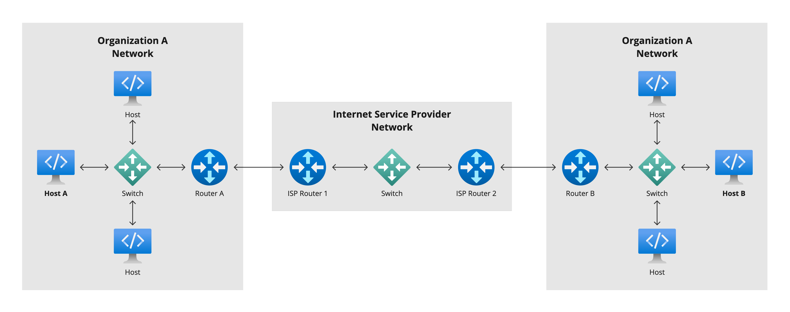
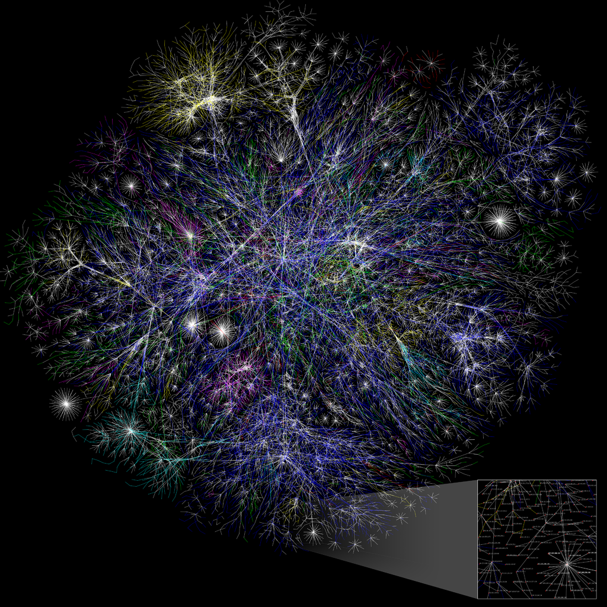
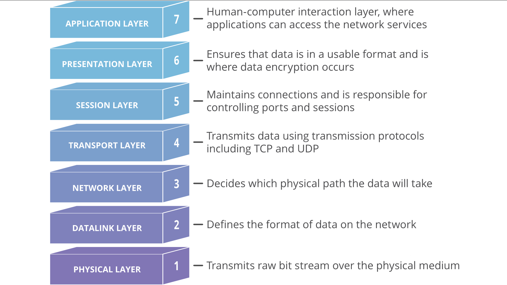
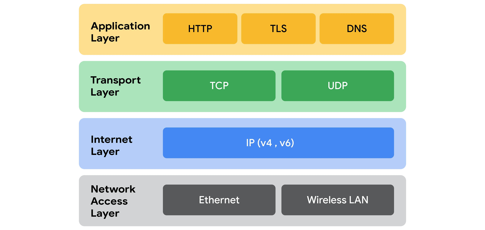
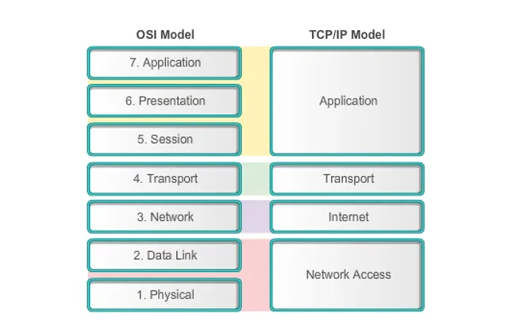
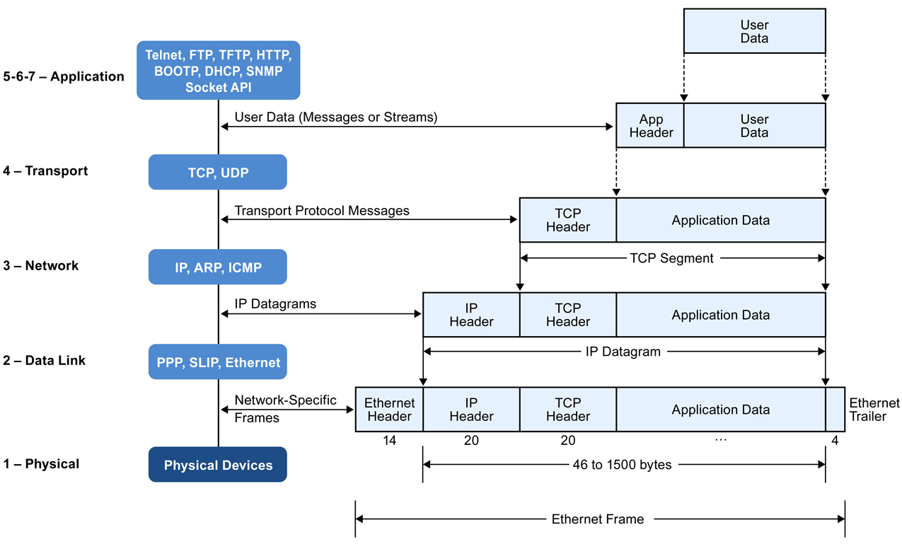
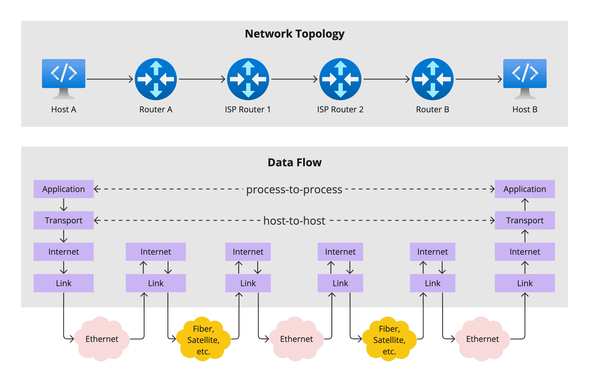

# TCP/IP Stack

The Internet protocol suite, commonly known as TCP/IP, is a framework for organizing the set of communication protocols used in the Internet and similar computer networks according to functional criteria. The foundational protocols in the suite are the Transmission Control Protocol (TCP), the User Datagram Protocol (UDP), and the Internet Protocol (IP). Early versions of this networking model were known as the Department of Defense (DoD) model because the research and development were funded by the United States Department of Defense through DARPA.

The Internet protocol suite provides end-to-end data communication specifying how data should be packetized, addressed, transmitted, routed, and received. This functionality is organized into four abstraction layers, which classify all related protocols according to each protocol's scope of networking. An implementation of the layers for a particular application forms a protocol stack. From lowest to highest, the layers are the link layer, containing communication methods for data that remains within a single network segment (link); the internet layer, providing internetworking between independent networks; the transport layer, handling host-to-host communication; and the application layer, providing process-to-process data exchange for applications.

## Internet

Internet is the network of networks.

Simple example:

Real life example. The part of the Internet in November 2003:

## OSI Model

The Open Systems Interconnection model (OSI model) is a conceptual model from the International Organization for Standardization (ISO) that "provides a common basis for the coordination of standards development for the purpose of systems interconnection." In the OSI reference model, the communications between systems are split into seven different abstraction layers: Physical, Data Link, Network, Transport, Session, Presentation, and Application.

The model partitions the flow of data in a communication system into seven abstraction layers to describe networked communication from the physical implementation of transmitting bits across a communications medium to the highest-level representation of data of a distributed application. Each intermediate layer serves a class of functionality to the layer above it and is served by the layer below it. Classes of functionality are realized in all software development through all standardized communication protocols.

## TCP/IP Model

### OSI Comparison

## Data Encapsulation

## Data Flow

## Links

* https://en.wikipedia.org/wiki/Internet_protocol_suite
* https://en.wikipedia.org/wiki/OSI_model

#tcp-ip
