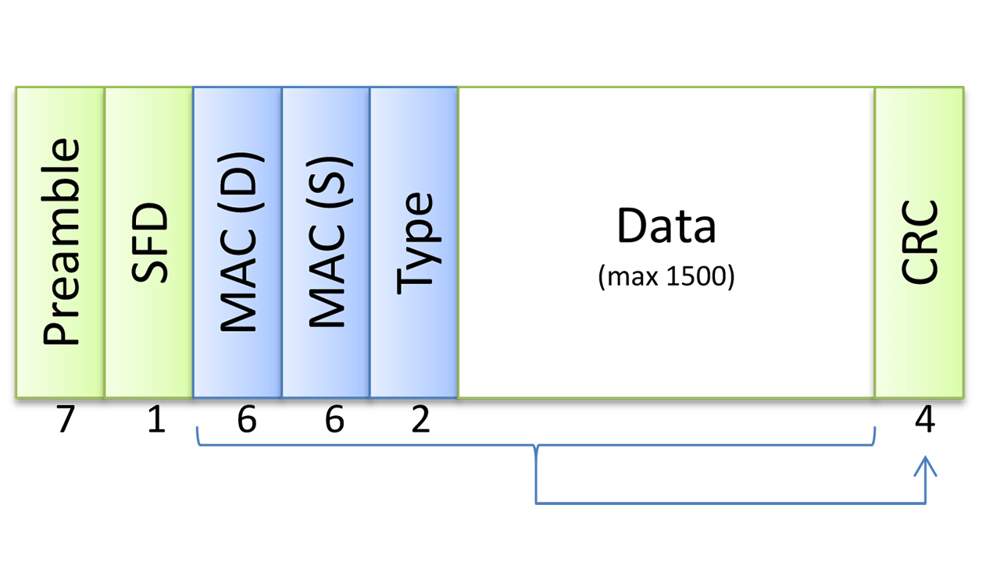

# Ethernet

Ethernet is a standard communication protocol used in wired networks to connect devices within a local area network (LAN). It defines how data packets are placed on the network and how they are addressed for transmission to other devices. Ethernet is widely used for connecting computers, routers, switches, and other networked devices.

## L1 Segment

__L1 segment__ (aka __physical segment__, aka __Ethernet segment__) - a network segment formed by an electrical (or optical) connection between networked devices using a shared medium. Nodes on a single L1 segment have a common physical layer.

_Ethernet repeater is an obsolete technology and not used nowadays._

Another example of the contemporary L1 segment is a point-to-point connection between two end-nodes via a patch or crossover cable.

## L2 Segment

__L2 segment__ - multiple L1 segments interconnected using a shared switch (aka __bridge__) or (somewhat recursively) multiple L2 segments merged into a bigger L2 segment by an upper-layer switch where nodes can communicate with each other using their L2 addresses (MAC) or by broadcasting frames.

### MAC Address

__MAC address__, or __Media Access Control address__, is a unique identifier assigned to network interfaces for communications on a physical network. It is a hardware address that is typically assigned by the manufacturer and is used for identifying devices on a network at the data link layer of the OSI model.

Here are some key points about MAC addresses:

1. __Format__: MAC addresses are usually expressed as six groups of two hexadecimal digits, separated by colons or dashes. For example, `"00:1A:2B:3C:4D:5E"`

2. __Uniqueness__: Each MAC address is meant to be globally unique. The first half of the address identifies the manufacturer, while the second half is unique to the device.

3. __Usage__: MAC addresses are used in Ethernet networks to uniquely identify devices. They play a crucial role in the functioning of network protocols.

4. __Changing MAC Address__: In some cases, users may want to change their device's MAC address for privacy or security reasons. This is usually done through software or configuration settings.

5. __Locating MAC Address__: On most devices, you can find the MAC address in the network settings. For example, on a computer, you can often find it in the network adapter settings.

### Bridge

__Ethernet bridge__ is a networking device that connects multiple network segments, making them operate as a single network. It operates at the data link layer (Layer 2) of the OSI model and is used to filter and forward Ethernet frames between network segments based on MAC addresses.

## Frame

__Ethernet frame__ is a data link layer protocol data unit (PDU) that is used to encapsulate and transport data over a local area network (LAN). It is the basic unit of information transmitted over Ethernet networks. The Ethernet frame format typically consists of the following components:

1. __Preamble__: A series of alternating 1s and 0s used to synchronize the receiver's clock with the incoming bitstream.

2. __Start Frame Delimiter (SFD)__: Marks the end of the preamble and indicates the beginning of the frame.

3. __Destination MAC Address__: The Media Access Control (MAC) address of the intended recipient device.

4. __Source MAC Address__: The MAC address of the sender's device.

5. __Type or Length__: Indicates either the length of the data field or the type of protocol being used.

6. __Data__: The actual payload of the frame, which can vary in size.

7. __Frame Check Sequence (FCS)__: A checksum or cyclic redundancy check (CRC) used for error detection.

## Links

* https://en.wikipedia.org/wiki/Ethernet
* https://en.wikipedia.org/wiki/Ethernet_frame
* https://iximiuz.com/en/posts/computer-networking-101/

#ethernet
