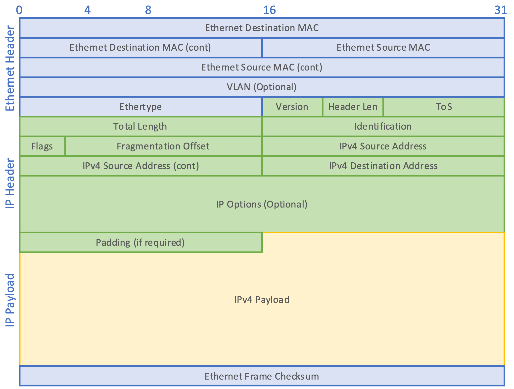

# IPv4 Datagrams

An IP packet consists of a header section and a data section. An IP packet has no data checksum or any other footer after the data section. Typically the link layer encapsulates IP packets in frames with a CRC footer that detects most errors, many transport-layer protocols carried by IP also have their own error checking.

IPv4 packet:

## Header

Field                                     | Description
------------------------------------------|------------
Version                                   | The first header field in an IP packet is the four-bit version field. For IPv4, this is always equal to 4
Internet Header Length (IHL)              | The IPv4 header is variable in size due to the optional 14th field (options). The IHL field contains the size of the IPv4 header; it has 4 bits that specify the number of 32-bit words in the header. The minimum value for this field is 5, which indicates a length of 5 × 32 bits = 160 bits = 20 bytes. As a 4-bit field, the maximum value is 15; this means that the maximum size of the IPv4 header is 15 × 32 bits = 480 bits = 60 bytes
Differentiated Services Code Point (DSCP) | Originally defined as the type of service (ToS), this field specifies differentiated services (DiffServ). Real-time data streaming makes use of the DSCP field. An example is Voice over IP (VoIP), which is used for interactive voice services
Explicit Congestion Notification (ECN)    | This field allows end-to-end notification of network congestion without dropping packets. ECN is an optional feature available when both endpoints support it and effective when also supported by the underlying network
Total Length                              | This 16-bit field defines the entire packet size in bytes, including header and data. The minimum size is 20 bytes (header without data) and the maximum is 65,535 bytes. All hosts are required to be able to reassemble datagrams of size up to 576 bytes, but most modern hosts handle much larger packets. Links may impose further restrictions on the packet size, in which case datagrams must be fragmented. Fragmentation in IPv4 is performed in either the sending host or in routers. Reassembly is performed at the receiving host
Identification                            | This field is an identification field and is primarily used for uniquely identifying the group of fragments of a single IP datagram. Some experimental work has suggested using the ID field for other purposes, such as for adding packet-tracing information to help trace datagrams with spoofed source addresses, but any such use is now prohibited
Flags                                     | A three-bit field follows and is used to control or identify fragments. They are (in order, from most significant to least significant): bit 0: __Reserved__; must be zero; bit 1: __Don't Fragment__ (__DF__); bit 2: __More Fragments__ (__MF__). If the DF flag is set, and fragmentation is required to route the packet, then the packet is dropped. This can be used when sending packets to a host that does not have resources to perform reassembly of fragments. It can also be used for path MTU discovery, either automatically by the host IP software, or manually using diagnostic tools such as ping or traceroute. For unfragmented packets, the MF flag is cleared. For fragmented packets, all fragments except the last have the MF flag set. The last fragment has a non-zero Fragment Offset field, differentiating it from an unfragmented packet.
Fragment offset                           | This field specifies the offset of a particular fragment relative to the beginning of the original unfragmented IP datagram. The fragmentation offset value for the first fragment is always 0. The field is 13 bits wide, so that the offset can be from 0 to 8191 (from (20  – 1) to (213 – 1)). Fragments are specified in units of 8 bytes, which is why fragment length must be a multiple of 8. Therefore, the 13-bit field allows a maximum offset of (213 – 1) × 8 = 65,528 bytes, with the header length included (65,528 + 20 = 65,548 bytes), supporting fragmentation of packets exceeding the maximum IP length of 65,535 bytes
Time to live (TTL)                        | An eight-bit time to live field limits a datagram's lifetime to prevent network failure in the event of a _routing loop_. It is specified in seconds, but time intervals less than 1 second are rounded up to 1. In practice, the field is used as a _hop count_ — when the datagram arrives at a router, the router decrements the TTL field by one. When the TTL field hits zero, the router discards the packet and typically sends an ICMP time exceeded message to the sender.
Protocol                                  | This field defines the protocol used in the data portion of the IP datagram. IANA maintains a list of IP protocol numbers
Header checksum                           | The 16-bit IPv4 header checksum field is used for error-checking of the header. When a packet arrives at a router, the router calculates the checksum of the header and compares it to the checksum field. If the values do not match, the router discards the packet. Errors in the data field must be handled by the encapsulated protocol. Both UDP and TCP have separate checksums that apply to their 
Source address                            | This 32-bit field is the IPv4 address of the sender of the packet. It may be changed in transit by network address translation (NAT)
Destination address                       | This 32-bit field is the IPv4 address of the receiver of the packet. It may be affected by NAT
Options                                   | The options field is not often used. Packets containing some options may be considered as dangerous by some routers and be blocked

## Data

The packet payload is not included in the checksum. Its contents are interpreted based on the value of the Protocol header field.

Some of the common payload protocols include:

Protocol Number | Protocol Name                        | Abbreviation
----------------|--------------------------------------|-------------
1               | Internet Control Message Protocol    | ICMP
2               | Internet Group Management Protocol   | IGMP
6               | Transmission Control Protocol        | TCP
17              | User Datagram Protocol               | UDP
41              | IPv6 encapsulation                   | ENCAP
89              | Open Shortest Path First             | OSPF
132             | Stream Control Transmission Protocol | SCTP

## Links

* https://en.wikipedia.org/wiki/List_of_IP_protocol_numbers

#ipv4-datagram
