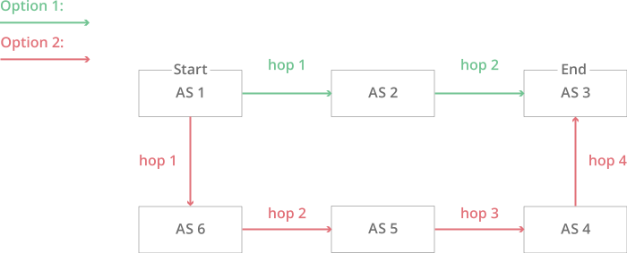
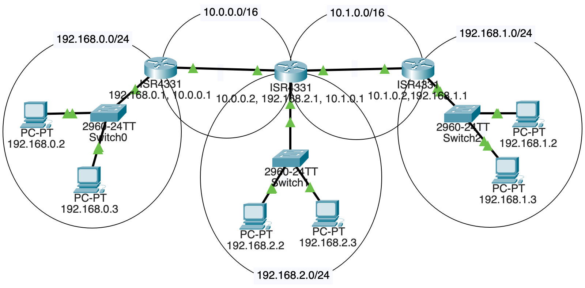
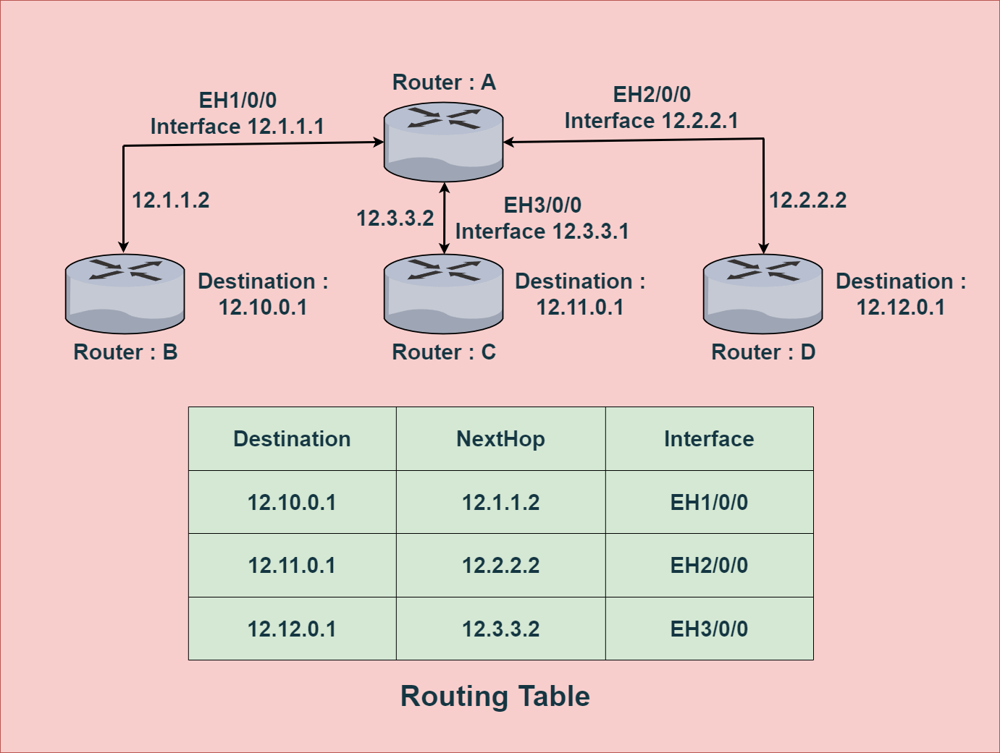

# IPv4 Routing

The Internet is a network of networks. Routing allows to find a way from a host in one network to a host in another network.

Usually, there are many paths between two given hosts.

Routing allows to select shortests and fastests paths.

IPv4 is a _connectionless_ protocol, and operates on a best-effort delivery model, in that it does not guarantee delivery, nor does it assure proper sequencing or avoidance of duplicate delivery. These aspects, including data integrity, are addressed by an upper layer transport protocol, such as the __Transmission Control Protocol__ (__TCP__).

Connectionless means that each packet of data is treated independently and is routed based on the destination address in the packet header, without establishing a dedicated connection between the sender and receiver.

## Routers

A __router__ is a networking device that forwards data packets between computer networks. It operates at the network layer and is responsible for determining the best path for data to travel from the source to the destination. Routers are commonly used in homes, businesses, and on the internet to connect different networks together and facilitate the exchange of data between devices.

On the internet, routers play a crucial role in directing data traffic between different networks, ensuring that data packets reach their intended destinations efficiently. They use routing tables and protocols, such as Border Gateway Protocol (BGP), to make decisions about the best path for data to travel based on factors like network congestion, speed, and reliability.

Routers make this work:

## Routing Table

Routers use a routing table to forward traffic from one network to another. The routing table stores the destination addresses for networks, hosts, or subnets accessible through a router.

The routing table contains the address of the next hop of each connected network. The next hop of a network is the router through which a packet must go to reach the destination network. Once a router receives an incoming packet, it uses the routing table to find the next hop.

There are special protocols like BGP for keeping routing tables up to date.

Here are the basic steps involved in managing a routing table:

1. Static or Dynamic Routing Configuration:

* Static Routing: Manually configured routes by a network administrator.
* Dynamic Routing: Automatically updated based on routing protocols such as RIP (Routing Information Protocol), OSPF (Open Shortest Path First), BGP (Border Gateway Protocol), etc.

2. Route Entry Configuration:

* Each entry in the routing table includes at least the following information:
  * Destination IP address or network.
  * Subnet mask or prefix length.
  * Next-hop IP address or exit interface.

3. Routing Decision Process:

* When a packet arrives at the router, the routing table is consulted to determine the best path for forwarding the packet.
* The router compares the destination IP address of the packet with the entries in its routing table.

4. Longest Prefix Match:

* The router uses the longest prefix match to find the most specific route in the routing table that matches the destination IP address of the packet.

5. Next-Hop Determination:

* The router identifies the next-hop IP address or exit interface based on the selected route.

6. Packet Forwarding:

* The router forwards the packet to the next-hop IP address or out the specified interface.

7. Dynamic Routing Updates (if applicable):

* In the case of dynamic routing, routing protocols periodically exchange routing information between routers to update their routing tables.

## Links

* https://www.cloudflare.com/learning/network-layer/what-is-routing/

#ipv4-routing
