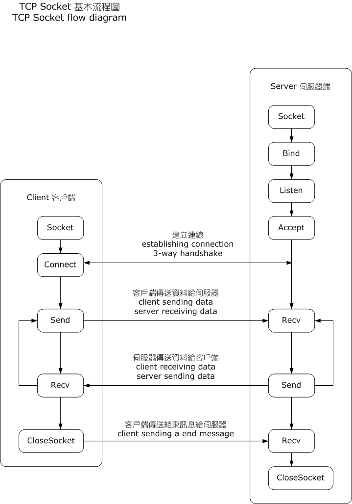

# Network Socket

A __network socket__ is a software structure within a network node of a computer network that serves as an endpoint for sending and receiving data across the network. The structure and properties of a socket are defined by an application programming interface (API) for the networking architecture. Sockets are created only during the lifetime of a process of an application running in the node.

## Types

Several types of sockets are available:

__Datagram sockets__

Connectionless sockets, which use User Datagram Protocol (UDP). Each packet sent or received on a datagram socket is individually addressed and routed. Order and reliability are not guaranteed with datagram sockets, so multiple packets sent from one machine or process to another may arrive in any order or might not arrive at all.

__Stream sockets__

Connection-oriented sockets, which use Transmission Control Protocol (TCP), Stream Control Transmission Protocol (SCTP) or Datagram Congestion Control Protocol (DCCP). A stream socket provides a sequenced and unique flow of error-free data without record boundaries, with well-defined mechanisms for creating and destroying connections and reporting errors. A stream socket transmits data reliably, in order, and with out-of-band capabilities. On the Internet, stream sockets are typically implemented using TCP so that applications can run across any networks using TCP/IP protocol.

__Raw sockets__

Allow direct sending and receiving of IP packets without any protocol-specific transport layer formatting. With other types of sockets, the payload is automatically encapsulated according to the chosen transport layer protocol (e.g. TCP, UDP), and the socket user is unaware of the existence of protocol headers that are broadcast with the payload. When reading from a raw socket, the headers are usually included. When transmitting packets from a raw socket, the automatic addition of a header is optional.

## Berkeley Sockets

__Berkeley sockets__ is an application programming interface (API) for Internet sockets and Unix domain sockets, used for inter-process communication (IPC). It is commonly implemented as a library of linkable modules. It originated with the 4.2BSD Unix operating system, which was released in 1983.

A socket is an abstract representation (handle) for the local endpoint of a network communication path. The Berkeley sockets API represents it as a file descriptor (file handle) in the Unix philosophy that provides a common interface for input and output to streams of data.

The Berkeley socket API typically provides the following functions:

* `socket()` creates a new socket of a certain type, identified by an integer number, and allocates system resources to it.
* `bind()` is typically used on the server side, and associates a socket with a socket address structure, i.e. a specified local IP address and a port number.
* `listen()` is used on the server side, and causes a bound TCP socket to enter listening state.
* `connect()` is used on the client side, and assigns a free local port number to a socket. In case of a TCP socket, it causes an attempt to establish a new TCP connection.
* `accept()` is used on the server side. It accepts a received incoming attempt to create a new TCP connection from the remote client, and creates a new socket associated with the socket address pair of this connection.
* `send()`, `recv()`, `sendto()`, and `recvfrom()` are used for sending and receiving data. The standard functions `write()` and `read()` may also be used.
* `close()` causes the system to release resources allocated to a socket. In case of TCP, the connection is terminated.
* `gethostbyname()` and `gethostbyaddr()` are used to resolve host names and addresses. IPv4 only.
* `getaddrinfo()` and `freeaddrinfo()` are used to resolve host names and addresses. IPv4, IPv6.
* `select()` is used to suspend, waiting for one or more of a provided list of sockets to be ready to read, ready to write, or that have errors.
`poll()` is used to check on the state of a socket in a set of sockets. The set can be tested to see if any socket can be written to, read from or if an error occurred.
`getsockopt()` is used to retrieve the current value of a particular socket option for the specified socket.
`setsockopt()` is used to set a particular socket option for the specified socket.

### .NET

.NET `Socket` class implements the Berkeley socket interface.

## Links

* https://en.wikipedia.org/wiki/Network_socket
* https://en.wikipedia.org/wiki/Berkeley_sockets
* https://learn.microsoft.com/en-us/dotnet/api/system.net.sockets.socket?view=net-7.0

#network-socket
