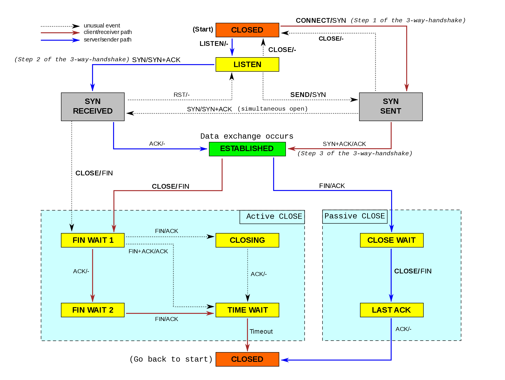
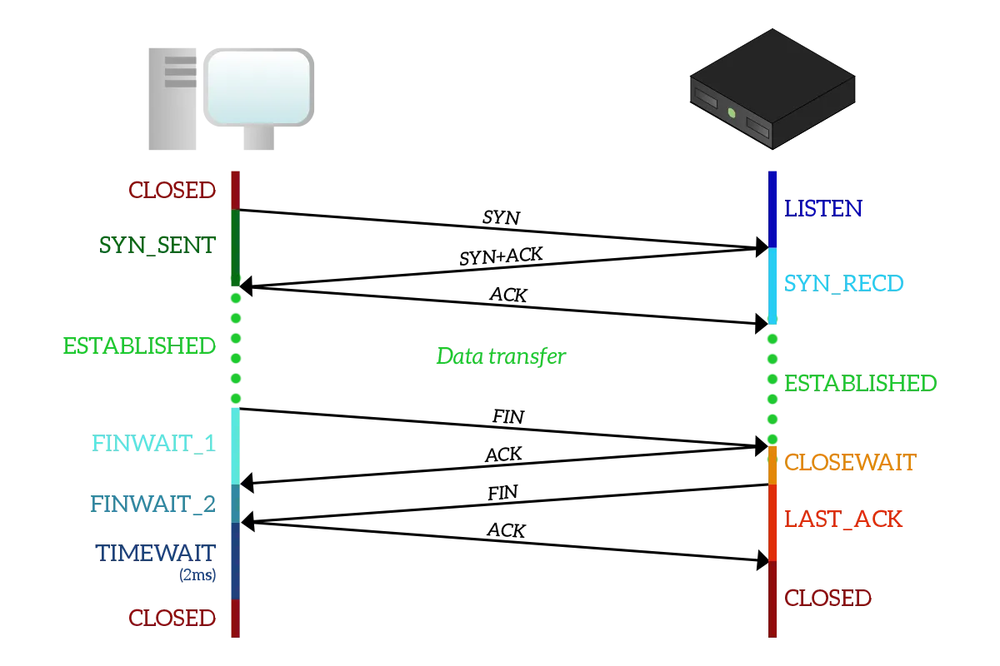
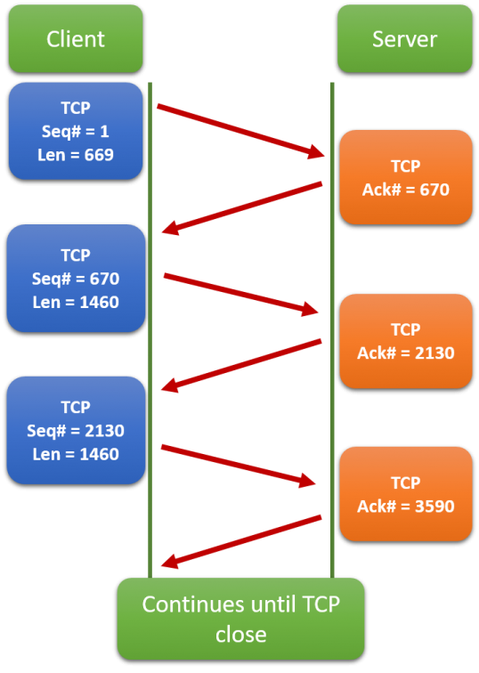
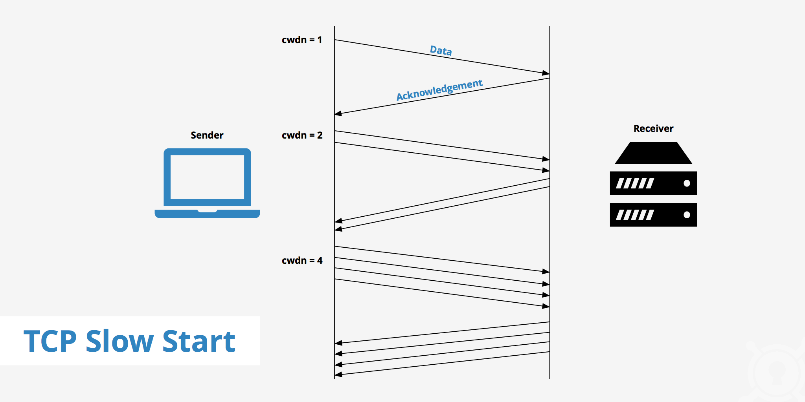

# TCP Protocol Operation

TCP protocol operations may be divided into three phases. _Connection establishment_ is a multi-step handshake process that establishes a connection before entering the _data transfer_ phase. After data transfer is completed, the _connection termination_ closes the connection and releases all allocated resources.

A TCP connection is managed by an operating system through a resource that represents the local end-point for communications, the __Internet socket__. During the lifetime of a TCP connection, the local end-point undergoes a series of state changes:

State        | Endpoint          | Description
-------------|-------------------|------------
LISTEN       | Server            | Waiting for a connection request from any remote TCP end-point.
SYN-SENT     | Client            | Waiting for a matching connection request after having sent a connection request.
SYN-RECEIVED | Server            | Waiting for a confirming connection request acknowledgment after having both received and sent a connection request.
ESTABLISHED  | Server and client | An open connection, data received can be delivered to the user. The normal state for the data transfer phase of the connection.
FIN-WAIT-1   | Server and client | Waiting for a connection termination request from the remote TCP, or an acknowledgment of the connection termination request previously sent.
FIN-WAIT-2   | Server and client | Waiting for a connection termination request from the remote TCP.
CLOSE-WAIT   | Server and client | Waiting for a connection termination request from the local user.
CLOSING      | Server and client | Waiting for a connection termination request acknowledgment from the remote TCP.
LAST-ACK     | Server and client | Waiting for an acknowledgment of the connection termination request previously sent to the remote TCP (which includes an acknowledgment of its connection termination request).
TIME-WAIT    | Server or client  | Waiting for enough time to pass to be sure that all remaining packets on the connection have expired.
CLOSED       | Server and client | No connection state at all.

## Connection Establishment

Before a client attempts to connect with a server, the server must first bind to and listen at a port to open it up for connections: this is called a passive open. Once the passive open is established, a client may establish a connection by initiating an active open using the three-way (or 3-step) handshake:

1. __SYN__: The active open is performed by the client sending a SYN to the server. The client sets the segment's sequence number to a random value A.
2. __SYN-ACK__: In response, the server replies with a SYN-ACK. The acknowledgment number is set to one more than the received sequence number i.e. A+1, and the sequence number that the server chooses for the packet is another random number, B.
3. __ACK__: Finally, the client sends an ACK back to the server. The sequence number is set to the received acknowledgment value i.e. A+1, and the acknowledgment number is set to one more than the received sequence number i.e. B+1.

Steps 1 and 2 establish and acknowledge the sequence number for one direction (client to server). Steps 2 and 3 establish and acknowledge the sequence number for the other direction (server to client). Following the completion of these steps, both the client and server have received acknowledgments and a full-duplex communication is established.

## Connection Termination

The connection termination phase uses a four-way handshake, with each side of the connection terminating independently. When an endpoint wishes to stop its half of the connection, it transmits a __FIN packet__, which the other end acknowledges with an __ACK__. Therefore, a typical tear-down requires a pair of FIN and ACK segments from each TCP endpoint.

## Data Transfer

TCP differs in several key features compared to UDP:

* Ordered data transfer: the destination host rearranges segments according to a sequence number
* Retransmission of lost packets: any cumulative stream not acknowledged is retransmitted
* Error-free data transfer: corrupted packets are treated as lost and are retransmitted
* Flow control: limits the rate a sender transfers data to guarantee reliable delivery. The receiver continually hints the sender on how much data can be received. When the receiving host's buffer fills, the next acknowledgment suspends the transfer and allows the data in the buffer to be processed
* Congestion control: lost packets (presumed due to congestion) trigger a reduction in data delivery rate

### Reliable Transmission

TCP uses a __sequence number__ to identify each byte of data. The sequence number identifies the order of the bytes sent from each computer so that the data can be reconstructed in order, regardless of any out-of-order delivery that may occur. The sequence number of the first byte is chosen by the transmitter for the first packet, which is flagged SYN. This number can be arbitrary, and should, in fact, be unpredictable to defend against TCP sequence prediction attacks.

__Acknowledgements__ (__ACKs__) are sent with a sequence number by the receiver of data to tell the sender that data has been received to the specified byte. ACKs do not imply that the data has been delivered to the application, they merely signify that it is now the receiver's responsibility to deliver the data.

### Slow Start

TCP slow start is an algorithm which balances the speed of a network connection. Slow start gradually increases the amount of data transmitted until it finds the network’s maximum carrying capacity.

TCP slow start is one of the first steps in the congestion control process. It balances the amount of data a sender can transmit (known as the _congestion window_) with the amount of data the receiver can accept (known as the _receiver window_). The lower of the two values becomes the maximum amount of data that the sender is allowed to transmit before receiving an acknowledgment from the receiver.

Step-by-step, here’s how slow start works:

1. A sender attempts to communicate to a receiver. The sender’s initial packet contains a small congestion window, which is determined based on the sender’s maximum window.
2. The receiver acknowledges the packet and responds with its own window size. If the receiver fails to respond, the sender knows not to continue sending data.
3. After receiving the acknowledgement, the sender increases the next packet’s window size. The window size gradually increases until the receiver can no longer acknowledge each packet, or until either the sender or the receiver’s window limit is reached.

## Notes

<mark>Establishing new TCP connection is expensive due to the 3-way handshake and the slow start.</mark>

## Links

* https://en.wikipedia.org/wiki/Transmission_Control_Protocol
* https://www.quora.com/Why-are-TCP-connections-expensive-when-made-from-an-application

#tcp-protocol-operation
