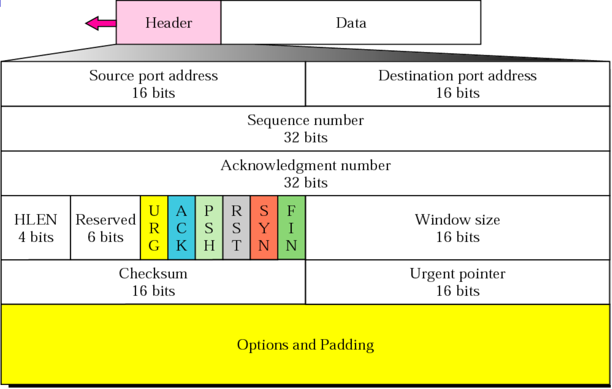

# TCP Segment

Transmission Control Protocol accepts data from a data stream, divides it into chunks, and adds a __TCP header__ creating a __TCP segment__. The TCP segment is then encapsulated into an Internet Protocol (IP) datagram, and exchanged with peers.

A TCP segment consists of a segment header and a data section. The segment header contains 10 mandatory fields, and an optional extension field (_Options_). The data section follows the header and is the payload data carried for the application. The length of the data section is not specified in the segment header; it can be calculated by subtracting the combined length of the segment header and IP header from the total IP datagram length specified in the IP header.

__Source port (16 bits)__

Identifies the sending port.

__Destination port (16 bits)__

Identifies the receiving port.

__Sequence number (32 bits)__

Has a dual role:

* If the SYN flag is set (1), then this is the initial sequence number. The sequence number of the actual first data byte and the acknowledged number in the corresponding ACK are then this sequence number plus 1.
* If the SYN flag is unset (0), then this is the accumulated sequence number of the first data byte of this segment for the current session.

__Acknowledgment number (32 bits)__

If the ACK flag is set then the value of this field is the next sequence number that the sender of the ACK is expecting. This acknowledges receipt of all prior bytes (if any). The first ACK sent by each end acknowledges the other end's initial sequence number itself, but no data.

__Data offset (4 bits)__

Specifies the size of the TCP header in 32-bit words. The minimum size header is 5 words and the maximum is 15 words thus giving the minimum size of 20 bytes and maximum of 60 bytes, allowing for up to 40 bytes of options in the header. This field gets its name from the fact that it is also the offset from the start of the TCP segment to the actual data.[citation needed]

__Reserved (4 bits)__

For future use and should be set to zero; senders should not set these and receivers should ignore them if set, in the absence of further specification and implementation. From 2003–2017, the last bit (bit 103 of the header) was defined as the NS (Nonce Sum) flag by the experimental RFC 3540, ECN-nonce. ECN-nonce never gained widespread use and the RFC was moved to Historic status.

__Flags (8 bits)__

Contains 8 1-bit flags (control bits) as follows:

* CWR (1 bit): Congestion window reduced (CWR) flag is set by the sending host to indicate that it received a TCP segment with the ECE flag set and had responded in congestion control mechanism.
* ECE (1 bit): ECN-Echo has a dual role, depending on the value of the SYN flag. It indicates:
    * If the SYN flag is set (1), the TCP peer is ECN capable.
    * If the SYN flag is unset (0), a packet with the Congestion Experienced flag set (ECN=11) in its IP header was received during normal transmission. This serves as an indication of network congestion (or impending congestion) to the TCP sender.
* URG (1 bit): Indicates that the Urgent pointer field is significant.
* ACK (1 bit): Indicates that the Acknowledgment field is significant. All packets after the initial SYN packet sent by the client should have this flag set.
* PSH (1 bit): Push function. Asks to push the buffered data to the receiving application.
* RST (1 bit): Reset the connection
* SYN (1 bit): Synchronize sequence numbers. Only the first packet sent from each end should have this flag set. Some other flags and fields change meaning based on this flag, and some are only valid when it is set, and others when it is clear.
* FIN (1 bit): Last packet from sender

__Window size (16 bits)__

The size of the receive window, which specifies the number of window size units that the sender of this segment is currently willing to receive.

__Checksum (16 bits)__

The 16-bit checksum field is used for error-checking of the TCP header, the payload and an IP pseudo-header. The pseudo-header consists of the source IP address, the destination IP address, the protocol number for the TCP protocol (6) and the length of the TCP headers and payload (in bytes).

__Urgent pointer (16 bits)__
If the URG flag is set, then this 16-bit field is an offset from the sequence number indicating the last urgent data byte.

__Options (Variable 0–320 bits, in units of 32 bits)__

The length of this field is determined by the _data offset_ field. Options have up to three fields: Option-Kind (1 byte), Option-Length (1 byte), Option-Data (variable). The Option-Kind field indicates the type of option and is the only field that is not optional. Depending on Option-Kind value, the next two fields may be set. Option-Length indicates the total length of the option, and Option-Data contains data associated with the option, if applicable. For example, an Option-Kind byte of 1 indicates that this is a no operation option used only for padding, and does not have an Option-Length or Option-Data fields following it. An Option-Kind byte of 0 marks the end of options, and is also only one byte. An Option-Kind byte of 2 is used to indicate Maximum Segment Size option, and will be followed by an Option-Length byte specifying the length of the MSS field. Option-Length is the total length of the given options field, including Option-Kind and Option-Length fields. So while the MSS value is typically expressed in two bytes, Option-Length will be 4. As an example, an MSS option field with a value of 0x05B4 is coded as (0x02 0x04 0x05B4) in the TCP options section.

__Padding__

The TCP header padding is used to ensure that the TCP header ends, and data begins, on a 32-bit boundary. The padding is composed of zeros.

## Links

* https://en.wikipedia.org/wiki/Transmission_Control_Protocol

#tcp-segment
