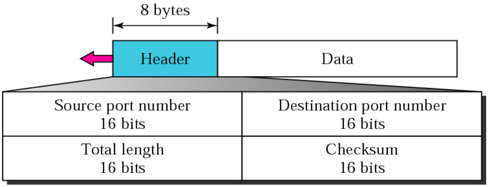
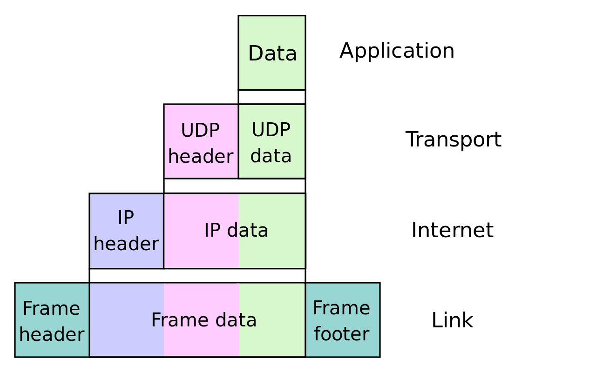

# UDP

__User Datagram Protocol__ (__UDP__) is one of the core communication protocols of the Internet protocol suite used to send messages (transported as _datagrams_ in _packets_) to other hosts on an Internet Protocol (IP) network. Within an IP network, UDP does not require prior communication to set up communication channels or data paths.

UDP uses a simple __connectionless__ communication model with a minimum of protocol mechanisms. UDP provides checksums for data integrity, and port numbers for addressing different functions at the source and destination of the datagram. It has no handshaking dialogues and thus exposes the user's program to any unreliability of the underlying network; there is no guarantee of delivery, ordering, or duplicate protection. If error-correction facilities are needed at the network interface level, an application may instead use TCP.

A number of UDP's attributes make it especially suited for certain applications.

* It is _transaction-oriented_, suitable for simple query-response protocols such as the Domain Name System or the Network Time Protocol.
* It provides _datagrams_, suitable for modeling other protocols such as IP tunneling or remote procedure call and the Network File System.
* It is _simple_, suitable for bootstrapping or other purposes without a full protocol stack, such as the DHCP and Trivial File Transfer Protocol.
* It is _stateless_, suitable for very large numbers of clients, such as in streaming media applications like IPTV.
* The _lack of retransmission delays_ makes it suitable for real-time applications such as Voice over IP, online games, and many protocols using Real Time Streaming Protocol.
* Because it supports _multicast_, it is suitable for broadcast information such as in many kinds of service discovery and shared information such as Precision Time Protocol and Routing Information Protocol.

## Ports

Applications can use datagram sockets to establish host-to-host communications. An application binds a socket to its endpoint of data transmission, which is a combination of an IP address and a port. In this way, UDP provides application multiplexing. A port is a software structure that is identified by the port number, a 16-bit integer value, allowing for port numbers between 0 and 65535. Port 0 is reserved but is a permissible source port value if the sending process does not expect messages in response.

## Datagram Structure

__Source port number__

This field identifies the sender's port, when used, and should be assumed to be the port to reply to if needed. If not used, it should be zero. If the source host is the client, the port number is likely to be an ephemeral port. If the source host is the server, the port number is likely to be a well-known port number from 0 to 1023.

__Destination port number__

This field identifies the receiver's port and is required. Similar to source port number, if the client is the destination host then the port number will likely be an ephemeral port number and if the destination host is the server then the port number will likely be a well-known port number.

__Length__

This field specifies the length in bytes of the UDP header and UDP data. The minimum length is 8 bytes, the length of the header. The field size sets a theoretical limit of 65,535 bytes (8-byte header + 65,527 bytes of data) for a UDP datagram. However, the actual limit for the data length, which is imposed by the underlying IPv4 protocol, is __65,507 bytes__ (65,535 bytes − 8-byte UDP header − 20-byte IP header).

__Checksum__

The checksum field may be used for error-checking of the header and data. This field is optional in IPv4, and mandatory in most cases in IPv6. The field carries all-zeros if unused.

## TCP/IP Encapsulation

## Applications

Numerous key Internet applications use UDP, including: the Domain Name System (DNS), the Simple Network Management Protocol (SNMP), the Routing Information Protocol (RIP) and the Dynamic Host Configuration Protocol (DHCP).

Voice and video traffic is generally transmitted using UDP. Real-time video and audio streaming protocols are designed to handle occasional lost packets, so only slight degradation in quality occurs, rather than large delays if lost packets were retransmitted.

Some VPN systems such as OpenVPN may use UDP and perform error checking at the application level while implementing reliable connections.

QUIC is a transport protocol built on top of UDP. QUIC provides a reliable and secure connection. HTTP/3 uses QUIC as opposed to earlier versions of HTTPS which use a combination of TCP and TLS to ensure reliability and security respectively. This means that HTTP/3 uses a single handshake to set up a connection, rather than having two separate handshakes for TCP and TLS, meaning the overall time to establish a connection is reduced.

## Links

* https://en.wikipedia.org/wiki/User_Datagram_Protocol
* https://enclave.io/high-performance-udp-sockets-net6/
* https://github.com/dotnet/runtime/issues/30797

#udp
