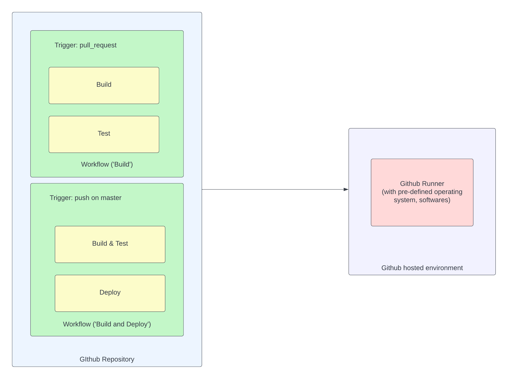

# GitHub Actions

GitHub Actions is a continuous integration and continuous delivery (CI/CD) platform provided by GitHub. It allows you to automate various tasks in your software development workflow, such as building, testing, and deploying your code. With GitHub Actions, you can define custom workflows using YAML syntax directly in your GitHub repository.

Key features of GitHub Actions include:

* __Workflow Automation__: Define custom workflows to automate tasks based on events in your GitHub repository, such as push, pull request, issue creation, etc.

* __CI/CD__: GitHub Actions is commonly used for Continuous Integration (CI) and Continuous Delivery (CD). You can set up workflows to build and test your code automatically whenever changes are pushed to the repository.

* __Extensibility__: GitHub Actions provides a marketplace where you can find and use pre-built actions created by the community. Actions are reusable units of code that can be combined to create workflows.

* __Matrix Builds__: You can define matrix builds to run jobs across multiple versions of programming languages, dependencies, or operating systems.

* __Secrets Management__: GitHub Actions allows you to securely store and use secrets, such as API keys and access tokens, in your workflows.

* __Parallel Jobs__: Workflows can consist of multiple jobs that can run in parallel, speeding up the overall execution time.

* __Notifications__: Receive notifications on the status of your workflows, making it easy to identify and address any issues.

GitHub Actions is integrated with GitHub repositories, making it a convenient choice for developers using GitHub as their version control system. It provides a flexible and scalable way to automate software development processes, improving collaboration and code quality.

## Links

* https://github.com/features/actions

#github-actions
