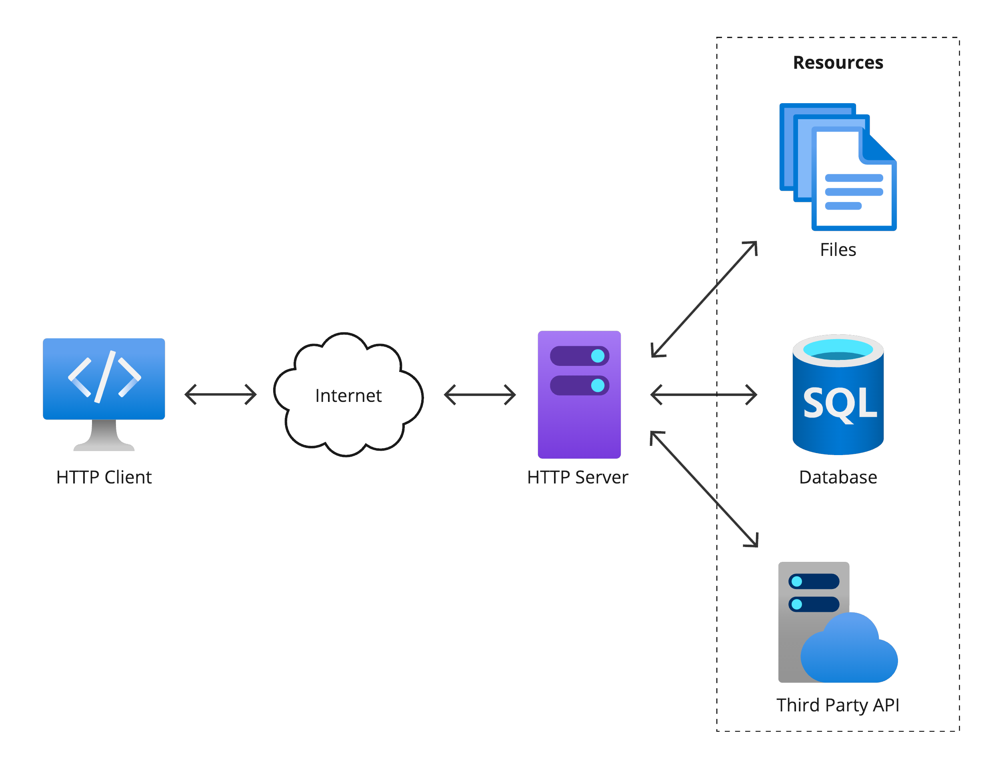
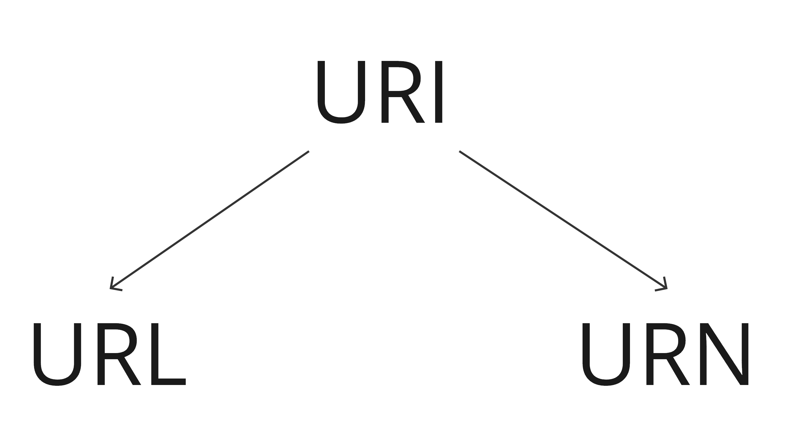

# HTTP Resources

The target of an HTTP request is called a __resource__. It can be a document, a photo, or anything else. Each resource is identified by a __Uniform Resource Identifier__ (__URI__) used throughout HTTP for identifying resources.



## URI



### URL

The most common form of URI is the __Uniform Resource Locator__ (URL), which is known as the _web address_.

Examples:

```
https://drim.city
https://drim.city:443
https://drim.city/blogs/mitro
https://drim.city/blogs/mitro/search?q=web
```

#### Structure

```
https://drim.city:443/blogs/mitro?q=web&c=10#results
```

* `https` - _scheme_. It indicates which protocol the client must use. Usually it is the HTTP protocol or its secured version, HTTPS.

* `drim.city` - _authority_. It is the domain name or authority that governs the namespace. It indicates which Web server is being requested. Alternatively, it is possible to directly use an IP address, but because it is less convenient, it is not often used on the Web.

* `443` - _port_. It indicates the technical "gate" used to access the resources on the web server. It is usually omitted if the web server uses the standard ports of the HTTP protocol (80 for HTTP and 443 for HTTPS) to grant access to its resources. Otherwise, it is mandatory.

* `/blogs/mitro` - _path_. It is the path to the resource on the Web server. In the early days of the Web, a path like this represented a physical file location on the Web server. Nowadays, it is mostly an abstraction handled by Web servers without any physical reality.

* `?q=web&c=10` - _query_. They are extra parameters provided to the Web server. Those parameters are a list of key/value pairs separated with the `&` symbol. The Web server can use those parameters to do extra stuff before returning the resource to the client. Each Web server has its own rules regarding parameters.

* `#results` - _fragment_. It is an anchor to another part of the resource itself. An anchor represents a sort of "bookmark" inside the resource, giving the browser the directions to show the content located at that "bookmarked" spot.

#### Clean URL

[Clean URLs](https://en.wikipedia.org/wiki/Clean_URL) (also known as user-friendly URLs, pretty URLs, search engine-friendly URLs or RESTful URLs) are web addresses or Uniform Resource Locator (URLs) intended to improve the usability and accessibility of a website, web application, or web service by being immediately and intuitively meaningful to non-expert users. Such URL schemes tend to reflect the conceptual structure of a collection of information and decouple the user interface from a server's internal representation of information.

| Original URL                                         | Clean URL                               |
|------------------------------------------------------|-----------------------------------------|
| https://example.com/about.html                       | https://example.com/about               |
| https://example.com/user.php?id=1                    | https://example.com/user/1              |
| https://example.com/index.php?page=name              | https://example.com/name                |
| https://example.com/kb/index.php?cat=1&id=23         | https://example.com/kb/1/23             |
| https://en.wikipedia.org/w/index.php?title=Clean_URL | https://en.wikipedia.org/wiki/Clean_URL |

### URN

A __Uniform Resource Name__ (__URN__) is a URI that identifies a resource by _name_ in a particular namespace.

Examples:

```
urn:isbn:9780141036144
urn:ietf:rfc:7230
```

URNs are not widely used.

### URL Encoding

__URL encoding__, officially known as [__percent-encoding__](https://en.wikipedia.org/wiki/Percent-encoding), is a method to encode arbitrary data in a URI using only the limited US-ASCII characters legal within a URI. Although it is known as URL encoding, it is also used more generally within the main URI set, which includes both URL and URN.

The characters allowed in a URI are either _reserved_ or _unreserved_. Reserved characters are those characters that sometimes have special meaning. For example, a forward slash character (`/`) is used to separate different parts of a URL (or more generally, a URI). Unreserved characters have no such meanings. Using percent-encoding, reserved characters are represented using special character sequences.

Reserved characters encoding:

|     |     |     |     |     |     |     |     |     |     |     |     |     |     |     |     |     |     |     |     |     |     |
|:---:|:---:|:---:|:---:|:---:|:---:|:---:|:---:|:---:|:---:|:---:|:---:|:---:|:---:|:---:|:---:|:---:|:---:|:---:|:---:|:---:|:---:|
| `␣` | `!` | `"` | `#` | `$` | `%` | `&` | `'` | `(` | `)` | `*` | `+` | `,` | `/` | `:` | `;` | `=` | `?` | `@` | `[` | `]` | `\|`|
|`%20`|`%21`|`%22`|`%23`|`%24`|`%25`|`%26`|`%27`|`%28`|`%29`|`%2A`|`%2B`|`%2C`|`%2F`|`%3A`|`%3B`|`%3D`|`%3F`|`%40`|`%5B`|`%5D`|`%7C`|

Non-ASCII characters are encoded using a `%` character and a two-character hex value corresponding to their UTF-8 character. For example, `上海+中國` in UTF-8 would be URL-encoded as `%E4%B8%8A%E6%B5%B7%2B%E4%B8%AD%E5%9C%8B`

#http-resources
