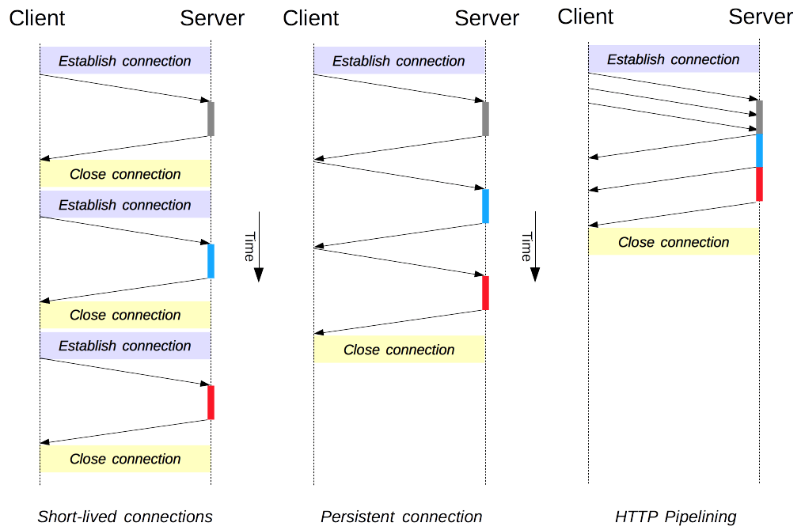

# HTTP/1.1 Connections

HTTP/1.1 operates over TCP connections. When a client makes a request to a server using HTTP 1.1, it typically establishes a TCP connection to the server's designated port (usually port 80 for HTTP and port 443 for HTTPS) before sending the request.

## Client-Server Chain

Each individual request is sent to a server, which handles it and provides an answer called the response. Between the client and the server there are numerous entities, collectively called __proxies__, which perform different operations and act as gateways or caches, for example.


Between the Web browser and the server, numerous computers and machines relay the HTTP messages. Due to the layered structure of the Web stack, most of these operate at the transport, network or physical levels, becoming transparent at the HTTP layer and potentially having a significant impact on performance. Those operating at the application layers are generally called proxies. These can be transparent, forwarding on the requests they receive without altering them in any way, or non-transparent, in which case they will change the request in some way before passing it along to the server. Proxies may perform numerous functions:

* __Caching__. The cache can be public or private, like the browser cache.
* __Filtering__. Like an antivirus scan or parental controls.
* __Load balancing__. To allow multiple servers to serve different requests.
* __Authentication__. To control access to different resources.
* __Logging__. Allowing the storage of historical information).

## Connection Management

In its infancy, HTTP used a single model to handle such connections. These connections were short-lived: a new one created each time a request needed sending, and closed once the answer had been received.

Two newer models were created in HTTP/1.1. The persistent-connection model keeps connections opened between successive requests, reducing the time needed to open new connections. The HTTP pipelining model goes one step further, by sending several successive requests without even waiting for an answer, reducing much of the latency in the network.



It's important to note that connection management in HTTP applies to the connection between two consecutive nodes, which is _hop-by-hop_ and not _end-to-end_.

### Pipelining

By default, HTTP requests are issued sequentially. The next request is only issued once the response to the current request has been received. As they are affected by network latencies and bandwidth limitations, this can result in significant delay before the next request is seen by the server.

__Pipelining__ is the process to send successive requests, over the same persistent connection, without waiting for the answer. This avoids latency of the connection. Theoretically, performance could also be improved if two HTTP requests were to be packed into the same TCP message.

> HTTP pipelining _is not activated_ by default in modern browsers:
> * Buggy proxies are still common and these lead to strange and erratic behaviors that Web developers cannot foresee and diagnose easily.
> * Pipelining is complex to implement correctly.
> * Pipelining is subject to the HOL (Head-of-Line Blocking) problem.

### `Connection` Header

The HTTP `Connection` header is used in HTTP requests to specify whether the connection should be kept open or closed after the current transaction is completed. It controls the behavior of the TCP connection between the client and the server.

There are typically two values for the `Connection` header:

* __keep-alive__. It indicates that the client wishes to keep the connection open for additional requests.

* __close__. It instructs the server to close the connection after sending the response.

Here's an example of how the `Connection` header might look in an HTTP request:

```http
GET /example HTTP/1.1
Host: example.com
Connection: keep-alive
```

### `Keep-Alive` Header

The `Keep-Alive` general header allows the sender to hint about how the connection may be used to set a timeout and a maximum amount of requests.

```http
Keep-Alive: parameters
```

`parameters`. A comma-separated list of parameters, each consisting of an identifier and a value separated by the equal sign (`=`). The following identifiers are possible:

* `timeout`: An integer that is the time in seconds that the host will allow an idle connection to remain open before it is closed. A connection is idle if no data is sent or received by a host. A host may keep an idle connection open for longer than timeout seconds, but the host should attempt to retain a connection for at least timeout seconds.
* `max`: An integer that is the maximum number of requests that can be sent on this connection before closing it. Unless 0, _this value is ignored for non-pipelined connections_ as another request will be sent in the next response. An HTTP pipeline can use it to limit the pipelining.

HTTP/1.1 uses `keep-alive` by default.

### Browser Connection Limit

As an HTTP/1.x connection is serializing requests, even without any ordering, it can't be optimal without large enough available bandwidth. As a solution, browsers open several connections to each domain, sending parallel requests. Default was once 2 to 3 connections, but this has now increased to a more common use of 6 parallel connections. There is a risk of triggering DoS protection on the server side if attempting more than this number.

## Links

* https://developer.mozilla.org/en-US/docs/Web/HTTP/Connection_management_in_HTTP_1.x
* https://developer.mozilla.org/en-US/docs/Web/HTTP/Headers/Connection
* https://developer.mozilla.org/en-US/docs/Web/HTTP/Headers/Keep-Alive
* https://en.wikipedia.org/wiki/HTTP_persistent_connection
* https://en.wikipedia.org/wiki/Head-of-line_blocking
* https://developer.mozilla.org/en-US/docs/Web/HTTP/Protocol_upgrade_mechanism
* https://alexhost.com/trust-and-security/how-to-prevent-ddos-attack-on-nginx/

#http1.1-connections
