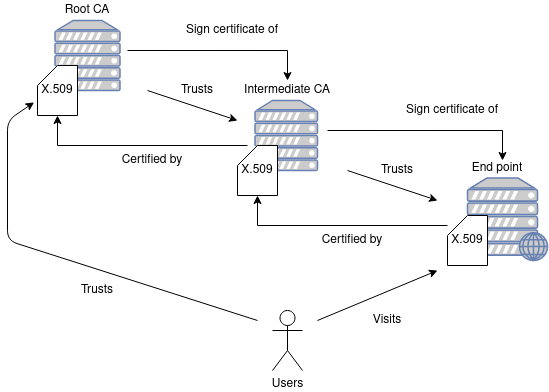

# Public Key Infrastructure

A public key infrastructure (PKI) is a set of roles, policies, hardware, software and procedures needed to create, manage, distribute, use, store and revoke __digital certificates__ and manage public-key encryption. The purpose of a PKI is to facilitate the secure electronic transfer of information for a range of network activities such as e-commerce, internet banking and confidential email. It is required for activities where simple passwords are an inadequate authentication method and more rigorous proof is required to confirm the identity of the parties involved in the communication and to validate the information being transferred.

## Man-in-the-Middle (MitM) Attack

A man in the middle (MitM) attack is a general term for when a perpetrator positions himself in a conversation between a user and an application—either to eavesdrop or to impersonate one of the parties, making it appear as if a normal exchange of information is underway.

The goal of an attack is to steal personal information, such as login credentials, account details and credit card numbers. Targets are typically the users of financial applications, SaaS businesses, e-commerce sites and other websites where logging in is required.

Steps:

1. ATTACKER intercepts the connection and so that all traffic goes through them

2. ATTACKER shares keys using Diffie-Hellman with CLIENT thus establishing TLS connection

3. ATTACKER shares keys using Diffie-Hellman with SERVER thus establishing TLS connection

4. ATTACKER receives encrypted data from CLIENT, decrypts it, stores it and then encrypts it and sends to SERVER

5. ATTACKER receives encrypted data from SERVER, decrypts it, stores it and then encrypts it and sends to CLIENT

Certificates play a crucial role in mitigating Man-in-the-Middle (MITM) attacks by ensuring the authenticity and integrity of communication between two parties, typically a client (such as a web browser) and a server (such as a website).

Certificates are issued by trusted Certificate Authorities (CAs) and are used to __authenticate the identity__ of the server to the client and vice versa. When a client connects to a server, the server presents its certificate, which contains its public key and other identifying information. The client verifies this certificate against a list of trusted CAs to ensure that it is legitimate.

> __In case of HTTPS a certificate binds a public key to a domain name.__

## Certificate Authority (CA)

A certificate authority (CA) is an entity that issues digital certificates used to establish the authenticity of websites, servers, and individuals in online transactions. These certificates contain information about the entity's identity, such as its name, public key, expiration date, and the digital signature of the CA.

The primary function of a CA is to verify the identity of the entity requesting a certificate and then vouch for that identity by digitally signing the certificate. This signature serves as a seal of approval, indicating to users that the information contained in the certificate can be trusted.

CAs play a crucial role in enabling secure communication over the internet, particularly in activities such as e-commerce, online banking, and secure email communication. When a user visits a website secured with HTTPS (Hypertext Transfer Protocol Secure), their web browser verifies the website's certificate with the issuing CA to ensure that it is legitimate and has not been tampered with.

Some well-known CAs include DigiCert, Symantec (now part of DigiCert), GlobalSign, Let's Encrypt, and Comodo (now Sectigo). It's important for CAs to follow strict security practices to prevent unauthorized issuance of certificates, as a compromised CA could potentially enable various forms of cyberattacks, such as man-in-the-middle attacks or phishing scams.

The process for issuing a certificate involves several steps:

* __Application__. The organization or individual applies for a CA certificate from a trusted Certificate Authority. This typically involves filling out a form and providing necessary documentation to prove identity and ownership.

* __Verification__. The Certificate Authority verifies the identity of the applicant and ensures they have the right to request the certificate for the domain(s) or service(s) in question. This verification process may involve checking government-issued IDs, business registrations, or domain ownership records.

* __Key Generation__. Once the applicant's identity is verified, a public-private key pair is generated. The private key remains securely with the applicant, while the public key is used to generate the CA certificate.

* __Certificate Signing Request (CSR)__. The applicant generates a CSR, which includes their public key and information about the entity requesting the certificate. This CSR is then submitted to the Certificate Authority.

* __Certificate Issuance__. The Certificate Authority reviews the CSR and, if everything is in order, issues a CA certificate. This CA certificate contains the applicant's public key, along with information such as the validity period and the domain(s) or service(s) it's authorized for.

Next steps include:

* __Installation__. The applicant installs the CA certificate onto their server or device, along with the corresponding private key. This enables secure communication using SSL/TLS protocols, as the CA certificate is used to verify the authenticity of the server's identity.

* __Renewal and Revocation__. CA certificates have expiration dates, so they need to be renewed periodically. Additionally, if a private key is compromised or if there's a need to revoke the certificate for any reason, the Certificate Authority can issue a certificate revocation list (CRL) or use online certificate status protocol (OCSP) to invalidate the certificate before its expiration date.

* __Compliance and Audit__. Certificate Authorities are often subject to compliance requirements and audits to ensure they adhere to industry standards and best practices in certificate issuance and management.

It's important to note that the exact process may vary slightly depending on the Certificate Authority and the type of certificate being issued (e.g., SSL/TLS certificate, code signing certificate, etc.). Additionally, some organizations may choose to operate their own internal Certificate Authority rather than relying on a third-party CA.

## Chain of Trust

A Certificate Authority (CA) chain of trust is a crucial concept in the realm of cybersecurity, particularly in the context of public key infrastructure (PKI). Here's a breakdown:

* __Certificate Authority (CA)__. A trusted entity responsible for issuing digital certificates that verify the ownership of a public key by the named subject of the certificate. CAs are vital in ensuring the authenticity and integrity of digital communications.

* __Chain of Trust__. In PKI, trust is established through a hierarchical chain of CAs. This chain begins with a root CA, whose certificate is self-signed and inherently trusted by the relying parties. The root CA issues intermediate CAs, which in turn may issue certificates to end entities or other intermediate CAs. Each certificate in the chain is signed by the private key of the issuing CA and can be verified using the public key contained in the issuer's certificate.

* __Verification Process__. When a digital certificate is presented, its authenticity is verified by checking its digital signature against the public key of the issuing CA. If the signature is valid and the CA's certificate is trusted (either because it's a root CA certificate or because its signature can be traced back to a trusted root), then the certificate is considered valid.

* __Trust Anchors__. Root CAs are considered trust anchors, as they are the starting point for validating the authenticity of certificates within the PKI. Trust in the root CA's certificate is typically established through manual means (e.g., pre-installation in web browsers or operating systems) or through out-of-band verification.

In summary, a CA chain of trust is the hierarchical structure of CAs where each CA in the chain is trusted to verify the authenticity of certificates it issues, ultimately leading back to a trusted root CA. This ensures the integrity and security of digital communications by allowing relying parties to verify the legitimacy of presented digital certificates.

## X.509 Certificate

An X.509 certificate binds __an identity to a public key__ using a digital signature. A certificate contains an identity (a hostname, or an organization, or an individual) and a public key (RSA, DSA, ECDSA, ed25519, etc.), and is either signed by a certificate authority or is self-signed. When a certificate is signed by a trusted certificate authority, or validated by other means, someone holding that certificate can use the public key it contains to establish secure communications with another party, or validate documents digitally signed by the corresponding private key.

The structure of an X.509 v3 digital certificate is as follows:

* Certificate
  * Version Number
  * Serial Number
  * Signature Algorithm ID
  * Issuer Name
  * Validity period
    * Not Before
    * Not After
  * Subject name
  * Subject Public Key Info
    * Public Key Algorithm
    * Subject Public Key
  * Issuer Unique Identifier (optional)
  * Subject Unique Identifier (optional)
  * Extensions (optional)
* Certificate Signature Algorithm
* Certificate Signature

## Links

* https://en.wikipedia.org/wiki/Public_key_infrastructure
* https://www.idmanagement.gov/university/pki/
* https://en.wikipedia.org/wiki/Man-in-the-middle_attack
* https://en.wikipedia.org/wiki/Certificate_authority
* https://en.wikipedia.org/wiki/DigiNotar
* https://en.wikipedia.org/wiki/X.509

#pki
